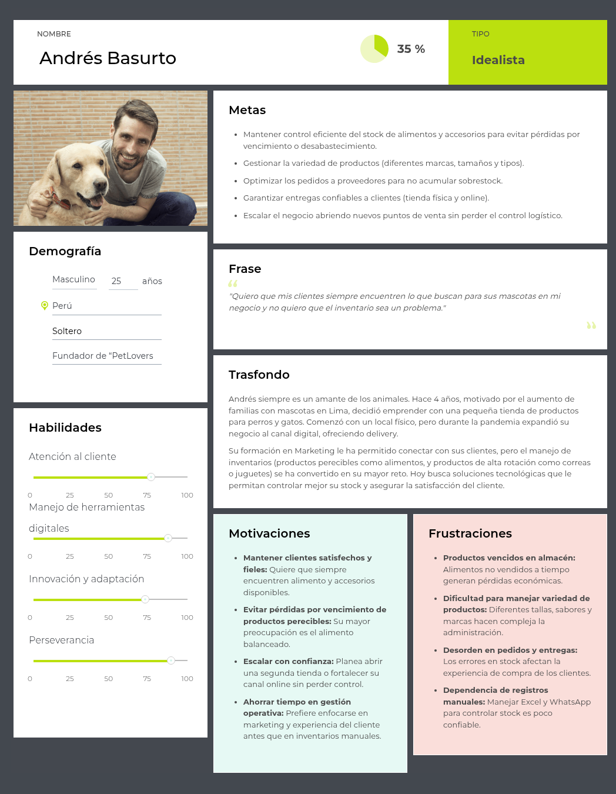
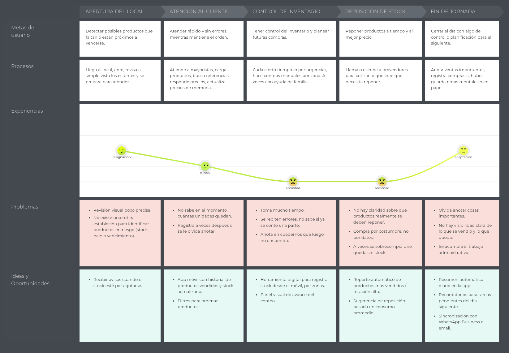
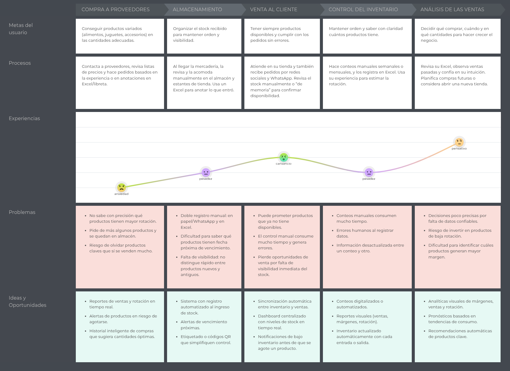
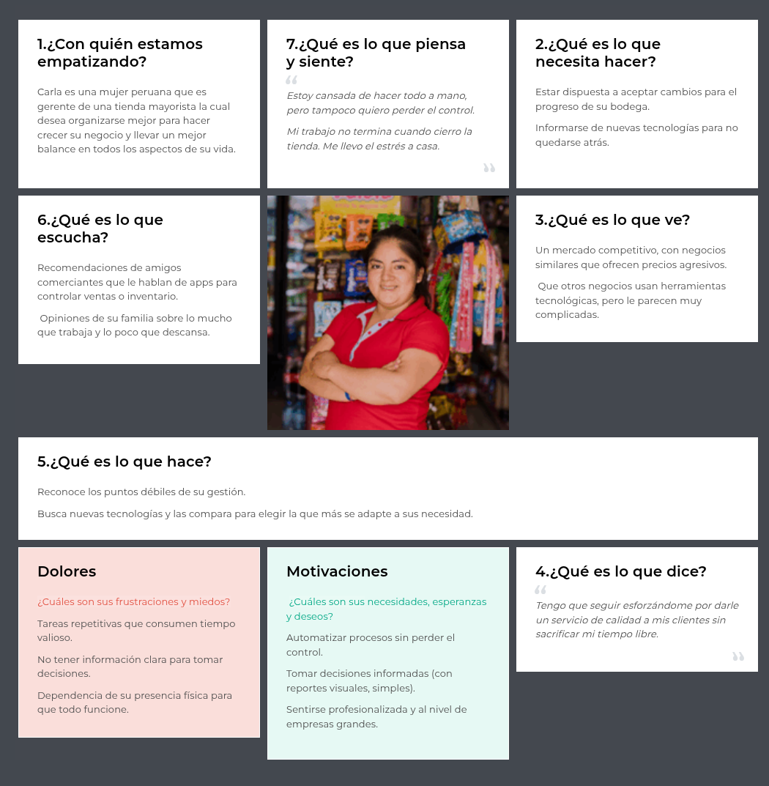

# Capítulo II: Requirements Elicitation & Analysis

## 2.1 Competidores

- **Zoho Inventory** (competidor directo): Plataforma SaaS global diseñada para el control de inventario, pedidos y facturación. Está orientada a PYMEs que venden a través de múltiples canales online y offline. Su principal fortaleza es la integración multicanal con plataformas como Amazon, Shopify y eBay, además de su escalabilidad, aunque presenta precios elevados para microempresas.

- **Odoo** (competidor indirecto): ERP modular de código abierto (open source) que permite integrar todas las áreas del negocio, incluyendo una robusta gestión de inventarios. Se orienta a empresas medianas y grandes que necesitan un sistema integral. Destaca por ser altamente personalizable y por su gran comunidad, aunque su implementación resulta compleja, tiene una alta curva de aprendizaje y los costos de integración son elevados.

- **Bsale / SISBodega** (competidor directo): Software de ventas e inventario 100% en la nube que integra facturación electrónica (SUNAT) y e-commerce en un mismo sistema. Se orienta a PYMEs y comercios locales en Perú, Chile y México. Su principal ventaja es su accesibilidad, facilidad de uso y soporte local en español, aunque ofrece menos funciones avanzadas si se le compara con un ERP completo.

### 2.1.1 Análisis Competitivo

**¿Por qué llevar a cabo este análisis?**

> El propósito de este análisis es determinar en qué segmentos del mercado existe una oportunidad real de competir, examinando cómo se posicionan los actores principales: qué públicos apuntan, qué ofrecen y cómo venden. Con esa información como base, se busca construir una propuesta de valor propia que sea diferenciada y relevante para el mercado al que nos dirigimos.

  

### 2.1.2 Estrategias y tácticas frente a competidores

**Estrategias**
  

    1. Diferenciación por simplicidad y usabilidad: La solución estará enfocada en bodegas y pequeñas empresas que requieren una interfaz intuitiva y un flujo de trabajo sencillo, reduciendo la curva de aprendizaje.

    2. Accesibilidad económica: La startup ofrecerá planes escalables y accesibles, con opción gratis básica para atraer usuarios y fomentar adopción masiva.

    3. Adaptación al mercado local: Integración directa con la facturación electrónica exigida por SUNAT en Perú y soporte en español, lo cual representa una ventaja frente a soluciones globales.    

    
    4. Posicionamiento digital: Focalización en marketing digital dirigido a bodegueros y pymes mediante redes sociales, asociaciones de comerciantes y programas de referidos.

**Tácticas**
  

    1. Frente a las fortalezas de competidores: Ofrecer un onboarding rápido y gratuito que simplifique la transición a nuestro sistema. Mantener integraciones básicas con e-commerce.

    2. Frente a las debilidades de competidores: Simplificar los módulos de inventario para usuarios no técnicos. Ofrecer precios más bajos y planes sin contratos largos. Incorporar soporte técnico personalizado en español.

    3. Aprovechando oportunidades del mercado: Posicionarse como solución para la digitalización de bodegas y pequeños negocios. Diseñar versiones móviles ligeras, dado que muchos bodegueros usan smartphones como principal herramienta de gestión.

    4. Mitigando amenazas: Diferenciarse de grandes empresas destacando el enfoque local. Crear una comunidad de usuarios locales que genere lealtad frente a la entrada de nuevos competidores. Innovar constantemente incorporando módulos escalables.

## 2.2. Entrevistas

En esta sección se lleva a cabo la investigación y recopilación de información mediante entrevistas a los usuarios de cada segmento objetivo, con el propósito de comprenderlos de manera más profunda.

### 2.2.1. Diseño de entrevistas

En esta sección se plantean preguntas principales y complementarias destinadas a entrevistas con cada uno de nuestros segmentos objetivos, con el propósito de recopilar la mayor cantidad posible de información relevante. Tras un análisis detallado, se definieron las siguientes preguntas para aplicar en las entrevistas a dichos segmentos.

**Segmento #1: Bodegas especializadas por rubro**

Preguntas principales:
1. ¿Podrías describirme cómo gestionas actualmente el inventario de tu bodega?
2. ¿Cuáles consideras que son los principales desafíos al momento de organizar tus productos?
3. ¿Has enfrentado pérdidas o inconvenientes por errores en el inventario? ¿Cómo los solucionaste?
4. ¿Qué tan relevante es para ti contar con un control del stock en tiempo real?
5. ¿Empleas algún sistema o herramienta digital para la gestión? Si es así, ¿cuál utilizas y cómo ha sido tu experiencia?
6. ¿De qué manera detectas cuando un producto está por agotarse o próximo a vencer?

Preguntas complementarias:
- ¿Qué tipo de reportes o información te gustaría obtener acerca de tu inventario?
- ¿Qué navegador y sistema operativo utilizas más? ¿Qué dispositivos utilizas con mayor frecuencia en tu trabajo (laptop, celular, tablet)?
- ¿Cómo imaginas que una plataforma digital podría ayudarte a optimizar tu operación diaria?
- ¿Qué redes sociales o canales digitales empleas para vender tus productos?

**Segmento #2: Startups y emprendedores en expansión con necesidades logísticas**

Preguntas principales:
1. ¿Cómo gestionas actualmente el inventario de tu negocio?
2. ¿En qué situaciones sientes que el control del stock te limita o te hace perder tiempo?
3. ¿De qué forma registras las entradas y salidas de productos?
4. ¿Qué aspectos te gustaría mejorar en tu proceso logístico actual?
5. ¿Has evaluado implementar una plataforma para gestionar tu inventario? ¿Por qué tomarías o no esa decisión?

Preguntas complementarias:

- ¿Qué herramientas digitales utilizas actualmente en tu negocio?
- ¿Dónde se encuentran almacenados tus productos?
- ¿Con qué frecuencia necesitas revisar tu stock?
- ¿Qué redes sociales o canales digitales empleas para vender tus productos?
- ¿Qué navegador y sistema operativo utilizas más? ¿Qué dispositivos utilizas con mayor frecuencia en tu trabajo (laptop, celular, tablet)?

### 2.2.2. Registro de entrevistas

Link de entrevistas:<a href="https://tinyurl.com/66etkfv8">https://tinyurl.com/66etkfv8</a>  

**Segmento #1: Bodegas especializadas por rubro**

| Nº | Datos del entrevistado | Resumen de la entrevista | Evidencia de entrevista |
|----|------------------------|------------------------------------------| ----------------------- |
| 1  | - **Nombre:** Lucarelly Sanchez Heredia   - **Edad:** 21 años | Lucarelly es dueño de una bodega y la gestiona junto a su abuelo. La administra usando excel pero no siempre está actualizado, además de usar una libreta. Uno de los mayores desafíos que enfrenta es la mezcla de lotes y fechas de vencimiento, lo que le genera pérdidas. No tiene un control en tiempo real del stock y no ha considerado usar una plataforma digital para gestionar su inventario, pero le gustaría tener un mejor control de sus productos. Actualmente no emplea alguna herramienta digital para la gestión de su bodega además de excel. Repone los productos de manera reactiva, es decir, cuando se le acaba o está por vencer un producto. Usa una laptop Windows y un celular Android, y como browser usa Chrome. Vende sus productos principalmente de forma presencial, pero también usa Whatsapp, Facebook e Instagram. |    **Duración:** 2:53 min |
| 2  | - **Nombre:** Rubi Vega   - **Edad:** 19 años | Actualmente, la bodega no cuenta con un sistema formal de gestión de inventario, pues al ser un negocio familiar las tareas se realizan de manera manual, aunque se considera contratar personal externo. El principal desafío es controlar las fechas de vencimiento, ya que con la llegada de nuevos productos se pierde seguimiento de los que están por caducar. No utilizan herramientas digitales, aunque reconocen la importancia de contar con un control en tiempo real para crecer y organizar pedidos. Detectan faltantes o vencimientos al limpiar estantes o por intuición. Usan celular y computadora, y gestionan pedidos principalmente por WhatsApp. |    **Duración:** 4:02 min |

**Segmento #2: Startups y emprendedores en expansión con necesidades logísticas**

| Nº | Datos del entrevistado | Resumen de la entrevista | Evidencia de entrevista |
|----|------------------------|------------------------------------------| ----------------------- |
| 1  | - **Nombre:** Alexander Miranda Vivanco   - **Edad:** 27 años | Alexander Miranda tiene un emprendimiento dedicado a venta de productos para mascotas. Actualmente, gestiona su inventario revisando su almacén presencialmente y lo hace interdiario, dependiendo de las ventas. Se siente limitado por lo tardado que es revisar el stock disponible. Registra su inventario únicamente en Excel y se guía por las boletas que emite. Le gustaría mejorar las entradas y salidas de productos e inventariado para así llevar un mejor control y saber cuando es necesario reponer ciertos ítems. Aún no ha considerado implementar una página, pero lo considera una oportunidad para digitalizar el negcio y agilizar el proceso de venta e inventario. |    **Duración:** 3:30 min |

| Nº | Datos del entrevistado | Resumen de la entrevista | Evidencia de entrevista |
|----|------------------------|------------------------------------------| ----------------------- |
| 2  | - **Nombre:** Alicia Navarro Chang   - **Edad:** 20 años | Alicia Navarro Chang tiene un negocio dedicado a la venta de queques. Actualmente gestiona su inventario utilizando principalmente Notion y Excel, donde registra compras y salidas de productos, aunque reconoce que el proceso es propenso a errores humanos, especialmente en los cálculos y conteos manuales. Le gustaría contar con un sistema más automático que reduzca esas fallas. Ha evaluado implementar plataformas digitales de inventario, pero aún no encuentra una que le ofrezca todas las herramientas que necesita ni planes de suscripción adecuados. Sus productos los almacena en un cuarto de su casa y revisa los insumos interdiario o casi a diario. Para ventas y promoción emplea TikTok e Instagram, y para contacto con clientes utiliza Instagram y WhatsApp. Desarrolla su trabajo principalmente desde su laptop y también con su celular. |    **Duración:** 3:32 min |
 

| Nº | Datos del entrevistado | Resumen de la entrevista | Evidencia de entrevista |
|----|------------------------|------------------------------------------| ----------------------- |
| 3  | - **Nombre:** Macpier Condezo   - **Edad:** 29 años |Macpier Condezo tiene un negocio e-commerce. Actualmente gestiona su inventario utilizando principalmente Excel, donde registra compras y salidas de productos, aunque reconoce que el proceso es manual y puede presentar errores, especialmente en los cálculos y conteos manuales. Le gustaría contar con un sistema más automático que reduzca esas fallas. Ha evaluado implementar plataformas digitales de inventario, pero aún no encuentra una que le parezca adecuada. Sus productos los almacena en su casa y revisa el stock a diario. Para publicitarse y manejar las ventas en su negocio usa facebook. Desarrolla su trabajo principalmente desde su PC y ocacionalmente desde su celular. |    **Duración:** 3:41 min |
 

### 2.2.3 Análisis de entrevistas

#### Segmento 1: Bodegas especializadas por rubro

Se analizaron **2 entrevistas** a administradores y dueños de bodegas. La información obtenida permitió identificar características objetivas y subjetivas clave para construir el arquetipo de dueño de bodega.

**Características**

| Característica | Mención | % | Evidencia |
| :--- | :--- | :--- | :--- |
| Gestión de inventario manual o en Excel | 2/2 | 100% | Uso de Excel (a veces desactualizado), libretas y realización de tareas de manera completamente manual. |
| Problemas críticos con fechas de vencimiento | 2/2 | 100% | Mencionan pérdidas por mezcla de lotes y falta de seguimiento al ingresar nuevos productos a los estantes. |
| Control y reposición reactiva / visual | 2/2 | 100% | Detectan faltantes al limpiar estantes, por intuición, o esperan a que el producto esté por agotarse para reponer. |
| Uso de WhatsApp como canal de gestión | 2/2 | 100% | Ambos señalan a WhatsApp como un canal principal para la gestión de pedidos o contacto con clientes. |
| Interés en el control en tiempo real | 2/2 | 100% | Reconocen la necesidad e importancia de un control actualizado para evitar pérdidas, organizarse y poder crecer. |

**Insights**

1. **El control de caducidad es el principal punto de dolor:** La falta de un sistema formal provoca que los nuevos lotes se mezclen con los antiguos, perdiendo el rastro de las fechas de vencimiento. Esto se traduce directamente en mermas y pérdidas económicas.
2. **Gestión logística reactiva y rudimentaria:** La dependencia de la memoria e inspección visual genera ineficiencia. El inventario solo se repone cuando el problema es evidente.
3. **Brecha de digitalización interna vs. externa:** Están digitalizados para vender (WhatsApp, redes sociales), pero no para gestionar su operación interna. La barrera no es tecnológica, sino de falta de herramientas adecuadas.
4. **Disposición latente hacia la digitalización:** Existe consciencia de que sus métodos actuales son insuficientes y hay apertura para adoptar sistemas en tiempo real que sean fáciles de usar.

---

#### Segmento 2: Startups y emprendedores en expansión con necesidades logísticas

Se analizaron **3 entrevistas** a emprendedores de negocios en crecimiento (e-commerce, mascotas, repostería). A partir de sus respuestas se identificaron aspectos clave para construir el arquetipo del emprendedor en expansión.

**Características**

| Característica | Mención | % | Evidencia |
| :--- | :--- | :--- | :--- |
| Dependencia de Excel como herramienta principal | 3/3 | 100% | Todos utilizan Excel (o Notion) para registrar compras, salidas y boletas emitidas. |
| Revisión física periódica de stock | 3/3 | 100% | Realizan inspecciones presenciales en sus almacenes o casas de forma diaria o interdiaria. |
| Consciencia de errores por gestión manual | 3/3 | 100% | Reconocen expresamente que sus procesos manuales quitan mucho tiempo y son propenso a errores de cálculo. |
| Deseo explícito de automatización | 3/3 | 100% | Buscan sistemas que agilicen el inventariado, mejoren el registro de entradas/salidas y alerten sobre reposiciones. |
| Dependencia de Redes Sociales para ventas | 3/3 | 100% | Uso activo de Facebook, Instagram, TikTok o WhatsApp para promocionarse y gestionar ventas. |
| Insatisfacción con la oferta de software actual | 2/3 | 66.7% | Han evaluado plataformas digitales, pero las descartan por complejidad o planes de precio inadecuados. |

**Insights**

1. **El trabajo manual es un cuello de botella para el crecimiento:** Invierten demasiado tiempo en conteos físicos. Saben que el Excel limita su capacidad operativa y buscan escalar.
2. **Necesidad de automatización y alertas de reposición:** Demanda clara de sistemas que reduzcan la carga mental, realicen cálculos automáticos y notifiquen cuándo reponer insumos.
3. **Insatisfacción con las soluciones del mercado actual:** Existe un vacío para este segmento; buscan software robusto pero con planes de suscripción accesibles y funcionalidades precisas.
4. **Ecosistema de ventas omnicanal descentralizado:** Gestionan ventas por múltiples redes sociales, lo que requiere agilidad para descontar stock rápidamente desde diversos canales digitales.

## 2.3. Needfinding

En la siguiente sección, analizaremos a nuestros segmentos objetivos para identificar sus necesidades y en base a esto ofrecerles soluciones óptimas a sus problemas.

### 2.3.1. User Personas

En esta sección se presentan dos User Personas que representan los segmentos clave del proyecto: los dueños de bodegas mayoristas y los emprendedores de negocios especializados con presencia digital. Estos perfiles permiten comprender en profundidad las necesidades, motivaciones, frustraciones y comportamientos de los usuarios potenciales del sistema, el cual busca optimizar la logística mediante el control de stock en tiempo real y la reducción de mermas por vencimiento.

El User Persona Carla Rodríguez representa a las dueñas y gestoras de bodegas mayoristas con amplia trayectoria en la distribución de productos de consumo masivo. Carla posee formación técnica en administración, pero su operación diaria sigue dependiendo fuertemente de métodos manuales, Excel y WhatsApp, lo que le genera una carga operativa excesiva y estrés laboral. Su principal motivación es modernizar su negocio para poder delegar tareas con confianza y disponer de más tiempo libre para su familia. Busca una solución tecnológica que le ofrezca reportes visuales y alertas automáticas de reposición, permitiéndole pasar de una gestión reactiva a una toma de decisiones informada y estratégica, sin la complejidad de las herramientas técnicas actuales que le resultan difíciles de interpretar.

    

La información mostrada del User Persona Carla Rodríguez permite identificar a una administradora que valora la tranquilidad operativa y la eficiencia. Su perfil evidencia que la falta de una herramienta confiable la obliga a estar presente físicamente en el almacén para evitar desórdenes, lo que limita el crecimiento de su negocio. En ese sentido, este perfil sintetiza la oportunidad de ofrecer una plataforma que simplifique el control de inventarios, automatice las alertas de stock y elimine la dependencia de procesos manuales agotadores.

Por otro lado, el User Persona Andrés Basurto representa a los jóvenes emprendedores y fundadores de startups en expansión, como "PetLovers", que operan tanto de forma física como digital. Con formación en Marketing, Andrés prioriza la satisfacción del cliente y la fidelización, pero enfrenta dificultades críticas en el manejo de una gran variedad de productos perecibles y accesorios. Actualmente, su dependencia de registros manuales y Excel le genera errores en las entregas y pérdidas económicas por productos vencidos en almacén, lo que pone en riesgo la experiencia de compra de sus clientes.

    

La información mostrada del User Persona Andrés Basurto permite identificar a un emprendedor que busca escalar su negocio con confianza abriendo nuevos puntos de venta. Su perfil refleja la necesidad de una solución tecnológica que garantice entregas confiables y optimice los pedidos a proveedores para evitar el sobrestock. Asimismo, se observa que valora herramientas que le ahorren tiempo en la gestión operativa para poder enfocarse en el marketing y la estrategia comercial. En ese sentido, este perfil destaca la necesidad de implementar un sistema de control logístico eficiente que soporte el crecimiento multicanal y asegure que el inventario nunca sea un obstáculo para la expansión del negocio.

### 2.3.2. User Task Matrix

Se presenta el User Task Matrix, que reúne las tareas que ambos User Persona, administradores de bodegas mayoristas y emprendedores de retail especializado, realizan para lograr sus objetivos operativos y estratégicos. Estas tareas son actividades que los usuarios llevan a cabo de manera habitual para mantener la continuidad de su negocio.

Los segmentos considerados para este análisis son:
- Dueños de bodegas
- Startups y emprendedores en expansión con necesidades logísticas

##### Task Matrix

| Tarea                                                      | Carla Rodríguez |             | Andrés Basurto |             |
| ---------------------------------------------------------- | -------------- | ----------- | ------------ | ----------- |
|                                                            | Frecuencia     | Importancia | Frecuencia   | Importancia |
| Supervisar stock físico en almacén            | often          | high        | often        | high        |
| Controlar fechas de vencimiento de productos                   | often          | high      | sometimes    | high      |
| Coordinar pedidos con proveedores vía WhatsApp/Excel             | often          | high        | often        | high        |
| Realizar conteos manuales para inventariad        | often      | high      | sometimes        | medium        |
| Gestionar ventas y pedidos omnicanal       | sometimes      | medium        | often    | high      |
| Revisar reportes de ventas y rotación        | sometimes          | high        | sometimes        | high        |
| Atención directa al cliente y dudas                        | often      | high      | often    | high      |
| Planificar la reposición de productos críticos          | often      | high        | sometimes        | high        |
| Capacitar al personal en procesos operativos | sometimes         | medium      | rarely       | medium      |

#### Análisis

- Ambos segmentos comparten tareas operativas de alta criticidad, como la supervisión de inventario y la coordinación de pedidos. Sin embargo, sus enfoques varían según su naturaleza: mientras las bodegas especializadas buscan eficiencia y control para reducir la carga física y el estrés operativo, las Startups y emprendedores en expansión se centran en que el inventario soporte su crecimiento omnicanal y la satisfacción del cliente.

- Un punto crítico compartido es el control de fechas de vencimiento. Para las bodegas es vital para evitar mermas en productos de consumo masivo, mientras que para los emprendedores especializados es clave para asegurar la calidad de productos específicos y la fidelidad de su nicho. Ambas tareas se realizan actualmente de forma manual, lo que valida la oportunidad de automatización.

- Por otro lado, tareas como la gestión de ventas omnicanal y la búsqueda de herramientas tecnológicas son mucho más relevantes para el segmento 2, dado que su modelo de negocio exige escalabilidad digital. En contraste, para el segmento 1, la prioridad absoluta es simplificar la gestión diaria mediante reportes visuales claros que permitan una toma de decisiones informada sin depender de procesos manuales agotadores.

### 2.3.3. User Journey Mapping

En esta sección se presentan los User Journey Maps (As-Is) de los segmentos representados, correspondientes a sus respectivas User Personas. Se ilustra el recorrido actual de los usuarios sin la intervención de la solución tecnológica propuesta, con el fin de identificar sus necesidades, puntos de fricción y oportunidades de mejora en la gestión logística y de inventarios. Cada mapa refleja las etapas clave de interacción, acciones realizadas, puntos de contacto, experiencias emocionales, dificultades enfrentadas y posibles soluciones.

**Carla Rodríguez**

A continuación se presenta el User Journey Mapping de Carla Rodríguez.

    

Uno de los problemas más críticos identificados en el recorrido de Carla es la falta de visibilidad y precisión en el control de inventario. Al depender de revisiones visuales poco precisas y conteos manuales por zonas, es común que se repitan errores, se anote información en cuadernos que luego se pierden o se olvide registrar la salida de productos clave. Esta desorganización genera una alta carga de ansiedad y fatiga, ya que el proceso consume demasiado tiempo y energía diaria.

La experiencia del usuario muestra una caída emocional significativa, especialmente en las etapas de Atención al cliente y Control de inventario. Durante la atención, la incertidumbre sobre el stock real genera miedo a fallar al cliente, mientras que en el control de stock, la sensación de ansiedad predomina debido a que la información suele ser inexacta o estar desactualizada. La dependencia de registros manuales y la falta de una rutina establecida para identificar productos en riesgo (stock bajo o por vencer) obliga a Carla a realizar pedidos de forma reactiva y no planificada.

En conclusión, el proceso de gestión de la bodega mayorista requiere de una herramienta digital que permita automatizar el registro de stock desde el móvil y centralizar la información. La implementación de alertas de stock bajo, reportes automáticos de rotación y un panel visual de avance permitiría a Carla reducir su estrés laboral, evitar pérdidas por productos vencidos y, finalmente, lograr la tranquilidad necesaria para delegar la operación y recuperar tiempo de calidad con su familia.

**Andrés Basurto**

A continuación se presenta el User Journey Mapping de Andrés Basurto.

    

El problema central identificado en el recorrido de Andrés es la desconexión de información entre sus canales de venta y su stock real. Al depender de procesos manuales, registros en Excel y notas de WhatsApp, Andrés enfrenta una dificultad crítica para manejar la gran variedad de productos perecibles y accesorios que ofrece. Esta falta de visibilidad genera un riesgo constante de pérdida económica por productos vencidos en almacén y errores en las entregas a domicilio, lo cual impacta directamente en la confianza y satisfacción del cliente.

La experiencia emocional de Andrés refleja picos de ansiedad y pesadez durante las fases de Compra a proveedores y Almacenamiento. La incertidumbre sobre qué productos tienen mayor rotación y la dificultad para distinguir lotes nuevos de antiguos provocan que las decisiones de reabastecimiento se basen más en la intuición que en datos reales. Durante la Venta al cliente, el cansancio se manifiesta al tener que verificar manualmente la disponibilidad de stock mientras atiende pedidos por redes sociales, perdiendo oportunidades de venta por falta de inmediatez en la información.

En conclusión, el análisis de este Journey Map evidencia que el crecimiento de una startup como PetLovers se ve frenado por el "cuello de botella" que representa la gestión manual. Se requiere una solución que proporcione un dashboard centralizado con niveles de stock en tiempo real, alertas de vencimiento próximas y análisis visual de márgenes.

### 2.3.4. Empathy Mapping

En esta sección, el equipo resume el proceso de elaboración y presenta los Empathy Maps realizados para cada User Persona. El proceso implicó centrar a cada User Persona y plasmar las observaciones del equipo, respondiendo a preguntas clave sobre qué piensan, sienten, ven, oyen, dicen y hacen. Finalmente, se identificaron los “Pains” y “Gains” con el objetivo de comprender mejor sus preocupaciones, necesidades y las soluciones que podrían generar mayor valor para ellos.

**Carla Rodríguez**

Esta sección presenta el Empathy Map elaborado para Carla Rodríguez, nuestra User Persona que representa a la gerente de una bodega especializadas por rubro en busca de una mejor organización operativa y equilibrio personal. Este mapa permite visualizar de manera integral sus pensamientos, emociones y los desafíos logísticos que enfrenta en la gestión diaria de su negocio.

    

A partir de este análisis, se evidencia que Carla experimenta un cansancio acumulado debido a la realización de todas sus tareas de forma manual, lo que la lleva a sentir que su trabajo no termina al cerrar la tienda, trasladando el estrés operativo a su hogar. A pesar de su disposición para aceptar cambios tecnológicos por el progreso de su bodega, se siente limitada por la complejidad percibida de las herramientas actuales, lo que refuerza su dependencia de estar físicamente presente en el almacén para que todo funcione correctamente.

Mediante este enfoque empático, se identificaron sus principales frustraciones (Pains), como las tareas repetitivas que consumen tiempo valioso y la falta de información clara para tomar decisiones, así como sus oportunidades de valor (Gains), entre las que destacan la automatización de procesos sin perder el control, el uso de reportes visuales simples y el deseo de sentirse profesionalizada al nivel de empresas más grandes. Esto permite orientar la solución hacia una herramienta intuitiva que reduzca su agotamiento y le permita recuperar su tiempo libre.

**Carla Rodríguez**

Esta sección presenta el Empathy Map elaborado para Andrés Basurto, nuestra User Persona clave que representa a los jóvenes emprendedores y fundadores de startups como "PetLovers". Este mapa permite visualizar de manera integral sus pensamientos, metas y los desafíos logísticos que enfrenta al intentar escalar un negocio con presencia física y digital.

    

A partir de este análisis, se evidencia que Andrés enfrenta dificultades críticas relacionadas con la variedad y rotación de sus productos, lo que le genera temor a perder el control del negocio durante su fase de crecimiento. Su frustración nace de dedicar demasiado tiempo a tareas operativas manuales en Excel, tiempo que preferiría dedicar al marketing y a la experiencia del cliente. Aunque es un usuario digitalmente hábil, la falta de una herramienta centralizada le impide tener la confianza necesaria para expandirse con orden.

Mediante este enfoque empático, se identificaron sus principales frustraciones (Pains), como la pérdida de dinero por productos vencidos y la ansiedad de perder clientes cuando un producto clave se agota, así como sus oportunidades de valor (Gains), destacando la tranquilidad de contar con alertas de inventario, la confianza para tomar decisiones estratégicas basadas en datos y el logro de un crecimiento sostenible y ordenado. Esto permite orientar la solución hacia una plataforma de monitoreo en tiempo real que elimine los errores manuales y facilite la escalabilidad de su emprendimiento.

### 2.3.5. As-is Scenario Mapping

## 2.4. Ubiquitous Language

El siguiente glosario presenta los términos clave utilizados en el desarrollo del proyecto StockTrack. Este lenguaje común asegura que todos los miembros del equipo (técnicos y no técnicos) compartan una comprensión unificada de los conceptos centrales, facilitando la comunicación y el diseño colaborativo del sistema.

1. **Inventario**: Conjunto organizado de productos gestionados dentro de la plataforma, que incluye información como cantidades disponibles, ubicación en la bodega, lotes y fechas de vencimiento.

2. **Producto**: Unidad básica registrada en el sistema. Cada producto posee atributos como nombre, descripción, categoría, unidades de medida, stock mínimo y fecha de vencimiento.

3. **Stock**: Cantidad disponible de un producto específico dentro del inventario.

4. **Stock mínimo**: Nivel definido por el usuario que representa la cantidad mínima aceptable de un producto antes de requerir reposición.

5. **Stock bajo**: Estado de un producto cuyo nivel de stock ha alcanzado o está por debajo del stock mínimo definido.

6. **Panel de Control**: Interfaz principal de la plataforma que centraliza la visualización de métricas clave (inventario disponible, alertas de stock bajo, movimientos recientes y reportes).

7. **Movimiento de Inventario**: Registro de cualquier variación en las existencias de productos, incluyendo entradas (compras o reposiciones), salidas (ventas, pérdidas o devoluciones) y ajustes manuales.

8. **Reporte**: Representación visual o estadística generada por el sistema que resume información relevante del inventario (rotación de productos, quiebres de stock, productos próximos a vencer, etc.).

9. **Bodega**: Pequeño negocio de venta de productos de consumo diario, principalmente alimentos, bebidas y artículos de primera necesidad.

10. **Dueña/o de bodega**: Usuario que gestiona directamente la operación de su bodega y utiliza StockTrack para optimizar el control de inventario, evitar pérdidas y mejorar la eficiencia.

11. **Emprendedor/a**: Usuario en etapa de crecimiento que gestiona uno o más puntos de venta y requiere profesionalizar su gestión logística con herramientas digitales.

12. **Proveedor**: Persona o empresa que abastece a las bodegas o emprendedores con productos que serán registrados y gestionados en StockTrack.

13. **Pedido**: Solicitud de reposición o compra de productos hecha a un proveedor, ya sea de forma manual o asistida por las recomendaciones del sistema.

14. **Alerta**: Notificación generada automáticamente por el sistema cuando ocurre un evento relevante (stock bajo, productos próximos a vencer, quiebre de stock, etc.).