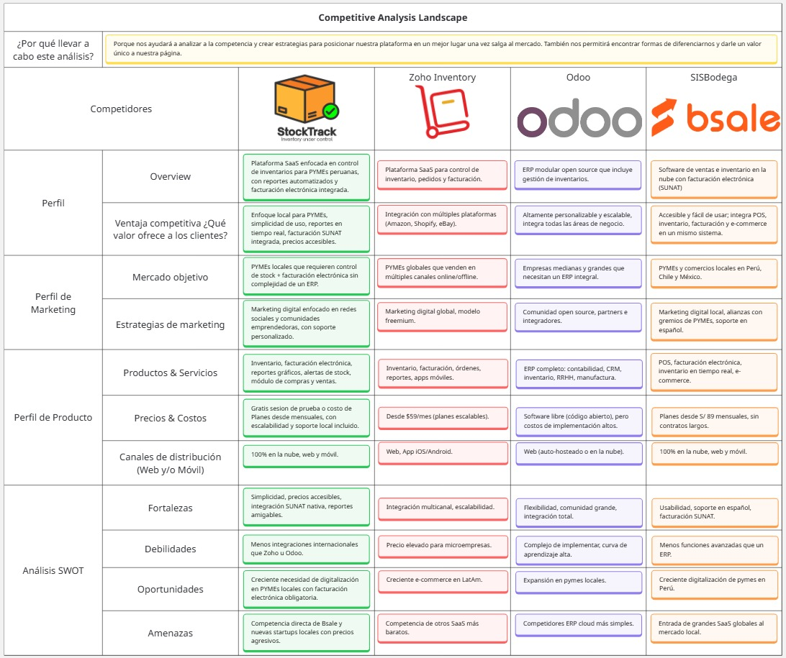

# Capítulo II: Requirements Elicitation & Analysis

## 2.1 Competidores

- **Zoho Inventory** (competidor directo): Plataforma SaaS global diseñada para el control de inventario, pedidos y facturación. Está orientada a PYMEs que venden a través de múltiples canales online y offline. Su principal fortaleza es la integración multicanal con plataformas como Amazon, Shopify y eBay, además de su escalabilidad, aunque presenta precios elevados para microempresas.

- **Odoo** (competidor indirecto): ERP modular de código abierto (open source) que permite integrar todas las áreas del negocio, incluyendo una robusta gestión de inventarios. Se orienta a empresas medianas y grandes que necesitan un sistema integral. Destaca por ser altamente personalizable y por su gran comunidad, aunque su implementación resulta compleja, tiene una alta curva de aprendizaje y los costos de integración son elevados.

- **Bsale / SISBodega** (competidor directo): Software de ventas e inventario 100% en la nube que integra facturación electrónica (SUNAT) y e-commerce en un mismo sistema. Se orienta a PYMEs y comercios locales en Perú, Chile y México. Su principal ventaja es su accesibilidad, facilidad de uso y soporte local en español, aunque ofrece menos funciones avanzadas si se le compara con un ERP completo.

### 2.1.1 Análisis Competitivo

**¿Por qué llevar a cabo este análisis?**

> El propósito de este análisis es determinar en qué segmentos del mercado existe una oportunidad real de competir, examinando cómo se posicionan los actores principales: qué públicos apuntan, qué ofrecen y cómo venden. Con esa información como base, se busca construir una propuesta de valor propia que sea diferenciada y relevante para el mercado al que nos dirigimos.

  

### 2.1.2 Estrategias y tácticas frente a competidores

**Estrategias**
  

    1. Diferenciación por simplicidad y usabilidad: La solución estará enfocada en bodegas y pequeñas empresas que requieren una interfaz intuitiva y un flujo de trabajo sencillo, reduciendo la curva de aprendizaje.

    2. Accesibilidad económica: La startup ofrecerá planes escalables y accesibles, con opción gratis básica para atraer usuarios y fomentar adopción masiva.

    3. Adaptación al mercado local: Integración directa con la facturación electrónica exigida por SUNAT en Perú y soporte en español, lo cual representa una ventaja frente a soluciones globales.    

    
    4. Posicionamiento digital: Focalización en marketing digital dirigido a bodegueros y pymes mediante redes sociales, asociaciones de comerciantes y programas de referidos.

**Tácticas**
  

    1. Frente a las fortalezas de competidores: Ofrecer un onboarding rápido y gratuito que simplifique la transición a nuestro sistema. Mantener integraciones básicas con e-commerce.

    2. Frente a las debilidades de competidores: Simplificar los módulos de inventario para usuarios no técnicos. Ofrecer precios más bajos y planes sin contratos largos. Incorporar soporte técnico personalizado en español.

    3. Aprovechando oportunidades del mercado: Posicionarse como solución para la digitalización de bodegas y pequeños negocios. Diseñar versiones móviles ligeras, dado que muchos bodegueros usan smartphones como principal herramienta de gestión.

    4. Mitigando amenazas: Diferenciarse de grandes empresas destacando el enfoque local. Crear una comunidad de usuarios locales que genere lealtad frente a la entrada de nuevos competidores. Innovar constantemente incorporando módulos escalables.

## 2.2. Entrevistas

En esta sección se lleva a cabo la investigación y recopilación de información mediante entrevistas a los usuarios de cada segmento objetivo, con el propósito de comprenderlos de manera más profunda.

### 2.2.1. Diseño de entrevistas

En esta sección se plantean preguntas principales y complementarias destinadas a entrevistas con cada uno de nuestros segmentos objetivos, con el propósito de recopilar la mayor cantidad posible de información relevante. Tras un análisis detallado, se definieron las siguientes preguntas para aplicar en las entrevistas a dichos segmentos.

**Segmento #1: Bodegas especializadas por rubro**

Preguntas principales:
1. ¿Podrías describirme cómo gestionas actualmente el inventario de tu bodega?
2. ¿Cuáles consideras que son los principales desafíos al momento de organizar tus productos?
3. ¿Has enfrentado pérdidas o inconvenientes por errores en el inventario? ¿Cómo los solucionaste?
4. ¿Qué tan relevante es para ti contar con un control del stock en tiempo real?
5. ¿Empleas algún sistema o herramienta digital para la gestión? Si es así, ¿cuál utilizas y cómo ha sido tu experiencia?
6. ¿De qué manera detectas cuando un producto está por agotarse o próximo a vencer?

Preguntas complementarias:
- ¿Qué tipo de reportes o información te gustaría obtener acerca de tu inventario?
- ¿Qué navegador y sistema operativo utilizas más? ¿Qué dispositivos utilizas con mayor frecuencia en tu trabajo (laptop, celular, tablet)?
- ¿Cómo imaginas que una plataforma digital podría ayudarte a optimizar tu operación diaria?
- ¿Qué redes sociales o canales digitales empleas para vender tus productos?

**Segmento #2: Startups y emprendedores en expansión con necesidades logísticas**

Preguntas principales:
1. ¿Cómo gestionas actualmente el inventario de tu negocio?
2. ¿En qué situaciones sientes que el control del stock te limita o te hace perder tiempo?
3. ¿De qué forma registras las entradas y salidas de productos?
4. ¿Qué aspectos te gustaría mejorar en tu proceso logístico actual?
5. ¿Has evaluado implementar una plataforma para gestionar tu inventario? ¿Por qué tomarías o no esa decisión?

Preguntas complementarias:

- ¿Qué herramientas digitales utilizas actualmente en tu negocio?
- ¿Dónde se encuentran almacenados tus productos?
- ¿Con qué frecuencia necesitas revisar tu stock?
- ¿Qué redes sociales o canales digitales empleas para vender tus productos?
- ¿Qué navegador y sistema operativo utilizas más? ¿Qué dispositivos utilizas con mayor frecuencia en tu trabajo (laptop, celular, tablet)?

### 2.2.2. Registro de entrevistas

### 2.2.3 Análisis de entrevistas

## 2.3. Needfinding

### 2.3.1. User Personas

### 2.3.2. User Task Matrix

### 2.3.3. User Journey Mapping

### 2.3.4. Empathy Mapping

### 2.3.5. As-is Scenario Mapping

## 2.4. Ubiquitous Language
