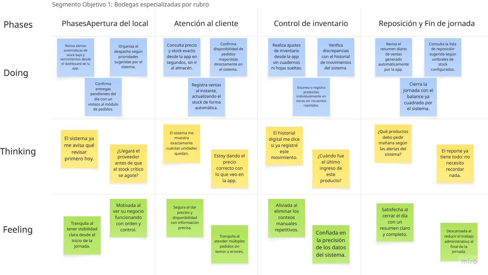
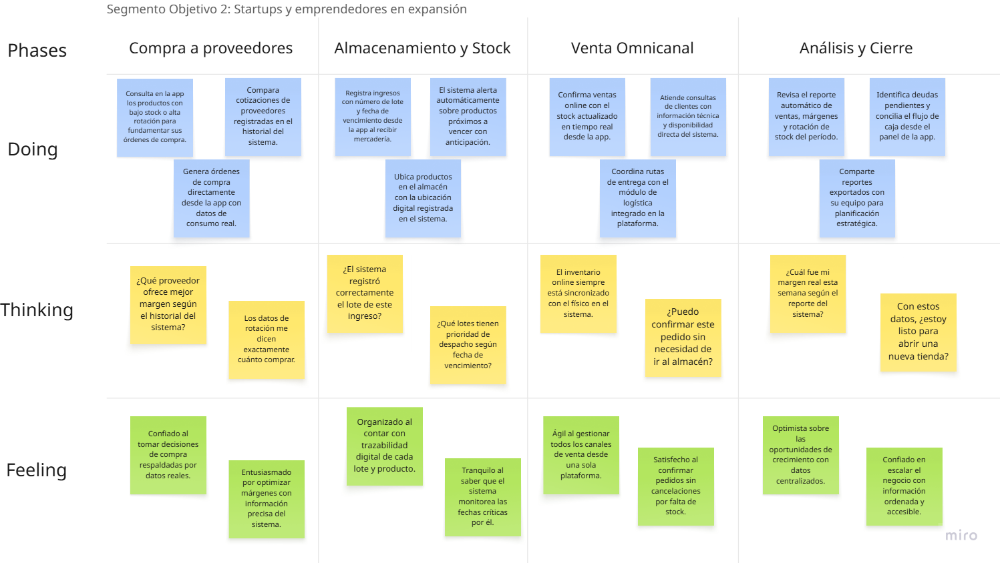

# Capítulo III: Requirements Specification

## 3.1. To-Be Scenario Mapping.

**Segmento 1: Bodegas especializadas por rubro:** En el siguiente escenario To-Be fue desarrollado a partir del análisis del escenario As-Is y la identificación de oportunidades de mejora para el perfil de Carla Rodríguez. Se proyectaron las principales fases que conforman el flujo de su trabajo diario como bodegas especializadas por rubro, incorporando las funcionalidades de la solución propuesta para optimizar sus procesos de apertura, atención al cliente, control de inventario y reposición.

    

**Segmento 2: Startups y emprendedores en expansión con necesidades logísticas:** En el siguiente escenario To-Be fue desarrollado a partir del análisis del escenario As-Is y la identificación de oportunidades de mejora para el perfil de Andrés Basurto. Se proyectaron las principales fases que conforman el flujo de su trabajo diario como startups y emprendedores en expansión, incorporando las funcionalidades de la solución propuesta para optimizar sus procesos de compra, almacenamiento, venta omnicanal y análisis de cierre.

    

## 3.2. User Stories

### User Stories

<table border="1" cellspacing="0" cellpadding="8" style="border-collapse:collapse; width:100%;">
    <tr>
        <th>Story ID</th>
        <th>User</th>
        <th>Priority</th>
        <th>Epic</th>
    </tr>
    <tr>
        <td align="center">US01</td>
        <td align="center">dueño de bodega</td>
        <td align="center">Alta</td>
        <td align="center">EP-04</td>
    </tr>
    <tr>
        <th>Title</th>
        <td colspan="3">Iniciar borrador de salida de productos</td>
    </tr>
    <tr>
        <th colspan="4">Description</th>
    </tr>
    <tr>
        <td colspan="4">
            <strong> Como </strong> dueño de bodega  
            <strong> Quiero </strong> iniciar un borrador de salida  
            <strong> Para </strong> agrupar ítems de una venta antes de confirmarla.
        </td>
    </tr>
    <tr>
        <th colspan="4">Acceptance Criteria</th>
    </tr>
    <tr>
        <td colspan="4">
            <strong> Escenario 1: Borrador creado</strong>   
            <strong> Dado que </strong> el usuario quiere registrar una venta  
            <strong> Cuando </strong> añade algún producto a la venta por registrar  
            <strong> Entonces </strong> el sistema crea un borrador con los productos añadidos a la salida de venta.
        </td>
    </tr>
</table>

<table border="1" cellspacing="0" cellpadding="8" style="border-collapse:collapse; width:100%;">
    <tr>
        <th>Story ID</th>
        <th>User</th>
        <th>Priority</th>
        <th>Epic</th>
    </tr>
    <tr>
        <td align="center">US02</td>
        <td align="center">dueño de bodega</td>
        <td align="center">Alta</td>
        <td align="center">EP-04</td>
    </tr>
    <tr>
        <th>Title</th>
        <td colspan="3">Gestionar ítems del borrador</td>
    </tr>
    <tr>
        <th colspan="4">Description</th>
    </tr>
    <tr>
        <td colspan="4">
            <strong> Como </strong> dueño de bodega  
            <strong> Quiero </strong> buscar productos y gestionar ítems  
            <strong> Para </strong> agregar, editar o retirar productos sin impactar el stock antes de la confirmación.
        </td>
    </tr>
    <tr>
        <th colspan="4">Acceptance Criteria</th>
    </tr>
    <tr>
        <td colspan="4">
            <strong> Escenario 1: Agregar ítem</strong>   
            <strong> Dado que </strong> el usuario tiene un borrador vacío  
            <strong> Cuando </strong> agrega un producto con cantidad > 0  
            <strong> Entonces </strong> el producto se añade al borrador y se recalculan subtotales.
              
            <strong> Escenario 2: Editar cantidad</strong>   
            <strong> Dado que </strong> el usuario quiere editar la cantidad de un ítem existente  
            <strong> Cuando </strong> cambia la cantidad a un valor válido (> 0)  
            <strong> Entonces </strong> el sistema actualiza el ítem y muestra el nuevo subtotal.
              
            <strong> Escenario 3: Retirar ítem</strong>   
            <strong> Dado que </strong> el usuario quiere retirar un ítem del borrador  
            <strong> Cuando </strong> retira el ítem del borrador  
            <strong> Entonces </strong> el ítem desaparece del borrador y se recalculan totales.
        </td>
    </tr>
</table>

<table border="1" cellspacing="0" cellpadding="8" style="border-collapse:collapse; width:100%;">
    <tr>
        <th>Story ID</th>
        <th>User</th>
        <th>Priority</th>
        <th>Epic</th>
    </tr>
    <tr>
        <td align="center">US03</td>
        <td align="center">dueño de bodega</td>
        <td align="center">Alta</td>
        <td align="center">EP-04</td>
    </tr>
    <tr>
        <th>Title</th>
        <td colspan="3">Confirmar salida de producto y descontar inventario</td>
    </tr>
    <tr>
        <th colspan="4">Description</th>
    </tr>
    <tr>
        <td colspan="4">
            <strong> Como </strong> dueño de bodega  
            <strong> Quiero </strong> confirmar la salida de un producto  
            <strong> Para </strong> registrar los movimientos de inventario y actualizar el stock disponible en tiempo real.
        </td>
    </tr>
    <tr>
        <th colspan="4">Acceptance Criteria</th>
    </tr>
    <tr>
        <td colspan="4">
            <strong> Escenario 1: Confirmación exitosa</strong>   
            <strong> Dado que </strong> el usuario tiene un borrador válido  
            <strong> Cuando </strong> confirma la salida  
            <strong> Entonces </strong> el sistema crea movimientos por ítem, decrementa el stock disponible y cambia el estado a confirmado.
              
            <strong> Escenario 2: Bloqueo por stock insuficiente</strong>   
            <strong> Dado que </strong> hay ítems sin stock suficiente  
            <strong> Cuando </strong> se intenta confirmar la salida  
            <strong> Entonces </strong> el sistema bloquea la acción y lista los productos faltantes.
              
            <strong> Escenario 3: Disparo de alertas</strong>   
            <strong> Dado que </strong> se confirma la salida  
            <strong> Cuando </strong> algún producto queda por debajo del umbral mínimo  
            <strong> Entonces </strong> el sistema genera una alerta de bajo stock.
        </td>
    </tr>
</table>

<table border="1" cellspacing="0" cellpadding="8" style="border-collapse:collapse; width:100%;">
    <tr>
        <th>Story ID</th>
        <th>User</th>
        <th>Priority</th>
        <th>Epic</th>
    </tr>
    <tr>
        <td align="center">US04</td>
        <td align="center">Dueño de bodega</td>
        <td align="center">Alta</td>
        <td align="center">EP-07</td>
    </tr>
    <tr>
        <th>Title</th>
        <td colspan="3">Generar reportes de estado de inventario</td>
    </tr>
    <tr>
        <th colspan="4">Description</th>
    </tr>
    <tr>
        <td colspan="4">
            <strong> Como </strong> dueño de bodega  
            <strong> Quiero </strong> emitir reportes dinámicos de mi inventario (stock actual, bajo stock y próximos a vencer)  
            <strong> Para </strong> tener visibilidad total del estado de mis productos y priorizar mis compras estratégicamente.
        </td>
    </tr>
    <tr>
        <th colspan="4">Acceptance Criteria</th>
    </tr>
    <tr>
        <td colspan="4">
            <strong> Escenario 1: Visualización del stock actual consolidado</strong>   
            <strong> Dado que </strong> el usuario accede al módulo de reportes de inventario  
            <strong> Cuando </strong> selecciona la vista general de "Stock Actual"  
            <strong> Entonces </strong> el sistema muestra una lista paginada de todos los productos con su cantidad disponible, categoría y valorización total.
              
            <strong> Escenario 2: Filtrado de productos con bajo stock</strong>   
            <strong> Dado que </strong> el usuario necesita planificar sus compras de reposición  
            <strong> Cuando </strong> aplica el filtro de "Bajo Stock" en el reporte  
            <strong> Entonces </strong> el sistema actualiza la vista para mostrar únicamente los productos cuya cantidad actual sea menor o igual a su umbral mínimo configurado.
              
            <strong> Escenario 3: Identificación de lotes próximos a vencer</strong>   
            <strong> Dado que </strong> el usuario desea evitar pérdidas por merma  
            <strong> Cuando </strong> aplica el filtro de "Próximos a Vencer"  
            <strong> Entonces </strong> el sistema lista los lotes ordenados por fecha de caducidad más próxima, resaltando visualmente aquellos que vencen en los próximos 30 días.
              
            <strong> Escenario 4: Exportación de datos</strong>   
            <strong> Dado que </strong> el usuario ha generado una vista específica del reporte (Stock General, Bajo Stock o Vencimientos)  
            <strong> Cuando </strong> hace clic en el botón de "Exportar"  
            <strong> Entonces </strong> el sistema genera y descarga un archivo (Excel o PDF) que contiene exactamente los datos mostrados en pantalla con sus respectivos filtros aplicados.
        </td>
    </tr>
</table>

<table border="1" cellspacing="0" cellpadding="8" style="border-collapse:collapse; width:100%;">
    <tr>
        <th>Story ID</th>
        <th>User</th>
        <th>Priority</th>
        <th>Epic</th>
    </tr>
    <tr>
        <td align="center">US05</td>
        <td align="center">Usuario</td>
        <td align="center">Media</td>
        <td align="center">EP-01</td>
    </tr>
    <tr>
        <th>Title</th>
        <td colspan="3">Notificaciones en el dashboard</td>
    </tr>
    <tr>
        <th colspan="4">Description</th>
    </tr>
    <tr>
        <td colspan="4">
            <strong> Como </strong> usuario  
            <strong> Quiero </strong> ver notificaciones en el dashboard  
            <strong> Para </strong> atender rápidamente situaciones críticas de inventario.
        </td>
    </tr>
    <tr>
        <th colspan="4">Acceptance Criteria</th>
    </tr>
    <tr>
        <td colspan="4">
            <strong> Escenario 1: Notificaciones de bajo stock</strong>   
            <strong> Dado que </strong> el usuario accede al sistema  
            <strong> Cuando </strong> existen productos con stock bajo  
            <strong> Entonces </strong> el sistema muestra una alerta destacada en el tablero principal.
              
            <strong> Escenario 2: Notificaciones de vencimiento</strong>   
            <strong> Dado que </strong> el usuario accede al sistema  
            <strong> Cuando </strong> hay lotes que vencen en los próximos 30 días  
            <strong> Entonces </strong> el sistema muestra una alerta indicando el riesgo de caducidad.
        </td>
    </tr>
</table>

<table border="1" cellspacing="0" cellpadding="8" style="border-collapse:collapse; width:100%;">
    <tr>
        <th>Story ID</th>
        <th>User</th>
        <th>Priority</th>
        <th>Epic</th>
    </tr>
    <tr>
        <td align="center">US06</td>
        <td align="center">Encargado de ventas</td>
        <td align="center">Alta</td>
        <td align="center">EP-01</td>
    </tr>
    <tr>
        <th>Title</th>
        <td colspan="3">Gestionar catálogo de productos</td>
    </tr>
    <tr>
        <th colspan="4">Description</th>
    </tr>
    <tr>
        <td colspan="4">
            <strong> Como </strong> encargado de ventas  
            <strong> Quiero </strong> gestionar el catálogo de productos (crear, editar e inhabilitar)  
            <strong> Para </strong> mantener un registro actualizado, corregir detalles técnicos y ocultar productos que ya no se venden sin perder su historial.
        </td>
    </tr>
    <tr>
        <th colspan="4">Acceptance Criteria</th>
    </tr>
    <tr>
        <td colspan="4">
            <strong> Escenario 1: Creación de un nuevo producto</strong>   
            <strong> Dado que </strong> el usuario necesita registrar un nuevo artículo  
            <strong> Cuando </strong> completa el formulario con datos válidos y guarda  
            <strong> Entonces </strong> el sistema añade el producto al catálogo y lo habilita para las operaciones de inventario.
              
            <strong> Escenario 2: Edición de un producto existente</strong>   
            <strong> Dado que </strong> la información de un producto debe ser actualizada (ej. precio o descripción)  
            <strong> Cuando </strong> el usuario modifica los campos permitidos y confirma los cambios  
            <strong> Entonces </strong> el sistema actualiza la ficha del producto, bloqueando la edición de campos críticos (como el ID/SKU).
              
            <strong> Escenario 3: Inhabilitación lógica (Soft-Delete)</strong>   
            <strong> Dado que </strong> un producto ya no será comercializado  
            <strong> Cuando </strong> el usuario selecciona la opción de desactivar o eliminar  
            <strong> Entonces </strong> el sistema cambia su estado a "inactivo", ocultándolo de nuevas ventas pero conservando su data para reportes históricos.
        </td>
    </tr>
</table>

<table border="1" cellspacing="0" cellpadding="8" style="border-collapse:collapse; width:100%;">
    <tr>
        <th>Story ID</th>
        <th>User</th>
        <th>Priority</th>
        <th>Epic</th>
    </tr>
    <tr>
        <td align="center">US07</td>
        <td align="center">Encargado de ventas</td>
        <td align="center">Alta</td>
        <td align="center">EP-01</td>
    </tr>
    <tr>
        <th>Title</th>
        <td colspan="3">Clasificación de productos por categoría</td>
    </tr>
    <tr>
        <th colspan="4">Description</th>
    </tr>
    <tr>
        <td colspan="4">
            <strong> Como </strong> encargado de ventas  
            <strong> Quiero </strong> asignar categorías a los productos  
            <strong> Para </strong> organizar el catálogo y agilizar los procesos de búsqueda.
        </td>
    </tr>
    <tr>
        <th colspan="4">Acceptance Criteria</th>
    </tr>
    <tr>
        <td colspan="4">
            <strong> Escenario 1: Clasificación válida</strong>   
            <strong> Dado que </strong> existe un maestro de categorías  
            <strong> Cuando </strong> el usuario asigna una categoría a un producto  
            <strong> Entonces </strong> el producto queda correctamente vinculado a dicha categoría.
              
            <strong> Escenario 2: Filtrado por categoría</strong>   
            <strong> Dado que </strong> existen productos en distintas categorías  
            <strong> Cuando </strong> se aplica un filtro específico  
            <strong> Entonces </strong> el sistema muestra únicamente los productos que pertenecen a la categoría seleccionada.
        </td>
    </tr>
</table>

<table border="1" cellspacing="0" cellpadding="8" style="border-collapse:collapse; width:100%;">
    <tr>
        <th>Story ID</th>
        <th>User</th>
        <th>Priority</th>
        <th>Epic</th>
    </tr>
    <tr>
        <td align="center">US08</td>
        <td align="center">Encargado de ventas</td>
        <td align="center">Alta</td>
        <td align="center">EP-01</td>
    </tr>
    <tr>
        <th>Title</th>
        <td colspan="3">Búsqueda y filtrado de productos</td>
    </tr>
    <tr>
        <th colspan="4">Description</th>
    </tr>
    <tr>
        <td colspan="4">
            <strong> Como </strong> encargado de ventas  
            <strong> Quiero </strong> buscar y filtrar productos  
            <strong> Para </strong> acceder rápidamente a la información necesaria para la toma de decisiones.
        </td>
    </tr>
    <tr>
        <th colspan="4">Acceptance Criteria</th>
    </tr>
    <tr>
        <td colspan="4">
            <strong> Escenario 1: Búsqueda parcial</strong>   
            <strong> Dado que </strong> existen productos registrados  
            <strong> Cuando </strong> se realiza una búsqueda por coincidencia parcial de nombre  
            <strong> Entonces </strong> el sistema lista todos los resultados que coincidan con la cadena ingresada.
              
            <strong> Escenario 2: Búsqueda combinada</strong>   
            <strong> Dado que </strong> se aplican múltiples filtros (categoría y estado)  
            <strong> Cuando </strong> se ejecuta la búsqueda  
            <strong> Entonces </strong> el sistema muestra solo los productos que cumplen simultáneamente con todas las condiciones.
        </td>
    </tr>
</table>

<table border="1" cellspacing="0" cellpadding="8" style="border-collapse:collapse; width:100%;">
    <tr>
        <th>Story ID</th>
        <th>User</th>
        <th>Priority</th>
        <th>Epic</th>
    </tr>
    <tr>
        <td align="center">US09</td>
        <td align="center">Visitante</td>
        <td align="center">Media</td>
        <td align="center">EP-09</td>
    </tr>
    <tr>
        <th>Title</th>
        <td colspan="3">Diseño responsive</td>
    </tr>
    <tr>
        <th colspan="4">Description</th>
    </tr>
    <tr>
        <td colspan="4">
            <strong> Como </strong> visitante  
            <strong> Quiero </strong> que la landing sea responsive  
            <strong> Para </strong> navegar cómodamente desde cualquier dispositivo móvil o tablet.
        </td>
    </tr>
    <tr>
        <th colspan="4">Acceptance Criteria</th>
    </tr>
    <tr>
        <td colspan="4">
            <strong> Escenario 1: Adaptación en móvil</strong>   
            <strong> Dado que </strong> el visitante accede desde un smartphone  
            <strong> Cuando </strong> carga la landing page  
            <strong> Entonces </strong> todos los elementos se ajustan proporcionalmente al ancho de la pantalla.
              
            <strong> Escenario 2: Adaptación en tablet</strong>   
            <strong> Dado que </strong> el visitante accede desde una tablet  
            <strong> Cuando </strong> navega por el sitio  
            <strong> Entonces </strong> el diseño mantiene la legibilidad y la estructura visual correcta.
        </td>
    </tr>
</table>

<table border="1" cellspacing="0" cellpadding="8" style="border-collapse:collapse; width:100%;">
    <tr>
        <th>Story ID</th>
        <th>User</th>
        <th>Priority</th>
        <th>Epic</th>
    </tr>
    <tr>
        <td align="center">US10</td>
        <td align="center">Encargado de ventas</td>
        <td align="center">Alta</td>
        <td align="center">EP-10</td>
    </tr>
    <tr>
        <th>Title</th>
        <td colspan="3">Asociar productos a proveedor</td>
    </tr>
    <tr>
        <th colspan="4">Description</th>
    </tr>
    <tr>
        <td colspan="4">
            <strong> Como </strong> encargado de ventas  
            <strong> Quiero </strong> vincular productos con sus proveedores  
            <strong> Para </strong> agilizar las reposiciones de stock y mejorar la trazabilidad de las compras.
        </td>
    </tr>
    <tr>
        <th colspan="4">Acceptance Criteria</th>
    </tr>
    <tr>
        <td colspan="4">
            <strong> Escenario 1: Asociación de producto</strong>   
            <strong> Dado que </strong> se está gestionando una reposición de inventario  
            <strong> Cuando </strong> se selecciona un producto para un proveedor específico  
            <strong> Entonces </strong> el sistema crea la relación y la almacena para consultas futuras.
              
            <strong> Escenario 2: Visualización de cartera de productos</strong>   
            <strong> Dado que </strong> un proveedor tiene productos asociados  
            <strong> Cuando </strong> el usuario consulta el detalle del proveedor  
            <strong> Entonces </strong> visualiza el listado completo de artículos que dicho proveedor suministra.
        </td>
    </tr>
</table>

<table border="1" cellspacing="0" cellpadding="8" style="border-collapse:collapse; width:100%;">
    <tr>
        <th>Story ID</th>
        <th>User</th>
        <th>Priority</th>
        <th>Epic</th>
    </tr>
    <tr>
        <td align="center">US11</td>
        <td align="center">Encargado de ventas</td>
        <td align="center">Media</td>
        <td align="center">EP-05</td>
    </tr>
    <tr>
        <th>Title</th>
        <td colspan="3">Definir composición de un kit</td>
    </tr>
    <tr>
        <th colspan="4">Description</th>
    </tr>
    <tr>
        <td colspan="4">
            <strong> Como </strong> encargado  
            <strong> Quiero </strong> definir la estructura de kits de productos  
            <strong> Para </strong> estandarizar las ofertas comerciales y paquetes promocionales.
        </td>
    </tr>
    <tr>
        <th colspan="4">Acceptance Criteria</th>
    </tr>
    <tr>
        <td colspan="4">
            <strong> Escenario 1: Creación de la definición</strong>   
            <strong> Dado que </strong> el usuario accede al módulo de kits  
            <strong> Cuando </strong> crea un nuevo kit agregando componentes y sus cantidades  
            <strong> Entonces </strong> el sistema almacena la definición del kit correctamente.
        </td>
    </tr>
</table>

<table border="1" cellspacing="0" cellpadding="8" style="border-collapse:collapse; width:100%;">
    <tr>
        <th>Story ID</th>
        <th>User</th>
        <th>Priority</th>
        <th>Epic</th>
    </tr>
    <tr>
        <td align="center">US12</td>
        <td align="center">Encargado de ventas</td>
        <td align="center">Alta</td>
        <td align="center">EP-06</td>
    </tr>
    <tr>
        <th>Title</th>
        <td colspan="3">Configurar umbrales de stock</td>
    </tr>
    <tr>
        <th colspan="4">Description</th>
    </tr>
    <tr>
        <td colspan="4">
            <strong> Como </strong> encargado de ventas  
            <strong> Quiero </strong> configurar umbrales mínimos de stock  
            <strong> Para </strong> que el sistema dispare alertas automáticas de reposición.
        </td>
    </tr>
    <tr>
        <th colspan="4">Acceptance Criteria</th>
    </tr>
    <tr>
        <td colspan="4">
            <strong> Escenario 1: Registro de umbral</strong>   
            <strong> Dado que </strong> se está registrando o editando un producto  
            <strong> Cuando </strong> se asigna un valor de stock mínimo  
            <strong> Entonces </strong> el sistema vincula ese parámetro al producto para monitorear sus saldos.
              
            <strong> Escenario 2: Edición de umbral</strong>   
            <strong> Dado que </strong> ya existe un umbral configurado  
            <strong> Cuando </strong> el usuario actualiza el valor y guarda  
            <strong> Entonces </strong> el sistema recalcula inmediatamente si debe mostrar alertas con el nuevo valor.
        </td>
    </tr>
</table>

<table border="1" cellspacing="0" cellpadding="8" style="border-collapse:collapse; width:100%;">
    <tr>
        <th>Story ID</th>
        <th>User</th>
        <th>Priority</th>
        <th>Epic</th>
    </tr>
    <tr>
        <td align="center">US13</td>
        <td align="center">Encargado de ventas</td>
        <td align="center">Alta</td>
        <td align="center">EP-06</td>
    </tr>
    <tr>
        <th>Title</th>
        <td colspan="3">Listar alertas pendientes</td>
    </tr>
    <tr>
        <th colspan="4">Description</th>
    </tr>
    <tr>
        <td colspan="4">
            <strong> Como </strong> encargado de ventas  
            <strong> Quiero </strong> visualizar un listado de alertas  
            <strong> Para </strong> priorizar las tareas de mantenimiento de inventario pendientes.
        </td>
    </tr>
    <tr>
        <th colspan="4">Acceptance Criteria</th>
    </tr>
    <tr>
        <td colspan="4">
            <strong> Escenario 1: Listado consolidado</strong>   
            <strong> Dado que </strong> existen alertas de bajo stock o vencimientos activas  
            <strong> Cuando </strong> el usuario accede al módulo de alertas  
            <strong> Entonces </strong> visualiza una tabla detallada con todas las situaciones pendientes de atención.
              
            <strong> Escenario 2: Sin alertas pendientes</strong>   
            <strong> Dado que </strong> no hay incidencias en el inventario  
            <strong> Cuando </strong> se consulta el listado  
            <strong> Entonces </strong> el sistema confirma que no existen alertas que requieran acción.
        </td>
    </tr>
</table>
<table border="1" cellspacing="0" cellpadding="8" style="border-collapse:collapse; width:100%;">
    <tr>
        <th>Story ID</th>
        <th>User</th>
        <th>Priority</th>
        <th>Epic</th>
    </tr>
    <tr>
        <td align="center">US14</td>
        <td align="center">Dueño de bodega</td>
        <td align="center">Alta</td>
        <td align="center">EP-02</td>
    </tr>
    <tr>
        <th>Title</th>
        <td colspan="3">Gestionar el ingreso de nuevos lotes</td>
    </tr>
    <tr>
        <th colspan="4">Description</th>
    </tr>
    <tr>
        <td colspan="4">
            <strong> Como </strong> dueño de bodega  
            <strong> Quiero </strong> registrar, visualizar y buscar los lotes ingresados  
            <strong> Para </strong> mantener un control del origen (proveedor), sumar el inventario y hacer trazabilidad de sus fechas de vencimiento.
        </td>
    </tr>
    <tr>
        <th colspan="4">Acceptance Criteria</th>
    </tr>
    <tr>
        <td colspan="4">
            <strong> Escenario 1: Registro de lote con vencimiento</strong>   
            <strong> Dado que </strong> el usuario recibe mercadería nueva  
            <strong> Cuando </strong> registra el ingreso asignando una cantidad, un proveedor y una fecha de caducidad  
            <strong> Entonces </strong> el sistema crea el lote, incrementa el stock del producto y guarda la fecha para futuras alertas.
              
            <strong> Escenario 2: Visualización de caducidad</strong>   
            <strong> Dado que </strong> se consulta el detalle del inventario  
            <strong> Cuando </strong> el usuario revisa los lotes vigentes  
            <strong> Entonces </strong> el sistema muestra claramente la fecha límite de consumo de cada unidad ingresada.
              
            <strong> Escenario 3: Filtro de auditoría por proveedor</strong>   
            <strong> Dado que </strong> se necesita revisar la mercadería suministrada por una empresa específica  
            <strong> Cuando </strong> se aplica el filtro por proveedor en la vista de lotes  
            <strong> Entonces </strong> el sistema lista únicamente los ingresos vinculados a ese socio comercial.
        </td>
    </tr>
</table>

### Spike Stories

<table border="1" cellspacing="0" cellpadding="8" style="border-collapse:collapse; width:100%;">
    <tr>
        <th>Story ID</th>
        <th>User</th>
        <th>Priority</th>
        <th>Epic</th>
    </tr>
    <tr>
        <td align="center">SP-01</td>
        <td align="center">Desarrollador</td>
        <td align="center">Alta</td>
        <td align="center">EP-08</td>
    </tr>
    <tr>
        <th>Title</th>
        <td colspan="3">Investigar implementación de JWT para autenticación segura</td>
    </tr>
    <tr>
        <th colspan="4">Description</th>
    </tr>
    <tr>
        <td colspan="4">
            <strong> Como </strong> desarrollador  
            <strong> Quiero </strong> investigar la implementación de JSON Web Tokens (JWT)  
            <strong> Para </strong> determinar la estrategia más segura de manejo de sesiones sin estado (stateless) en la plataforma.
        </td>
    </tr>
    <tr>
        <th colspan="4">Acceptance Criteria</th>
    </tr>
    <tr>
        <td colspan="4">
            <strong> Escenario 1: Evaluación de seguridad y flujo</strong>   
            <strong> Dado que </strong> se realiza la investigación sobre el estándar JWT  
            <strong> Cuando </strong> se evalúan los algoritmos de firma y el almacenamiento de tokens (Secure Cookies vs LocalStorage)  
            <strong> Entonces </strong> se presenta una propuesta técnica y un prototipo funcional que valide la generación y verificación de tokens.
        </td>
    </tr>
</table>

<table border="1" cellspacing="0" cellpadding="8" style="border-collapse:collapse; width:100%;">
    <tr>
        <th>Story ID</th>
        <th>User</th>
        <th>Priority</th>
        <th>Epic</th>
    </tr>
    <tr>
        <td align="center">SP-02</td>
        <td align="center">Desarrollador</td>
        <td align="center">Alta</td>
        <td align="center">EP-04</td>
    </tr>
    <tr>
        <th>Title</th>
        <td colspan="3">Investigar despliegue de backend en Railway</td>
    </tr>
    <tr>
        <th colspan="4">Description</th>
    </tr>
    <tr>
        <td colspan="4">
            <strong> Como </strong> desarrollador  
            <strong> Quiero </strong> investigar la plataforma Railway  
            <strong> Para </strong> evaluar su viabilidad como entorno de despliegue para el backend desarrollado en Spring Boot.
        </td>
    </tr>
    <tr>
        <th colspan="4">Acceptance Criteria</th>
    </tr>
    <tr>
        <td colspan="4">
            <strong> Escenario 1: Evaluación de CI/CD y conectividad</strong>   
            <strong> Dado que </strong> se investigan las capacidades de Railway  
            <strong> Cuando </strong> se realiza una prueba de despliegue conectando el repositorio de GitHub y la base de datos  
            <strong> Entonces </strong> se determina si la plataforma cumple con los requisitos de escalabilidad y facilidad de integración para el proyecto.
        </td>
    </tr>
</table>

<table border="1" cellspacing="0" cellpadding="8" style="border-collapse:collapse; width:100%;">
    <tr>
        <th>Story ID</th>
        <th>User</th>
        <th>Priority</th>
        <th>Epic</th>
    </tr>
    <tr>
        <td align="center">SP-03</td>
        <td align="center">Desarrollador</td>
        <td align="center">Alta</td>
        <td align="center">EP-09</td>
    </tr>
    <tr>
        <th>Title</th>
        <td colspan="3">Investigar despliegue de frontend en Vercel</td>
    </tr>
    <tr>
        <th colspan="4">Description</th>
    </tr>
    <tr>
        <td colspan="4">
            <strong> Como </strong> desarrollador  
            <strong> Quiero </strong> investigar el uso de Vercel para el despliegue del frontend  
            <strong> Para </strong> asegurar una entrega rápida de contenido y una integración continua eficiente con la landing page y la aplicación.
        </td>
    </tr>
    <tr>
        <th colspan="4">Acceptance Criteria</th>
    </tr>
    <tr>
        <td colspan="4">
            <strong> Escenario 1: Prototipo de despliegue en Vercel</strong>   
            <strong> Dado que </strong> se evalúa Vercel como hosting para el frontend  
            <strong> Cuando </strong> se configura el flujo de despliegue automático  
            <strong> Entonces </strong> se cuenta con una URL pública funcional y un reporte de optimización de carga.
        </td>
    </tr>
</table>

<table border="1" cellspacing="0" cellpadding="8" style="border-collapse:collapse; width:100%;">
    <tr>
        <th>Story ID</th>
        <th>User</th>
        <th>Priority</th>
        <th>Epic</th>
    </tr>
    <tr>
        <td align="center">SP-04</td>
        <td align="center">Desarrollador</td>
        <td align="center">Media</td>
        <td align="center">EP-07</td>
    </tr>
    <tr>
        <th>Title</th>
        <td colspan="3">Evaluar ExcelJS para exportación de reportes</td>
    </tr>
    <tr>
        <th colspan="4">Description</th>
    </tr>
    <tr>
        <td colspan="4">
            <strong> Como </strong> desarrollador  
            <strong> Quiero </strong> evaluar la librería ExcelJS  
            <strong> Para </strong> determinar su capacidad de generar archivos Excel con formato avanzado requeridos en los reportes operativos.
        </td>
    </tr>
    <tr>
        <th colspan="4">Acceptance Criteria</th>
    </tr>
    <tr>
        <td colspan="4">
            <strong> Escenario 1: Generación de archivo de prueba</strong>   
            <strong> Dado que </strong> se integra la librería ExcelJS en un entorno de desarrollo  
            <strong> Cuando </strong> se intenta exportar un conjunto de datos de stock con estilos básicos y celdas combinadas  
            <strong> Entonces </strong> se obtiene un archivo .xlsx válido que cumple con los requisitos visuales mínimos del negocio.
        </td>
    </tr>
</table>

### Epics

<table border="1" cellspacing="0" cellpadding="8" style="border-collapse:collapse; width:100%;">
  <thead>
    <tr>
      <th style="width:10%;">Epic ID</th>
      <th style="width:20%;">Título</th>
      <th style="width:55%;">Descripción</th>
      <th style="width:15%;">HUs asociadas</th>
    </tr>
  </thead>
  <tbody>   
    <tr>
      <td>EP-01</td>
      <td>Catálogo de Productos</td>
      <td>Como encargado de ventas, quiero crear y mantener el maestro de productos (nombre, UM, categoría, estado) y configurar umbrales de bajo stock, para asegurar datos consistentes y habilitar alertas útiles.</td>
      <td>US07, US09, US10, US11, US12</td>
    </tr>
    <tr>
      <td>EP-02</td>
      <td>Lotes y Vencimientos</td>
      <td>Como dueño de bodega, quiero gestionar lotes y asignar fechas de vencimiento aplicando políticas como FEFO, para garantizar trazabilidad y reducir mermas por caducidad.</td>
      <td>US25, US26, US27, US28</td>
    </tr>
    <tr>
      <td>EP-03</td>
      <td>Dashboard</td>
      <td>Como usuario, quiero acceder a un panel de control con métricas clave (productos próximos a vencer, stock bajo, rotación, alertas recientes), para tener una visión general y tomar decisiones rápidas..</td>
      <td>US08, US19</td>
    </tr>
    <tr>
      <td>EP-04</td>
      <td>Movimientos de Inventario</td>
      <td>Como dueño de bodega, quiero registrar de forma precisa todas las entradas (compras, ajustes) y salidas de productos, para mantener la exactitud del stock en tiempo real y tener una trazabilidad completa de cada movimiento.</td>
      <td>US01, US02, US03</td>
    </tr>
    <tr>
      <td>EP-05</td>
      <td>Kits</td>
      <td>Como encargado de ventas, quiero definir kits (combos) y agregarlos a la venta con desglose automático de componentes, para impactar correctamente el stock y el costo real.</td>
      <td>US20</td>
    </tr>
    <tr>
      <td>EP-06</td>
      <td>Alertas y Notificaciones</td>
      <td>Como dueño o encargado de ventas, quiero recibir alertas de bajo stock y próximos a vencer por canales externos simples (email, Telegram/Slack, push), para reponer a tiempo y evitar pérdidas.</td>
      <td>US21, US22</td>
    </tr>
    <tr>
      <td>EP-07</td>
      <td>Reportes Operativos</td>
      <td>Como dueño de bodega, quiero emitir reportes de stock a fecha (valorizado), rotación/ventas con utilidad, mermas/ajustes, con exportación a CSV/PDF/Sheets, para tomar decisiones y auditar.</td>
      <td>US04, US06</td>
    </tr>
    <tr>
      <td>EP-08</td>
      <td>Usuarios, Roles y Permisos</td>
      <td>Como dueño de bodega, quiero crear usuarios y asignar roles y permisos mínimos (dueño, encargado, dueño de bodega/supervisor), para controlar el acceso y resguardar operaciones clave.</td>
      <td>US29, US30, US31, US32, US33, US34</td>
    </tr>
    <tr>
      <td>EP-09</td>
      <td>Landing</td>
      <td>Como visitante, quiero visualizar una landing con propuesta de valor, funcionalidades y registro/contacto, para conocer StockTrack y convertirme en usuario.</td>
      <td>US13, US14, US15</td>
    </tr>
    <tr>
      <td>EP-10</td>
      <td>Proveedores</td>
      <td>Como encargado de ventas, quiero registrar, consultar, editar y eliminar proveedores, asociarlos a productos y gestionar datos de contacto, para asegurar un abastecimiento confiable y trazable.</td>
      <td>US16, US17, US18</td>
    </tr>
  </tbody>
</table>

### Technical stories

<table border="1" cellspacing="0" cellpadding="8" style="border-collapse:collapse; width:100%;">
    <tr>
        <th>Story ID</th>
        <th>User</th>
        <th>Priority</th>
        <th>Epic</th>
    </tr>
    <tr>
        <td align="center">TS01</td>
        <td align="center">Desarrollador</td>
        <td align="center">Alta</td>
        <td align="center">EP-08</td>
    </tr>
    <tr>
        <th>Title</th>
        <td colspan="3">Gestión de sesiones y tokens de autenticación</td>
    </tr>
    <tr>
        <th colspan="4">Description</th>
    </tr>
    <tr>
        <td colspan="4">
            <strong> Como </strong> desarrollador  
            <strong> Quiero </strong> implementar la gestión de tokens de autenticación  
            <strong> Para </strong> garantizar que las sesiones sean seguras, tengan un tiempo de vida definido y puedan ser invalidadas.
        </td>
    </tr>
    <tr>
        <th colspan="4">Acceptance Criteria</th>
    </tr>
    <tr>
        <td colspan="4">
            <strong> Escenario 1: Token emitido al autenticarse correctamente</strong>   
            <strong> Dado que </strong> un usuario envía credenciales válidas al sistema de autenticación  
            <strong> Cuando </strong> el sistema valida las credenciales  
            <strong> Entonces </strong> el sistema emite un token de acceso con tiempo de expiración definido y un token de refresco asociado a la sesión.
              
            <strong> Escenario 2: Solicitud con token expirado rechazada</strong>   
            <strong> Dado que </strong> un usuario realiza una solicitud a la plataforma con un token de acceso expirado  
            <strong> Cuando </strong> el sistema valida el token  
            <strong> Entonces </strong> el sistema rechaza la solicitud y devuelve una respuesta de sesión expirada.
              
            <strong> Escenario 3: Token de acceso renovado</strong>   
            <strong> Dado que </strong> un usuario autenticado tiene un token de acceso expirado y un token de refresco vigente  
            <strong> Cuando </strong> el cliente solicita la renovación de la sesión  
            <strong> Entonces </strong> el sistema emite un nuevo token de acceso y renueva el token de refresco.
              
            <strong> Escenario 4: Cierre de sesión</strong>   
            <strong> Dado que </strong> un usuario autenticado solicita cerrar sesión  
            <strong> Cuando </strong> el sistema procesa la salida  
            <strong> Entonces </strong> el sistema invalida los tokens activos de esa sesión y rechaza solicitudes posteriores.
        </td>
    </tr>
</table>

<table border="1" cellspacing="0" cellpadding="8" style="border-collapse:collapse; width:100%;">
    <tr>
        <th>Story ID</th>
        <th>User</th>
        <th>Priority</th>
        <th>Epic</th>
    </tr>
    <tr>
        <td align="center">TS02</td>
        <td align="center">Desarrollador</td>
        <td align="center">Alta</td>
        <td align="center">EP-01</td>
    </tr>
    <tr>
        <th>Title</th>
        <td colspan="3">Uso de Java springboot para desarrollar el backend</td>
    </tr>
    <tr>
        <th colspan="4">Description</th>
    </tr>
    <tr>
        <td colspan="4">
            <strong> Como </strong> desarrollador  
            <strong> Quiero </strong> emplear Java con el framework Spring Boot  
            <strong> Para </strong> construir el backend de la aplicación garantizando una arquitectura modular, escalable y eficiente.
        </td>
    </tr>
    <tr>
        <th colspan="4">Acceptance Criteria</th>
    </tr>
    <tr>
        <td colspan="4">
            <strong> Escenario 1: Implementación de arquitectura de capas</strong>   
            <strong> Dado que </strong> se inicia el desarrollo de un módulo funcional  
            <strong> Cuando </strong> se define la lógica de negocio  
            <strong> Entonces </strong> el sistema implementa el patrón de persistencia y servicios para asegurar la separación de responsabilidades.
              
            <strong> Escenario 2: Intercambio de datos</strong>   
            <strong> Dado que </strong> el frontend requiere consumir o enviar datos  
            <strong> Cuando </strong> se procesan las solicitudes de información  
            <strong> Entonces </strong> el sistema utiliza formato JSON y retorna las respuestas con los estados correspondientes.
              
            <strong> Escenario 3: Gestión de persistencia</strong>   
            <strong> Dado que </strong> la necesidad de interactuar con la base de datos  
            <strong> Cuando </strong> se define el modelo de datos  
            <strong> Entonces </strong> el sistema utiliza un mapeo objeto-relacional para asegurar transacciones consistentes.
        </td>
    </tr>
</table>

<table border="1" cellspacing="0" cellpadding="8" style="border-collapse:collapse; width:100%;">
    <tr>
        <th>Story ID</th>
        <th>User</th>
        <th>Priority</th>
        <th>Epic</th>
    </tr>
    <tr>
        <td align="center">TS03</td>
        <td align="center">Encargado</td>
        <td align="center">Alta</td>
        <td align="center">EP-05</td>
    </tr>
    <tr>
        <th>Title</th>
        <td colspan="3">Motor de kits (receta y costo)</td>
    </tr>
    <tr>
        <th colspan="4">Description</th>
    </tr>
    <tr>
        <td colspan="4">
            <strong> Como </strong> encargado  
            <strong> Quiero </strong> que el sistema desglose los kits en sus componentes  
            <strong> Para </strong> descontar el stock correctamente y calcular la utilidad basada en costos reales.
        </td>
    </tr>
    <tr>
        <th colspan="4">Acceptance Criteria</th>
    </tr>
    <tr>
        <td colspan="4">
            <strong> Escenario 1: Desglose automático</strong>   
            <strong> Dado que </strong> una salida confirmada incluye kits  
            <strong> Cuando </strong> el sistema procesa el movimiento de inventario  
            <strong> Entonces </strong> se genera un descuento individual por cada componente según la receta definida.
              
            <strong> Escenario 2: Cálculo de utilidad</strong>   
            <strong> Dado que </strong> una venta de kits con componentes con costos variables  
            <strong> Cuando </strong> se calcula el margen de ganancia  
            <strong> Entonces </strong> el sistema suma el costo de todos los componentes para determinar la utilidad global.
              
            <strong> Escenario 3: Validación de existencias</strong>   
            <strong> Dado que </strong> un componente del kit no tiene stock suficiente  
            <strong> Cuando </strong> se intenta realizar la salida  
            <strong> Entonces </strong> el sistema impide la operación y notifica el faltante.
        </td>
    </tr>
</table>

<table border="1" cellspacing="0" cellpadding="8" style="border-collapse:collapse; width:100%;">
    <tr>
        <th>Story ID</th>
        <th>User</th>
        <th>Priority</th>
        <th>Epic</th>
    </tr>
    <tr>
        <td align="center">TS04</td>
        <td align="center">Analista</td>
        <td align="center">Media</td>
        <td align="center">EP-03</td>
    </tr>
    <tr>
        <th>Title</th>
        <td colspan="3">Read models para KPIs/Reportes</td>
    </tr>
    <tr>
        <th colspan="4">Description</th>
    </tr>
    <tr>
        <td colspan="4">
            <strong> Como </strong> analista  
            <strong> Quiero </strong> modelos de lectura especializados para reportes  
            <strong> Para </strong> consultar indicadores de rendimiento sin afectar el rendimiento de la base de datos principal.
        </td>
    </tr>
    <tr>
        <th colspan="4">Acceptance Criteria</th>
    </tr>
    <tr>
        <td colspan="4">
            <strong> Escenario 1: Actualización de indicadores</strong>   
            <strong> Dado que </strong> ocurren movimientos de inventario  
            <strong> Cuando </strong> se solicita el estado del negocio  
            <strong> Entonces </strong> los modelos de lectura reflejan los nuevos saldos y métricas de forma optimizada.
              
            <strong> Escenario 2: Tiempo de respuesta</strong>   
            <strong> Dado que </strong> se solicita un reporte complejo  
            <strong> Cuando </strong> el sistema procesa la consulta  
            <strong> Entonces </strong> el resultado se entrega en un tiempo significativamente inferior a la consulta transaccional.
        </td>
    </tr>
</table>

<table border="1" cellspacing="0" cellpadding="8" style="border-collapse:collapse; width:100%;">
    <tr>
        <th>Story ID</th>
        <th>User</th>
        <th>Priority</th>
        <th>Epic</th>
    </tr>
    <tr>
        <td align="center">TS05</td>
        <td align="center">Desarrollador</td>
        <td align="center">Alta</td>
        <td align="center">EP-01</td>
    </tr>
    <tr>
        <th>Title</th>
        <td colspan="3">Endpoints para la gestión de productos</td>
    </tr>
    <tr>
        <th colspan="4">Description</th>
    </tr>
    <tr>
        <td colspan="4">
            <strong> Como </strong> desarrollador  
            <strong> Quiero </strong> implementar un servicio para gestionar el catálogo de productos  
            <strong> Para </strong> permitir operaciones de mantenimiento y consulta de inventario.
        </td>
    </tr>
    <tr>
        <th colspan="4">Acceptance Criteria</th>
    </tr>
    <tr>
        <td colspan="4">
            <strong> Escenario 1: Consulta de productos</strong>   
            <strong> Dado que </strong> existen productos registrados  
            <strong> Cuando </strong> se solicita la información del catálogo  
            <strong> Entonces </strong> el sistema devuelve el listado con los detalles correspondientes.
              
            <strong> Escenario 2: Actualización de datos</strong>   
            <strong> Dado que </strong> se cuenta con un producto existente  
            <strong> Cuando </strong> se solicita modificar su información  
            <strong> Entonces </strong> el sistema guarda los cambios y responde con el objeto actualizado.
        </td>
    </tr>
</table>

<table border="1" cellspacing="0" cellpadding="8" style="border-collapse:collapse; width:100%;">
    <tr>
        <th>Story ID</th>
        <th>User</th>
        <th>Priority</th>
        <th>Epic</th>
    </tr>
    <tr>
        <td align="center">TS06</td>
        <td align="center">Desarrollador</td>
        <td align="center">Alta</td>
        <td align="center">EP-08</td>
    </tr>
    <tr>
        <th>Title</th>
        <td colspan="3">Endpoints de Autenticación</td>
    </tr>
    <tr>
        <th colspan="4">Description</th>
    </tr>
    <tr>
        <td colspan="4">
            <strong> Como </strong> desarrollador  
            <strong> Quiero </strong> exponer servicios de autenticación  
            <strong> Para </strong> permitir el acceso seguro y controlado de los usuarios a la plataforma.
        </td>
    </tr>
    <tr>
        <th colspan="4">Acceptance Criteria</th>
    </tr>
    <tr>
        <td colspan="4">
            <strong> Escenario 1: Registro de cuenta</strong>   
            <strong> Dado que </strong> un nuevo usuario ingresa datos válidos  
            <strong> Cuando </strong> se procesa su registro  
            <strong> Entonces </strong> se crea su perfil y el sistema confirma la operación satisfactoria.
        </td>
    </tr>
</table>

<table border="1" cellspacing="0" cellpadding="8" style="border-collapse:collapse; width:100%;">
    <tr>
        <th>Story ID</th>
        <th>User</th>
        <th>Priority</th>
        <th>Epic</th>
    </tr>
    <tr>
        <td align="center">TS07</td>
        <td align="center">Desarrollador</td>
        <td align="center">Alta</td>
        <td align="center">EP-03</td>
    </tr>
    <tr>
        <th>Title</th>
        <td colspan="3">Endpoint de Dashboard</td>
    </tr>
    <tr>
        <th colspan="4">Description</th>
    </tr>
    <tr>
        <td colspan="4">
            <strong> Como </strong> desarrollador  
            <strong> Quiero </strong> implementar un servicio de resumen estadístico  
            <strong> Para </strong> proveer métricas clave en una sola consulta al tablero principal.
        </td>
    </tr>
    <tr>
        <th colspan="4">Acceptance Criteria</th>
    </tr>
    <tr>
        <td colspan="4">
            <strong> Escenario 1: Obtención de indicadores</strong>   
            <strong> Dado que </strong> un usuario está debidamente autenticado  
            <strong> Cuando </strong> carga el dashboard  
            <strong> Entonces </strong> el sistema provee un resumen consolidado de stock, ventas y alertas.
        </td>
    </tr>
</table>

<table border="1" cellspacing="0" cellpadding="8" style="border-collapse:collapse; width:100%;">
    <tr>
        <th>Story ID</th>
        <th>User</th>
        <th>Priority</th>
        <th>Epic</th>
    </tr>
    <tr>
        <td align="center">TS08</td>
        <td align="center">Desarrollador</td>
        <td align="center">Alta</td>
        <td align="center">EP-04</td>
    </tr>
    <tr>
        <th>Title</th>
        <td colspan="3">Endpoints de Gestión de Ventas</td>
    </tr>
    <tr>
        <th colspan="4">Description</th>
    </tr>
    <tr>
        <td colspan="4">
            <strong> Como </strong> desarrollador  
            <strong> Quiero </strong> implementar servicios transaccionales  
            <strong> Para </strong> registrar ventas y permitir la trazabilidad de las operaciones comerciales.
        </td>
    </tr>
    <tr>
        <th colspan="4">Acceptance Criteria</th>
    </tr>
    <tr>
        <td colspan="4">
            <strong> Escenario 1: Registro de operación</strong>   
            <strong> Dado que </strong> se ha confirmado una venta con productos válidos  
            <strong> Cuando </strong> se procesa la transacción  
            <strong> Entonces </strong> el sistema almacena el registro histórico y actualiza los saldos de inventario.
        </td>
    </tr>
</table>

<table border="1" cellspacing="0" cellpadding="8" style="border-collapse:collapse; width:100%;">
    <tr>
        <th>Story ID</th>
        <th>User</th>
        <th>Priority</th>
        <th>Epic</th>
    </tr>
    <tr>
        <td align="center">TS09</td>
        <td align="center">Desarrollador</td>
        <td align="center">Alta</td>
        <td align="center">EP-10</td>
    </tr>
    <tr>
        <th>Title</th>
        <td colspan="3">Endpoints para la gestión de proveedores</td>
    </tr>
    <tr>
        <th colspan="4">Description</th>
    </tr>
    <tr>
        <td colspan="4">
            <strong> Como </strong> desarrollador  
            <strong> Quiero </strong> implementar servicios de gestión de abastecedores  
            <strong> Para </strong> centralizar y administrar la base de datos de proveedores del negocio.
        </td>
    </tr>
    <tr>
        <th colspan="4">Acceptance Criteria</th>
    </tr>
    <tr>
        <td colspan="4">
            <strong> Escenario 1: Actualización de proveedor</strong>   
            <strong> Dado que </strong> un proveedor ya existe en el sistema  
            <strong> Cuando </strong> se envían datos actualizados  
            <strong> Entonces </strong> el sistema guarda los cambios y valida que no se dupliquen identificadores únicos.
        </td>
    </tr>
</table>

<table border="1" cellspacing="0" cellpadding="8" style="border-collapse:collapse; width:100%;">
    <tr>
        <th>Story ID</th>
        <th>User</th>
        <th>Priority</th>
        <th>Epic</th>
    </tr>
    <tr>
        <td align="center">TS10</td>
        <td align="center">Desarrollador</td>
        <td align="center">Alta</td>
        <td align="center">EP-02</td>
    </tr>
    <tr>
        <th>Title</th>
        <td colspan="3">Endpoints para la gestión de lotes (Batches)</td>
    </tr>
    <tr>
        <th colspan="4">Description</th>
    </tr>
    <tr>
        <td colspan="4">
            <strong> Como </strong> desarrollador  
            <strong> Quiero </strong> implementar servicios de control de lotes  
            <strong> Para </strong> gestionar la trazabilidad de entrada y caducidad de cada unidad de inventario.
        </td>
    </tr>
    <tr>
        <th colspan="4">Acceptance Criteria</th>
    </tr>
    <tr>
        <td colspan="4">
            <strong> Escenario 1: Registro de nuevo lote</strong>   
            <strong> Dado que </strong> ingresa mercadería con fecha de vencimiento  
            <strong> Cuando </strong> se solicita la creación del lote  
            <strong> Entonces </strong> el sistema incrementa el stock disponible y asocia el vencimiento al registro.
        </td>
    </tr>
</table>

<table border="1" cellspacing="0" cellpadding="8" style="border-collapse:collapse; width:100%;">
    <tr>
        <th>Story ID</th>
        <th>User</th>
        <th>Priority</th>
        <th>Epic</th>
    </tr>
    <tr>
        <td align="center">TS11</td>
        <td align="center">Desarrollador</td>
        <td align="center">Alta</td>
        <td align="center">EP-08</td>
    </tr>
    <tr>
        <th>Title</th>
        <td colspan="3">Endpoints de Permisos</td>
    </tr>
    <tr>
        <th colspan="4">Description</th>
    </tr>
    <tr>
        <td colspan="4">
            <strong> Como </strong> desarrollador  
            <strong> Quiero </strong> implementar servicios de autorización granular  
            <strong> Para </strong> controlar las acciones habilitadas según las facultades de cada usuario.
        </td>
    </tr>
    <tr>
        <th colspan="4">Acceptance Criteria</th>
    </tr>
    <tr>
        <td colspan="4">
            <strong> Escenario 1: Consulta de facultades</strong>   
            <strong> Dado que </strong> un usuario tiene un rol asignado  
            <strong> Cuando </strong> el sistema verifica sus capacidades  
            <strong> Entonces </strong> se retorna el listado de acciones permitidas para dicho perfil.
        </td>
    </tr>
</table>

<table border="1" cellspacing="0" cellpadding="8" style="border-collapse:collapse; width:100%;">
    <tr>
        <th>Story ID</th>
        <th>User</th>
        <th>Priority</th>
        <th>Epic</th>
    </tr>
    <tr>
        <td align="center">TS12</td>
        <td align="center">Desarrollador</td>
        <td align="center">Alta</td>
        <td align="center">EP-08</td>
    </tr>
    <tr>
        <th>Title</th>
        <td colspan="3">Endpoints de Gestión de Usuarios</td>
    </tr>
    <tr>
        <th colspan="4">Description</th>
    </tr>
    <tr>
        <td colspan="4">
            <strong> Como </strong> desarrollador  
            <strong> Quiero </strong> implementar servicios de administración de personal  
            <strong> Para </strong> gestionar las cuentas de acceso y la seguridad de la información.
        </td>
    </tr>
    <tr>
        <th colspan="4">Acceptance Criteria</th>
    </tr>
    <tr>
        <td colspan="4">
            <strong> Escenario 1: Baja de cuenta</strong>   
            <strong> Dado que </strong> un usuario deja de pertenecer a la operación  
            <strong> Cuando </strong> se solicita su eliminación  
            <strong> Entonces </strong> el sistema inhabilita su acceso conservando la integridad de los datos históricos.
        </td>
    </tr>
</table>

<table border="1" cellspacing="0" cellpadding="8" style="border-collapse:collapse; width:100%;">
    <tr>
        <th>Story ID</th>
        <th>User</th>
        <th>Priority</th>
        <th>Epic</th>
    </tr>
    <tr>
        <td align="center">TS13</td>
        <td align="center">Desarrollador</td>
        <td align="center">Alta</td>
        <td align="center">EP-01</td>
    </tr>
    <tr>
        <th>Title</th>
        <td colspan="3">Endpoints de Categorías</td>
    </tr>
    <tr>
        <th colspan="4">Description</th>
    </tr>
    <tr>
        <td colspan="4">
            <strong> Como </strong> desarrollador  
            <strong> Quiero </strong> implementar servicios de clasificación  
            <strong> Para </strong> organizar el catálogo de productos bajo una estructura taxonómica lógica.
        </td>
    </tr>
    <tr>
        <th colspan="4">Acceptance Criteria</th>
    </tr>
    <tr>
        <td colspan="4">
            <strong> Escenario 1: Creación de categoría</strong>   
            <strong> Dado que </strong> se requiere una nueva clasificación  
            <strong> Cuando </strong> se solicita su registro  
            <strong> Entonces </strong> la categoría queda inmediatamente disponible para ser asociada a productos.
        </td>
    </tr>
</table>

<table border="1" cellspacing="0" cellpadding="8" style="border-collapse:collapse; width:100%;">
    <tr>
        <th>Story ID</th>
        <th>User</th>
        <th>Priority</th>
        <th>Epic</th>
    </tr>
    <tr>
        <td align="center">TS14</td>
        <td align="center">Desarrollador</td>
        <td align="center">Alta</td>
        <td align="center">EP-05</td>
    </tr>
    <tr>
        <th>Title</th>
        <td colspan="3">Endpoints de Kits (Combos)</td>
    </tr>
    <tr>
        <th colspan="4">Description</th>
    </tr>
    <tr>
        <td colspan="4">
            <strong> Como </strong> desarrollador  
            <strong> Quiero </strong> implementar servicios de composición de ofertas  
            <strong> Para </strong> gestionar agrupaciones de productos con lógica de inventario vinculada.
        </td>
    </tr>
    <tr>
        <th colspan="4">Acceptance Criteria</th>
    </tr>
    <tr>
        <td colspan="4">
            <strong> Escenario 1: Definición de paquete comercial</strong>   
            <strong> Dado que </strong> se establecen componentes y cantidades para un kit  
            <strong> Cuando </strong> se guarda la configuración  
            <strong> Entonces </strong> el sistema registra la estructura para su uso en los procesos de venta y ensamble.
        </td>
    </tr>
</table>

## 3.3. Product Backlog

| # Orden | User Story Id | Título | Descripción | Story Points |
| :------ | :------------ | :----- | :---------- | :----------- |
| **01** | US06 | Gestionar catálogo de productos | Como encargado de ventas, quiero gestionar el catálogo de productos (crear, editar e inhabilitar) para mantener un registro actualizado, corregir detalles técnicos y ocultar productos que ya no se venden sin perder su historial. | 3 |
| **02** | US07 | Clasificación de productos por categoría | Como encargado de ventas, quiero asignar categorías a los productos para organizar el catálogo y agilizar los procesos de búsqueda. | 2 |
| **03** | US08 | Búsqueda y filtrado de productos | Como encargado de ventas, quiero buscar y filtrar productos para acceder rápidamente a la información necesaria para la toma de decisiones. | 2 |
| **04** | US10 | Asociar productos a proveedor | Como encargado de ventas, quiero vincular productos con sus proveedores para agilizar las reposiciones de stock y mejorar la trazabilidad de las compras. | 5 |
| **05** | US14 | Gestionar el ingreso de nuevos lotes | Como dueño de bodega, quiero registrar, visualizar y buscar los lotes ingresados para mantener un control del origen (proveedor), sumar el inventario y hacer trazabilidad de sus fechas de vencimiento. | 4 |
| **06** | US01 | Iniciar borrador de salida de productos | Como dueño de bodega, quiero iniciar un borrador de salida para agrupar ítems de una venta antes de confirmarla. | 2 |
| **07** | US02 | Gestionar ítems del borrador | Como dueño de bodega, quiero buscar productos y gestionar ítems para agregar, editar o retirar productos sin impactar el stock antes de la confirmación. | 2 |
| **08** | US03 | Confirmar salida de producto y descontar inventario | Como dueño de bodega, quiero confirmar la salida de un producto para registrar los movimientos de inventario y actualizar el stock disponible en tiempo real. | 3 |
| **09** | US12 | Configurar umbrales de stock | Como encargado de ventas, quiero configurar umbrales mínimos de stock para que el sistema dispare alertas automáticas de reposición. | 3 |
| **10** | US05 | Notificaciones en el dashboard | Como usuario, quiero ver notificaciones en el dashboard para atender rápidamente situaciones críticas de inventario. | 3 |
| **11** | US13 | Listar alertas pendientes | Como encargado de ventas, quiero visualizar un listado de alertas para priorizar las tareas de mantenimiento de inventario pendientes. | 2 |
| **12** | US04 | Generar reportes de estado de inventario | Como dueño de bodega, quiero emitir reportes dinámicos de mi inventario (stock actual, bajo stock y próximos a vencer) para tener visibilidad total del estado de mis productos y priorizar mis compras estratégicamente. | 5 |
| **13** | US11 | Definir composición de un kit | Como encargado, quiero definir la estructura de kits de productos para estandarizar las ofertas comerciales y paquetes promocionales. | 3 |
| **14** | US09 | Diseño responsive | Como visitante, quiero que la landing sea responsive para navegar cómodamente desde cualquier dispositivo móvil o tablet. | 2 |

## 3.4. Impact Mapping

A continuación se visualiza el **Impact Map** del proyecto **Inventiapp**, donde se muestra la relación entre el *Business Goal* definido, los **User Personas** identificados, los **Impactos** esperados en su comportamiento, los **Deliverables** que como negocio digital podemos ofrecer y las **User Stories** asociadas que permitirán implementar las funcionalidades necesarias en la aplicación web y la landing page. Este mapa busca asegurar la alineación entre los objetivos estratégicos y el desarrollo de la solución digital.

  

