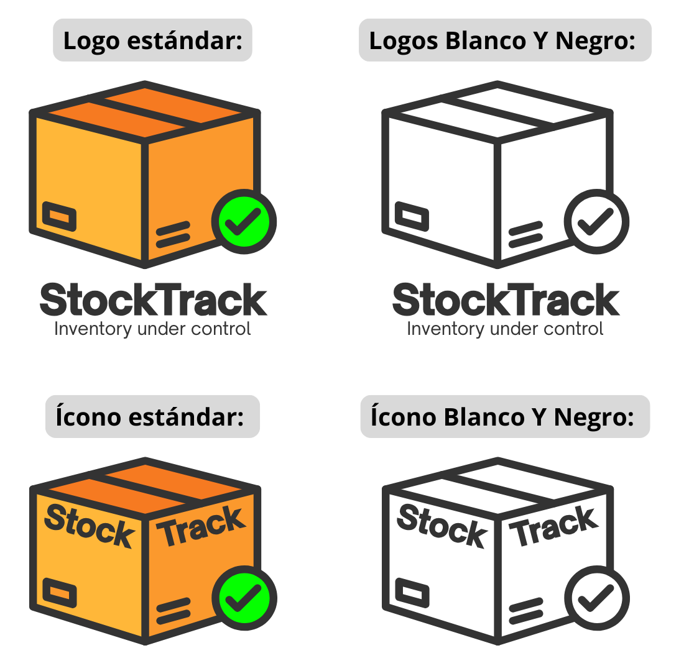
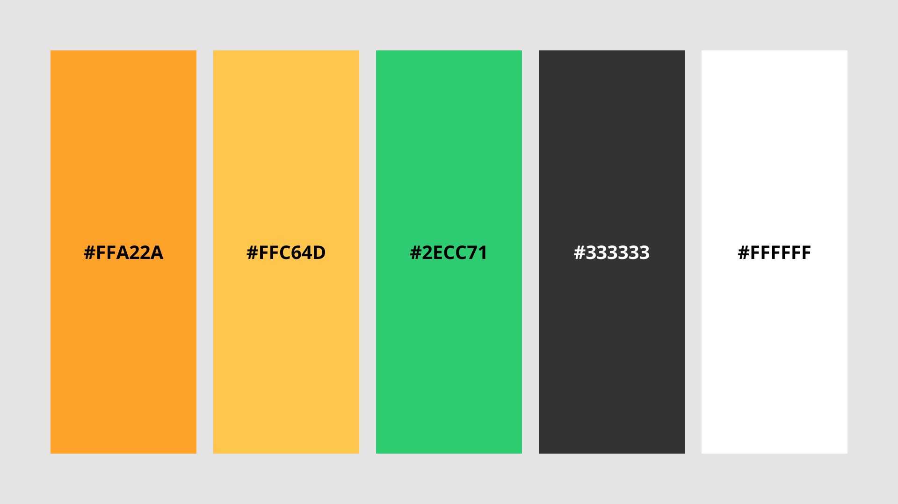
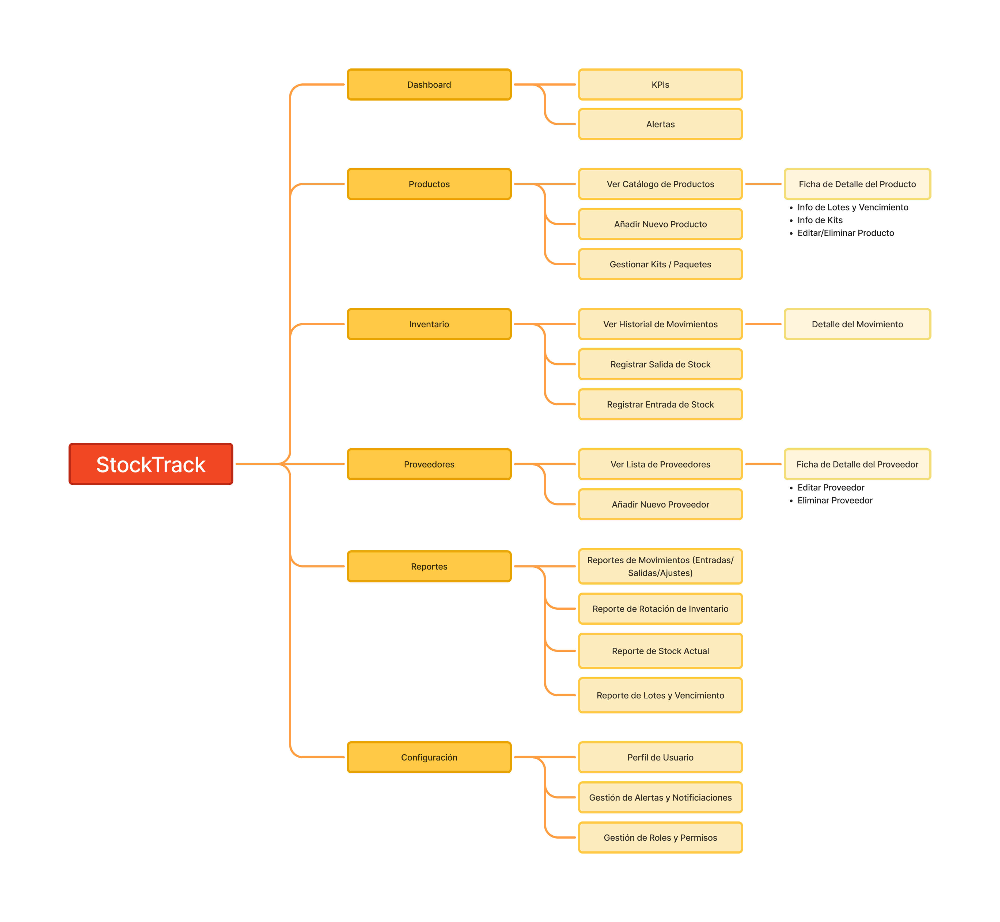
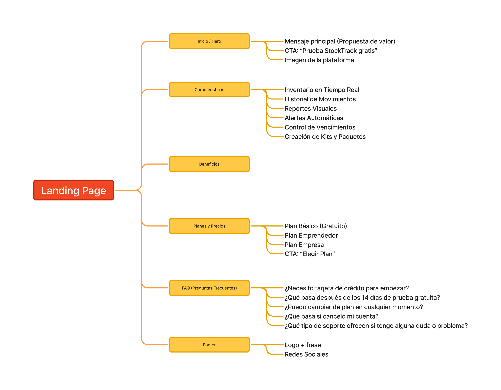

# Capítulo IV: Product Design

## 4.1. Style Guidelines.
### 4.1.1. General Style Guidelines.

**Branding**

Para nuestro logo, hemos implementado símbolos que reflejan el propósito central de StockTrack: la gestión eficiente y confiable del inventario. El logo de StockTrack proyecta una identidad sólida y práctica, alineada con su misión de brindar una solución tecnológica sencilla pero poderosa para la gestión de inventarios.

La caja representa de manera clara y universal el concepto de mercancía, almacenaje y stock, siendo el núcleo del negocio de bodegas y almacenes. El check verde simboliza control, seguridad y validación, transmitiendo la idea de que los productos están siempre bajo seguimiento y en orden.

El conjunto visual comunica simplicidad, confiabilidad y modernidad, reforzando el objetivo de StockTrack de ayudar a las bodegas a mantener su inventario bajo control, reducir errores y optimizar procesos.

La paleta de colores combina tonos cálidos (naranja/amarillo) que evocan dinamismo, accesibilidad y cercanía con el usuario, junto con un verde que transmite seguridad, éxito y confianza.

**Tipografía**

- **Fuente principal:**
Nuestra fuente principal es Open Sauce, la cual aporta un estilo sólido y moderno que transmite fuerza, confiabilidad y profesionalismo. Perfecta para logotipos y títulos de alta relevancia, esta tipografía está diseñada para proyectar claridad y autoridad visual. Uso exclusivamente para el logo y títulos principales. Estilo: Mayúsculas, Bold, tamaño 64px.

- **Fuente secundaria:**
La fuente secundaria utilizada es Roboto, la cual aporta legibilidad y neutralidad en interfaces digitales. Su estilo limpio y curvo facilita la lectura continua en pantallas, ideal para textos extensos, descripciones y datos de inventario. Uso en párrafos, subtítulos, descripciones y etiquetas dentro de la aplicación.

- **Jerarquía tipográfica:**
Tamaño variable según jerarquía de texto (H1: títulos principales (32px, bold), H2: subtítulos (24px, semibold), Párrafos: 16px, regular, Notas/etiquetas: 12px). Asegura una visualización cómoda y ordenada.

**Colores**

La paleta de colores de StockTrack fue diseñada para transmitir energía, confianza y control en la gestión de inventarios.

- **Colores principales:** Naranja (#FFA22A): Representa dinamismo, accesibilidad y cercanía con el usuario evocando movimiento y acción. Amarillo (#FFC64D): Simboliza optimismo y rapidez, reforzando la idea de eficiencia en procesos. Se emplean como colores principales en el logo y en elementos destacados de la interfaz (botones de acción, iconografía principal). Verde (#2ECC71): Asociado al éxito, la validación y la seguridad. Refuerza el concepto de control y precisión en el stock, se reserva para estados positivos, alertas de stock correcto o validaciones (check, confirmaciones).

- **Colores secundarios:** Gris oscuro (#333333): Usado en tipografía y detalles, transmite seriedad y profesionalismo. Blanco (#FFFFFF): Representa simplicidad y claridad visual. Conforman la base de la tipografía y fondos, asegurando contraste y legibilidad en cualquier dispositivo.

**Spacing**

El espaciado juega un rol fundamental en la experiencia de usuario, asegurando legibilidad, orden y consistencia visual en todas las interfaces de StockTrack. Hemos definido un sistema de espaciado que será utilizado en la aplicación web.

| Elemento | Peso | Tamaño | Line height | Notas |
| :--- | :--- | :--- | :--- | :--- |
| **H1 (títulos)** | Bold 700 | 48px | 110% – 120% | Espaciado adicional de +0.5px para mayor impacto visual. |
| **H2 – H3 (secciones)** | Semi-Bold 600 | 32px – 40px | 120% – 130% | Claridad visual, adecuado para encabezados intermedios. |
| **H4 – H5 (subtítulos)** | Medium 500 | 24px | 130% – 140% | Transiciones suaves entre secciones y subsecciones. |
| **Body text (texto principal)** | Regular 400 | 16px – 18px | 150% – 160% | Legible y cómodo para párrafos largos. |
| **Botones / CTAs** | Semi-Bold 600 | 16px | 120% | Uso de mayúsculas opcionales para dar fuerza visual. |

**Tono de comunicación**

- Lenguaje: Claro, cercano y profesional.
- Formal/Casual: Casual, pero con respeto hacia los usuarios.
- Divertido/Serio: Equilibrio entre serio y entusiasta.
- Respetuoso/Irreverente: Respetuoso con un toque de humor ligero cuando sea apropiado.
- Entusiasta/Sereno: Entusiasta, motivando a los usuarios a participar en debates y predicciones.

### 4.1.2. Web Style Guidelines.

**DISEÑO RESPONSIVE:**
- El diseño se adaptará automáticamente al tamaño de la pantalla.

**COMPONENTES VISUALES:**
- Botones: Redondeados con 10px de radio. Cambian de color y tienen un efecto de sombra al usarse.
- Formularios: Cajas de texto con bordes suaves y sombreados ligeros, 40px. de alto.
- Links: En azul (#0000FF), subrayado. Subrayado, con color de cambio a azul oscuro (#00008E).
- Navegación: Menú superior: Con enlaces a las principales secciones.

## 4.2. Information Architecture.
En esta sección se detallará parte importante de la estructura y etiquetado de la aplicación web.

### 4.2.1. Organization Systems.
**Jerarquía del sistema de organización de la aplicación web**

**Jerarquía del sistema de organización de la landing page**

### 4.2.2. Labeling Systems.
En esta sección se especifica el conjunto de etiquetas que se utilizarán para representar la información y las acciones dentro de la plataforma StockTrack. El objetivo de este sistema de etiquetado es garantizar la simplicidad, evitar la confusión y presentar los datos de manera consistente para nuestros usuarios.

**1. Etiquetas de Navegación Principal**
Representan las secciones principales de la aplicación y se ubicarán en el menú de navegación principal.

| Etiqueta | Uso / Contexto | Propósito / Justificación |
| :--- | :--- | :--- |
| **Dashboard** | Enlace en el menú principal. | Accede al panel de control principal. |
| **Productos** | Enlace en el menú principal. | Dirige a la sección de gestión del catálogo de productos. |
| **Inventario** | Enlace en el menú principal. | Accede a las funciones de movimientos de stock. |
| **Proveedores** | Enlace en el menú principal. | Dirige a la gestión de la lista de proveedores. |
| **Reportes** | Enlace en el menú principal. | Accede a la sección de análisis y visualización de datos. |
| **Configuración** | Enlace en el menú principal. | Dirige a los ajustes de la cuenta, usuarios y alertas. |

**2. Etiquetas de Acciones (Botones y Enlaces)**
Indican acciones que el usuario puede realizar. Son verbos o frases cortas que comunican un resultado claro.

| Etiqueta | Uso / Contexto | Propósito / Justificación |
| :--- | :--- | :--- |
| **Añadir Nuevo** | Botón principal en secciones como Productos y Proveedores. | Inicia el proceso de creación de un nuevo elemento. |
| **Guardar** | Botón para confirmar cambios en un formulario. | Acción estándar para persistir datos. |
| **Cancelar** | Botón o enlace para descartar una acción. | Acción estándar para anular un proceso sin guardar cambios. |
| **Editar** | Botón o ícono en listas y páginas de detalle. | Permite modificar la información de un elemento existente. |
| **Eliminar** | Botón o ícono para borrar un elemento. | Acción destructiva, claramente etiquetada. |
| **Exportar** | Botón en la sección de Reportes y listas. | Permite al usuario descargar los datos. |
| **Registrar Entrada** | Botón en la sección de Inventario. | Inicia el flujo para añadir stock de un producto. |
| **Registrar Salida** | Botón en la sección de Inventario. | Inicia el flujo para reducir stock. |

**3. Etiquetas de Estatus y Alertas**
Comunican el estado actual de un producto o un proceso, acompañadas de un color.

| Etiqueta | Uso / Contexto | Propósito / Justificación |
| :--- | :--- | :--- |
| **En Stock** | Indicador de estado en la lista de productos (Verde). | Nivel de stock por encima del mínimo definido. |
| **Stock Bajo** | Indicador de estado (Naranja). | Alerta de que un producto ha alcanzado su nivel mínimo. |
| **Agotado** | Indicador de estado (Rojo). | Informa que no hay unidades disponibles. |
| **Próximo a Vencer** | Etiqueta en reportes (Naranja/Rojo). | Alerta sobre productos cuya fecha de vencimiento está cerca. |
| **Vencido** | Etiqueta en reportes (Rojo Oscuro). | Indica que un lote ha superado su fecha de vencimiento. |

**4. Etiquetas de Campos de Datos y Tablas**
Nombres de los campos en formularios y cabeceras de columnas.

| Etiqueta | Uso / Contexto | Propósito / Justificación |
| :--- | :--- | :--- |
| **Nombre del Producto** | Campo en formulario y cabecera de tabla. | Etiqueta clara para el nombre del ítem. |
| **SKU / Código** | Campo y cabecera de tabla. | Abarca tanto el SKU interno como el código de barras. |
| **Stock Actual** | Cabecera de tabla y dato en el Dashboard. | Cantidad de unidades disponibles. |
| **Stock Mínimo** | Campo en el formulario de producto. | Define el umbral para las alertas de "Stock Bajo". |
| **Fecha de Vencimiento** | Campo en el registro de entrada. | Control de productos perecederos. |
| **Precio de Costo** | Campo en formulario. | Se refiere al costo de adquisición. |
| **Precio de Venta** | Campo en formulario. | Precio para el cliente final. |

### 4.2.3. SEO Tags and Meta Tags.
**1. Landing Page (Sitio Web Estático)**
* **Title Tag:** `<title>StockTrack | Software de Inventario para Bodegas y Emprendedores</title>`
* **Meta Tag Description:** `<meta name="description" content="Gestiona tu inventario sin errores ni pérdidas. StockTrack es el software fácil de usar para bodegas y emprendedores. Controla tu stock en tiempo real, recibe alertas y toma mejores decisiones. ¡Prueba gratis!">`
* **Meta Tag Keywords:** `<meta name="keywords" content="software de inventario, control de stock, gestión de inventario para pymes, inventario para bodegas, sistema de inventario, control de vencimientos, app para inventario, perú">`
* **Meta Tag Author:** `<meta name="author" content="Inventiapp">`

**2. Web Application (Dashboard Principal)**
* **Title Tag:** `<title>Dashboard | StockTrack</title>`
* **Meta Tag Description:** `<meta name="description" content="Panel de control de tu inventario. Visualiza tus alertas, niveles de stock y reportes clave en un solo lugar.">`
* **Meta Tag Keywords:** `<meta name="keywords" content="dashboard, inventario, control de stock, reportes, alertas">`
* **Meta Tag Author:** `<meta name="author" content="Inventiapp">`

### 4.2.4. Searching Systems.
**1. Sistema de Búsqueda del Catálogo de Productos**
* **Opciones:** Barra de búsqueda principal (autocompletado) por Nombre, SKU o Descripción corta.
* **Filtros:** Por Categoría, Por Proveedor, Por Estado de Stock.
* **Resultados:** Cuadrícula/lista actualizada en tiempo real con contador de resultados.

**2. Sistema de Búsqueda del Historial de Movimientos**
* **Opciones:** Barra de búsqueda por nombre del producto o SKU.
* **Filtros:** Por Tipo de Movimiento, Por Rango de Fechas, Por Usuario.
* **Resultados:** Tabla cronológica con movimientos filtrados.

**3. Sistema de Búsqueda de Proveedores**
* **Opciones:** Barra de búsqueda por Nombre, Nombre del contacto, o RUC.
* **Filtros:** A futuro, etiquetas personalizadas.
* **Resultados:** Lista en tiempo real en formato de tarjetas.

**4. Sistema de Búsqueda de Lotes y Vencimientos**
* **Opciones:** Barra de búsqueda para número de lote o producto.
* **Filtros:** Por Fecha de Vencimiento, Por Estado (Vigente, Próximo a vencer, Vencido).
* **Resultados:** Tabla con codificación por colores según vigencia.

**5. Sistemas de Búsqueda y Filtrado en Reportes**
* **Filtros:** Rango de Fechas, Categoría de Producto, Proveedor.
* **Resultados:** Gráficos interactivos actualizados dinámicamente.

### 4.2.5. Navigation Systems.
**1. Sistema de Navegación del Landing Page**
* **Navegación Principal (Global):** Barra de navegación fija con enlaces de anclaje (`Beneficios`, `Características`, `Planes`, `FAQ`).
* **Navegación de Cortesía:** Botones de `Iniciar Sesión` y `[ Prueba Gratis ]`.

**2. Sistema de Navegación de la Aplicación Web (Post-Login)**
* **Navegación Principal Persistente:** Barra lateral izquierda (`Dashboard`, `Productos`, `Inventario`, `Proveedores`, `Reportes`, `Configuración`).
* **Navegación Secundaria (Local):** Pestañas o submenús dentro de las secciones principales.
* **Navegación Contextual:** Enlaces integrados (ej. nombre del producto hacia su ficha), alertas interactivas y Migas de Pan (Breadcrumbs).
* **Navegación de Cortesía:** Menú de usuario superior derecho (`Mi Perfil`, `Cerrar Sesión`).
