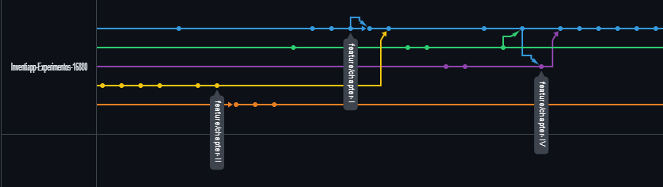
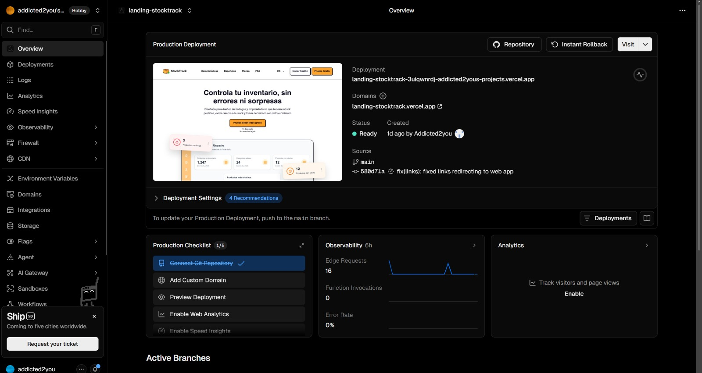
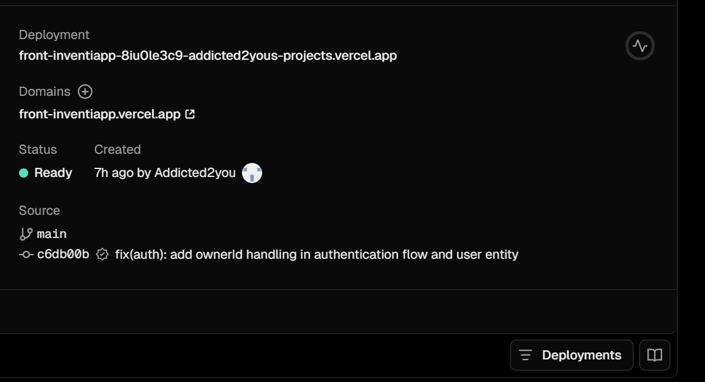
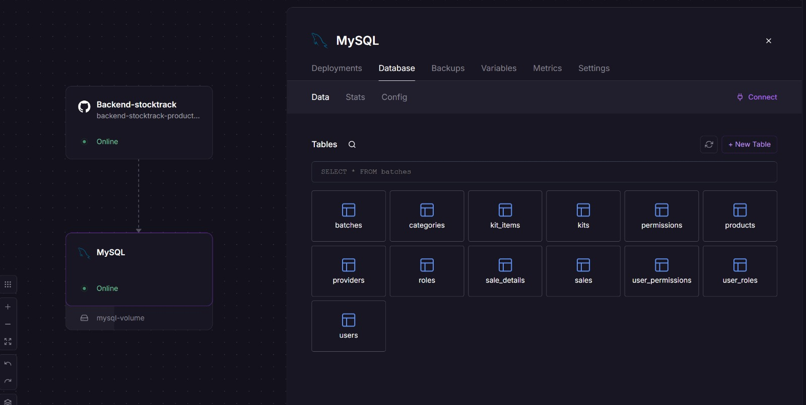
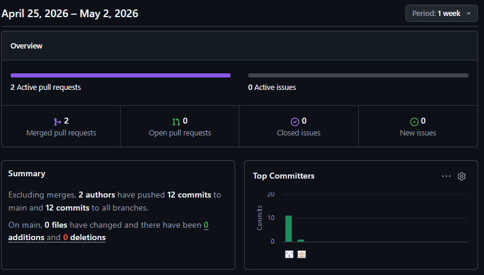
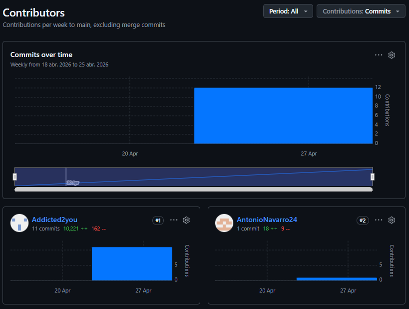
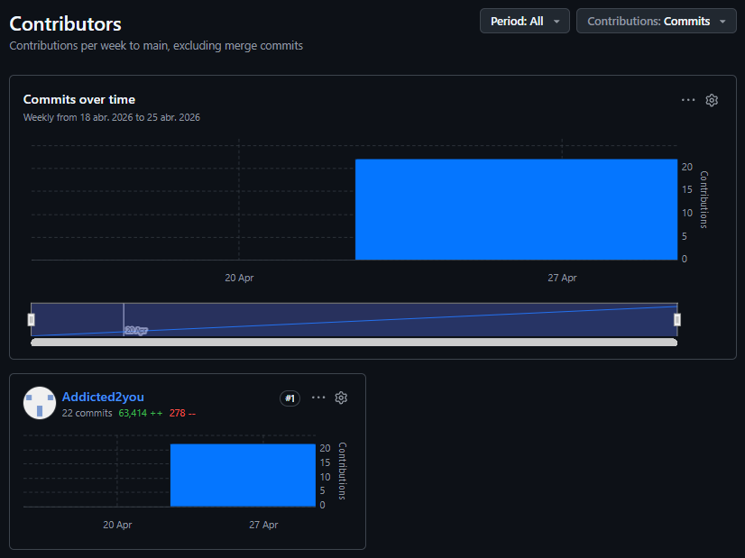
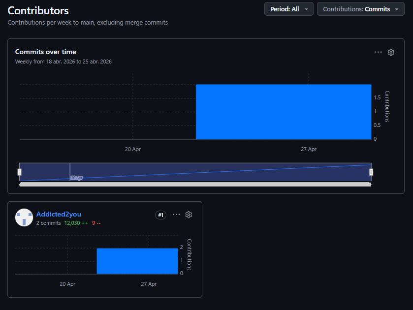

# Capítulo V: Product Implementation

## 5.1 Software Configuration Management

### 5.1.1 Software Development Environment Configuration

**Project Management:**

Para la gestión de nuestro proyecto, hemos utilizado como principal medio de comunicación WhatsApp, a través de un grupo en el cual planificamos reuniones y compartimos nuestras ideas sobre cada parte del trabajo. También utilizamos la aplicación de Discord, para realizar reuniones y conversar en modalidad virtual. Asimismo se utilizó Github el cual elaboramos un repositorio con todos los integrantes del grupo. En esta, hicimos la creación del documento para trabajar de manera colaborativa y también la documentación de las aplicaciones. 

**Requirements Management:**

Para el registro de las historias de usuario, utilizamos la herramienta de Jira, en la cual se registró cada una de ellas y se ordenaron por prioridad en el Product Backlog.

**Product UX/UI Design:**

Se realizaron los productos de UX con la herramienta de UXPressia, así como las User Persona, Impact Mapping, entre otras. Por ello se pudo modelar de manera efectiva el diseño de la experiencia de usuario. Por otro lado, se realizaron los prototipos de la aplicación web utilizando la herramienta Figma, lo cual nos permitió realizae los Wireframes y Mock-ups para tener una mejor perspectiva de la aplicación.

**Software Development:**

Para el desarrollo del proyecto, se ha definido un stack tecnológico especializado que permite una separación clara entre las capas de la aplicación:

- Entornos de Desarrollo (IDEs): El flujo de trabajo se centraliza en herramientas de JetBrains para maximizar la productividad. Se utiliza WebStorm como entorno principal para el desarrollo del frontend e IntelliJ IDEA para la gestión y construcción del backend.
- Tecnologías Frontend: La aplicación web se desarrolla bajo el framework Angular, utilizando HTML, CSS y JavaScript para la creación de interfaces dinámicas y responsivas.
- Tecnologías Backend: Se utiliza Spring Boot para el desarrollo del lado del servidor, aprovechando su robustez para la implementación de la lógica de negocio.
- Control de Versiones y Gestión: Se utiliza GitHub como plataforma central para el alojamiento de repositorios, permitiendo un control detallado del historial de cambios y una colaboración eficiente mediante Git.

### 5.1.2 Source Code Management

Para la gestión de versiones, el proyecto adoptará el modelo GitFlow, utilizando GitHub como repositorio y plataforma principal. En las siguientes secciones se detallará la aplicación de este flujo de trabajo, además de proporcionar los enlace correspondiente de cada repositorio.

Repositorio de GitHub:
- Enlace para acceder a la organización en GitHub: https://github.com/Inventiapp-Experimentos-16880

- Enlace para acceder al repositorio de la landing Page: https://github.com/Inventiapp-Experimentos-16880/Landing-page-stocktrack

- Enlace para acceder al repositorio del reporte: https://github.com/Inventiapp-Experimentos-16880/Report-stocktrack

- Enlace para acceder al repositorio de la App Web: https://github.com/Inventiapp-Experimentos-16880/Front-Inventiapp

- Enlace para acceder al repositorio del back end: https://github.com/Inventiapp-Experimentos-16880/Backend-stocktrack

**Flujo de trabajo GitFlow**

El ciclo de desarrollo se gestionará implementando el modelo de ramas diseñado por Vincent Driessen en 'A successful Git branching model'.

  

Estructura de branches (Ramas):

1. Main (Rama Principal): Constituye el eje central del repositorio, reservada exclusivamente para versiones estables y productivas del software. El código alojado aquí debe haber superado rigurosos procesos de validación y pruebas previas en las ramas de funcionalidad y desarrollo.

2. Develop (Rama de Desarrollo): Actúa como el entorno de integración continua para el equipo. Su función principal es centralizar el progreso diario del proyecto, sirviendo de base para la consolidación de nuevas características antes de su despliegue final.

3. Features (Ramas de Funcionalidad): Se empleará una rama independiente para cada módulo o tarea específica. Una vez concluida y verificada la funcionalidad, esta se integrará a la rama Develop. Para mantener el orden, se aplicará una nomenclatura estandarizada bajo el patrón "feature/chapter-#".

### 5.1.3 Source Code Style Guide & Conventions

En el desarrollo de este trabajo, se utilizará una gran variedad de lenguajes y frameworks para trabajar en la Landing Page, el Frontend Web Application y los Web Services. Para ello, se utilizará la siguiente guía de estilos y convenciones.

#### HTML
Es el lenguaje utilizado para estructurar el contenido de las interfaces, brindando los elementos necesarios para la interacción del usuario. 
Referencia: [https://www.w3schools.com/html/html5_syntax.asp](https://www.w3schools.com/html/html5_syntax.asp)

*   Declarar siempre el tipo de documento en la primera línea con `<!DOCTYPE html>`.
*   Respetar la estructura básica del HTML: `<html>`, `<head>`, `<body>`.
*   Declarar el título de la página para dar a conocer al usuario en qué página se encuentra usando el elemento `<title>`.
*   Siempre cerrar los elementos que lo requieran, ya sea una división, párrafo o título.
*   Declarar el atributo `alt` para todas las imágenes para asegurar la accesibilidad.
*   Se usará una indentación coherente para lograr una lectura sencilla del código y sus niveles de anidamiento.

#### CSS
Es el lenguaje utilizado para definir el diseño visual, incluyendo los estilos, fuentes, colores y contenedores.
Referencia: [https://google.github.io/styleguide/htmlcssguide.html](https://google.github.io/styleguide/htmlcssguide.html)

*   Usar indentación de forma correcta para mantener el orden.
*   Los nombres para los elementos y clases deben ser cortos y en minúsculas.
*   Declarar los colores en código hexadecimal
*   Dejar comentarios para conocer el propósito del estilo y su uso dentro de la hoja de estilos.
*   El diseño debe ser responsive para que los usuarios lo visualicen cómodamente desde cualquier dispositivo.

#### TypeScript (Angular)
Es el superconjunto de JavaScript que añade tipado estático y funciones avanzadas para el desarrollo del Frontend.
Referencia: [https://www.typescriptlang.org/docs/handbook/intro.html](https://www.typescriptlang.org/docs/handbook/intro.html)

*   Declarar nombres significativos y consistentes para las variables y funciones.
*   Declarar interfaces y tipos utilizando `PascalCase`.
*   Declarar variables y funciones utilizando `camelCase`.
*   Evitar el uso del tipo `any` para aprovechar las ventajas del tipado fuerte.
*   Usar interfaces para la reutilización de código y contratos de datos claros.
*   Dejar comentarios para explicar la lógica de los servicios y componentes complejos.

#### Angular
Framework utilizado para la creación de la aplicación web principal de forma modular y escalable.
Referencia: [https://angular.io/docs](https://angular.io/docs)

*   Mantener una estructura de carpetas organizada separando components, services, models y modules.
*   Crear componentes reutilizables para evitar la duplicación de código en la interfaz.
*   Separar la lógica de negocio de la vista, delegando el consumo de APIs a los servicios.
*   Utilizar la inyección de dependencias de forma correcta para mantener el código desacoplado.
*   Documentar el propósito de los componentes mediante comentarios internos.

#### Astro
Framework utilizado para el desarrollo de la Landing Page, optimizando el rendimiento y la velocidad de carga.
Referencia: [https://docs.astro.build/](https://docs.astro.build/)

*   Utilizar la arquitectura de "islas" para minimizar el envío de JavaScript innecesario al cliente.
*   Organizar los componentes globales de la landing en la carpeta `src/components`.
*   Aprovechar el sistema de rutas basado en archivos dentro de la carpeta `src/pages`.
*   Optimizar el uso de recursos multimedia mediante los componentes nativos de Astro.

#### Java (Spring Boot)
Lenguaje y framework utilizado para el desarrollo de los Web Services y la lógica del lado del servidor.
Referencia: [https://google.github.io/styleguide/javaguide.html](https://google.github.io/styleguide/javaguide.html)

*   Nombrar las variables, funciones y clases con `camelCase` o `PascalCase` según corresponda, siendo significativos y cortos.
*   Seguir los principios de **Clean Architecture**, separando la lógica de dominio de la infraestructura.
*   Usar indentación correctamente para un código coherente y ordenado.
*   Usar comillas dobles (") para las cadenas de texto.
*   Utilizar las anotaciones de Lombok para reducir el código repetitivo y mejorar la legibilidad.
*   Dejar comentarios en cada bloque de código relevante para explicar su funcionalidad.

### 5.1.4 Software Deployment Configuration

#### Landing Page Deployment

La landing page para el proyecto se ha desplegado en Vercel, lo que permite alojar el sitio web de manera gratuita y sencilla: 

  

Ruta de referencia del landing: https://landing-stocktrack-3uiqwnrdj-addicted2yous-projects.vercel.app 

#### Web Application Deployment

La aplicaciín web del proyecto se ha deplegado en Vercel, lo que permite alojar el sitio web de manera gratuita y sencilla directamente desde el repositorio de GitHub:

  

Ruta de referencia del web app: https://front-inventiapp.vercel.app/auth/login

#### Backend Deployment

El backend del proyecto se ha desplegado utilizando Railway, lo que permite alojar el sitio web de manera gratuita y sencilla directamente desde el repositorio de GitHub:

  

Ruta de referencia del web app: https://backend-stocktrack-production.up.railway.app/swagger-ui/index.html

## 5.2 Product Implementation & Deployment

Durante este sprint decisivo, el equipo de desarrollo llevó a cabo la implementación, integración y despliegue de todas las capas del software. Se trabajó en paralelo en el desarrollo de la Landing Page, la Aplicación Web (Frontend en Angular) y la API RESTful (Backend en Spring Boot), culminando con el despliegue del sistema completo en la nube.

### 5.2.1 Sprint Backlogs

| User Story Id | User Story Title | Task Id | Task Title | Description | Estimation (Hours) | Assigned to | Status |
| :--- | :--- | :--- | :--- | :--- | :--- | :--- | :--- |
| US16 | Crear usuarios nuevos | US16-1 | Diseño UI registro | Diseñar interfaz de formulario de creación de usuarios. | 3 | Dayro | Done |
| | | US16-2 | API y lógica | Crear endpoint de creación con encriptación de claves. | 5 | Antonio | Done |
| US06 | Gestionar catálogo de productos | US06-1 | UI CRUD catálogo | Formulario para alta, edición y listado de productos. | 4 | Dayro | Done |
| | | US06-2 | API CRUD productos | Endpoints POST, PUT, DELETE para maestro de productos. | 6 | Yaku | Done |
| US07 | Clasificación por categoría | US07-1 | UI selector | Agregar dropdown de categorías en vista de productos. | 2 | Giovany | Done |
| | | US07-2 | BD categorías | Crear tabla paramétrica y relacionar con productos. | 4 | Antonio | Done |
| US08 | Búsqueda y filtrado de productos | US08-1 | Barra de búsqueda | Interfaz reactiva para ingresar filtros y texto. | 3 | Giovany | Done |
| | | US08-2 | Query params API | Lógica backend para devolver coincidencias parciales. | 3 | Yaku | Done |
| US10 | Gestionar cartera de proveedores | US10-1 | UI proveedores | Vistas para listar y registrar datos de abastecedores. | 4 | Dayro | Done |
| | | US10-2 | API proveedores | Endpoints REST (CRUD) para la gestión de proveedores. | 5 | Antonio | Done |
| US11 | Asociar productos a proveedor | US11-1 | Interfaz vinculación | Modal UI para seleccionar productos por proveedor. | 3 | Giovany | Done |
| | | US11-2 | Tablas intermedias | Lógica relacional (N:M) en base de datos. | 5 | Yaku | Done |
| US15 | Gestionar ingreso de lotes | US15-1 | Formulario ingreso | UI para registrar entrada, proveedor y vencimiento. | 4 | Dayro | Done |
| | | US15-2 | API inventario IN | Endpoint para sumar stock y registrar nuevo lote. | 6 | Antonio | Done |
| US01 | Iniciar borrador de salida | US01-1 | UI nueva venta | Vista principal y grilla para el punto de salida/venta. | 4 | Giovany | Done |
| | | US01-2 | Estado temporal | Manejo de sesión/carrito temporal para almacenar borrador. | 4 | Yaku | Done |
| US02 | Gestionar ítems del borrador | US02-1 | Lógica frontend | Funciones JS para agregar, quitar y editar cantidad. | 4 | Giovany | Done |
| | | US02-2 | Cálculos dinámicos | Actualización de subtotales y totales en tiempo real UI. | 3 | Dayro | Done |
| US03 | Confirmar salida de producto | US03-1 | Validaciones UI | Manejo de errores y confirmación visual de salida. | 3 | Dayro | Done |
| | | US03-2 | Transacción ACID | Endpoint para validar saldos y descontar stock real. | 6 | Yaku | Done |
| US13 | Configurar umbrales de stock | US13-1 | Campo stock UI | Añadir input de stock mínimo en formulario de producto. | 2 | Giovany | Done |
| | | US13-2 | Actualización BD | Migración y endpoint para guardar el valor umbral. | 3 | Antonio | Done |
| US05 | Notificaciones dashboard | US05-1 | Diseño widgets | Maquetación de tarjetas de alerta en pantalla de inicio. | 3 | Dayro | Done |
| | | US05-2 | Integración datos | Consumo de API para renderizar alertas activas. | 4 | Giovany | Done |
| US14 | Listar alertas pendientes | US14-1 | Vista tabla alertas | UI para mostrar lotes por vencer y bajo stock. | 3 | Dayro | Done |
| | | US14-2 | API alertas | Consultas SQL para detectar incidencias de inventario. | 4 | Yaku | Done |
| US04 | Reportes de inventario | US04-1 | UI reportes | Filtros y tablas consolidadas para visualización. | 5 | Giovany | Done |
| | | US04-2 | Backend exportar | Lógica para agregar data y generar exportables Excel/PDF. | 6 | Antonio | Done |
| US12 | Composición de un kit | US12-1 | Interfaz armado | UI para agregar productos hijos a un paquete/kit. | 4 | Dayro | Done |
| | | US12-2 | Estructura BD | Lógica padre-hijo para agrupamiento en base de datos. | 4 | Yaku | Done |
| US09 | Diseño responsive | US09-1 | Layouts móvil | Ajuste de contenedores para pantallas pequeñas. | 4 | Giovany | Done |
| | | US09-2 | Adaptación tablet | Refinamiento de grillas para pantallas medianas. | 3 | Dayro | Done |

### 5.2.2 Implemented Landing Page Evidence

El equipo completó el diseño interactivo y el despliegue de la página de aterrizaje (Landing Page) promocional para StockTrack, utilizando tecnologías web modernas para asegurar su rapidez y diseño responsive.
* **Plataforma de Despliegue:** Vercel
* **Link de despliegue:** [https://landing-stocktrack.vercel.app](https://landing-stocktrack.vercel.app)
* **Características Implementadas:** Hero interactivo, sección de características y beneficios, planes de suscripción (PricingSection), FAQ.

### 5.2.3 Implemented Frontend-Web Application Evidence

Se construyó una Single Page Application (SPA) robusta utilizando el framework Angular. Esta aplicación es el núcleo visual del sistema, donde los usuarios interactúan con los módulos de negocio.
* **Plataforma de Despliegue:** Vercel
* **Link de Despliegue:** [https://front-inventiapp.vercel.app/auth/login](https://front-inventiapp.vercel.app/auth/login)
* **Módulos implementados y conectados:**
  * **Seguridad:** Login y Registro protegidos por AuthGuards e interceptores HTTP para enviar el token JWT.
  * **Dashboard:** Panel de control con navegación lateral (Sidebar) y métricas de negocio.
  * **Gestión Operativa:** Vistas dinámicas para Inventario (entradas, salidas, reposición) y Proveedores.
  * **Administración:** Gestión de usuarios del sistema, asignación de roles y permisos.

### 5.2.4 Implemented RESTful API and/or Serverless Backend Evidence

Se implementó el backend del sistema utilizando Java y Spring Boot bajo el enfoque de *Domain-Driven Design* (DDD). La API expone servicios REST seguros para interactuar con una base de datos relacional PostgreSQL/MySQL.
* **Plataforma de Despliegue:** Railway (Backend + Database)
* **Base API URL:** [https://backend-stocktrack-production.up.railway.app/api/v1](https://backend-stocktrack-production.up.railway.app//api/v1)
* **Evidencia de Ejecución:** El funcionamiento completo de la API fue validado a través de colecciones en Postman, comprobando respuestas HTTP correctas (200 OK, 201 Created, 401 Unauthorized, 404 Not Found) para casos de éxito y manejo de excepciones en las operaciones de negocio.

### 5.2.5 RESTful API documentation

Se utilizó la especificación OpenAPI (Swagger) para garantizar una documentación clara, interactiva y estandarizada. Esta herramienta fue fundamental para que el equipo frontend pudiera consumir los endpoints correctamente durante el sprint.
* **Swagger API URL:** [https://backend-stocktrack-production.up.railway.app/swagger-ui/index.html](https://backend-stocktrack-production.up.railway.app/swagger-ui/index.html)
* **Módulos y Endpoints Documentados:**
  * **Autenticación (`/api/v1/authentication`):** Endpoints `sign-in` y `sign-up` para generación de JWT.
  * **Productos (`/api/v1/products`):** GET, POST, PUT, DELETE para la gestión del catálogo.
  * **Lotes (`/api/v1/batches`):** Gestión de lotes, vencimientos e historial.
  * **Ventas (`/api/v1/sales`):** Registro y consulta de transacciones de salida.
  * **Proveedores (`/api/v1/providers`):** Administración de la cadena de suministro.
  * **Seguridad (`/api/v1/users`, `/api/v1/roles`):** CRUD de perfiles y roles del sistema.

### 5.2.6 Team Collaboration Insights

Al ejecutar todas las fases del desarrollo en este sprint, la colaboración del equipo requirió alta sincronización mediante GitHub:

Repositorio Backend:

  

  

Repositorio Frontend:

  

  

Repositorio Landing Page:

  

  

## 5.3 Video About-the-Product
