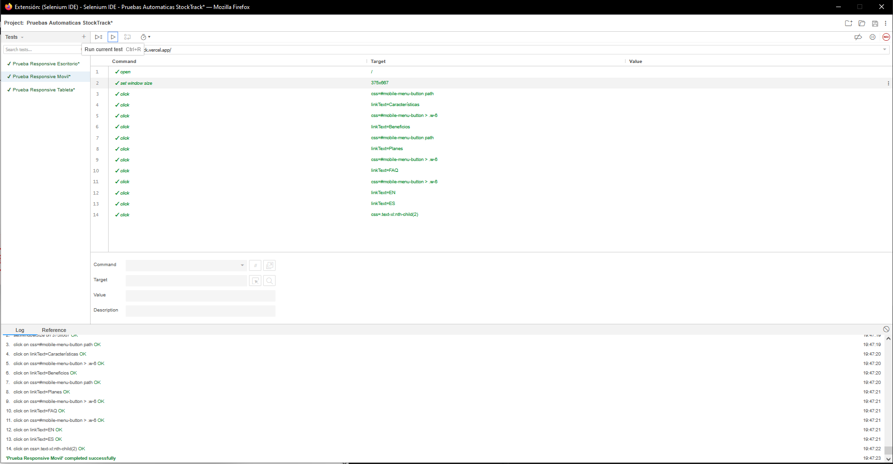
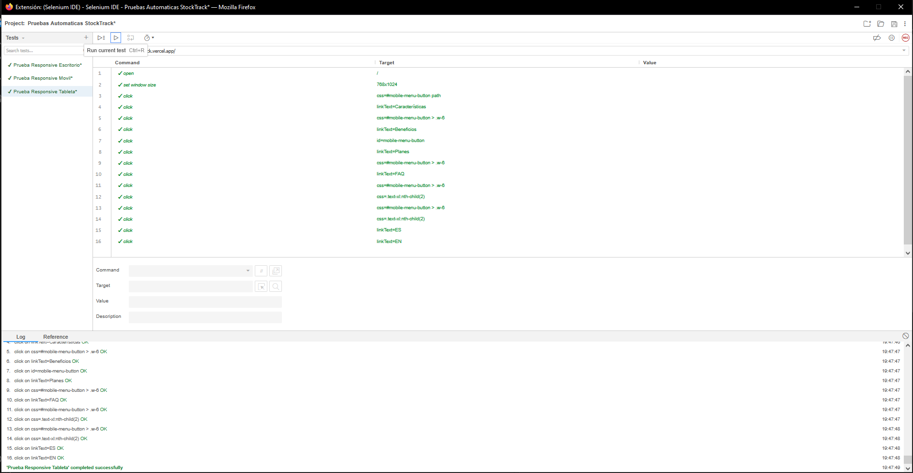
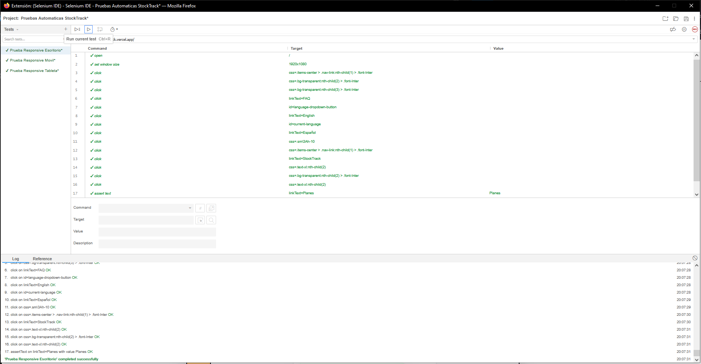

# Capítulo VI: Product Verification & Validation
## 6.1. Testing Suites & Validation

Para garantizar la calidad, estabilidad y escalabilidad de la plataforma StockTrack, se ha implementado una estrategia de pruebas multinivel. Todas las pruebas definidas en este capítulo se han derivado directamente de las User Stories (US) establecidas en el Backlog del proyecto. Cada test case ha sido diseñado para validar los Criterios de Aceptación, asegurando que el producto final cumpla con las necesidades funcionales y de negocio.

### 6.1.1. Core Entities Unit Tests.

En esta fase, se realizaron pruebas unitarias sobre la lógica de negocio central en el Backend. Dado que el proyecto utiliza una arquitectura basada en Domain-Driven Design (DDD) implementada con Java y Spring Boot, las pruebas se enfocaron en el aislamiento y validación de las entidades dentro de cada Bounded Context.

### 6.1.2. Core Integration Tests.

Las pruebas de integración validan la interacción entre los módulos de la capa de presentación (Frontend en Angular) y los servicios del API REST. El objetivo es confirmar que la comunicación bidireccional y el procesamiento de respuestas JSON sean consistentes.

### 6.1.3. Core Behavior-Driven Development

### 6.1.4. Core System Tests.

Para la validación final del sistema, se utilizó **Selenium IDE**, enfocándose en el cumplimiento de la **US09 (Diseño Responsive)** de la Landing Page (desarrollada en Astro). Se ejecutó una **Suite de Pruebas de Responsividad** simulando interacciones reales para asegurar que la experiencia de usuario y los flujos de conversión (como el cambio de idioma) sean óptimos en cualquier resolución de pantalla.

<table border="1" cellspacing="0" cellpadding="8" style="border-collapse:collapse; width:100%;">
    <tr>
        <th>US 09</th>
        <th>Diseño responsive</td></th>
        <th>
        <strong> Como </strong> visitante  
        <strong> Quiero </strong> que la landing sea responsive  
        <strong> Para </strong> navegar cómodamente desde cualquier dispositivo móvil, tablet o escritorio.
        </td>
        </th> 
    
</table>

 

#### **Test 1: Prueba en Dispositivo Movil**

  

#### **Test 2: Prueba en Dispositivo Tableta**

  

#### **Test 3: Prueba en Dispositivo Escritorio**

  

