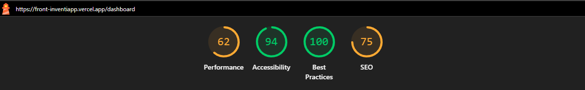
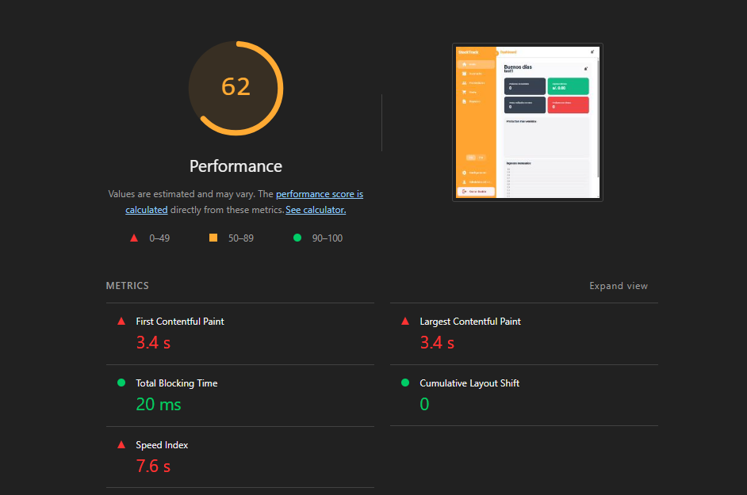
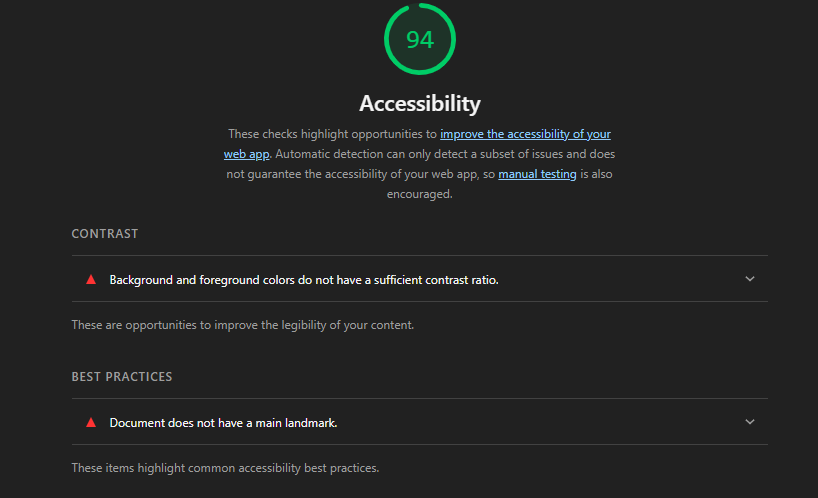
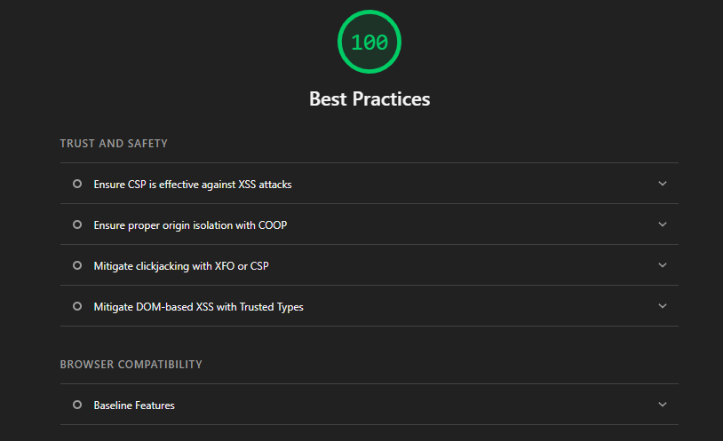
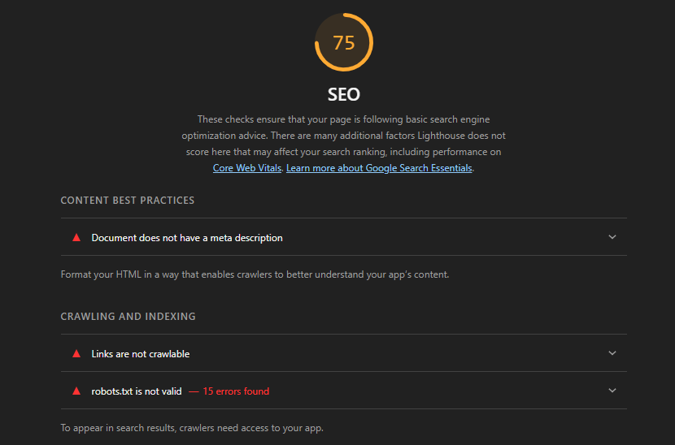
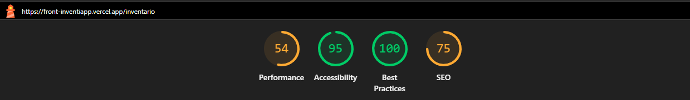
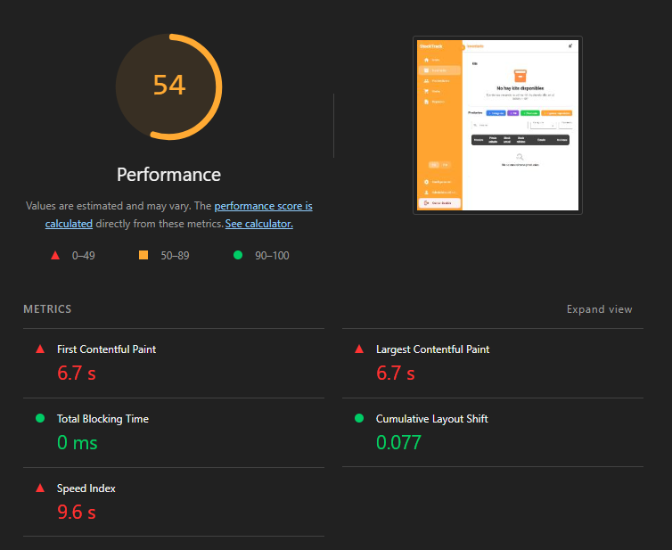
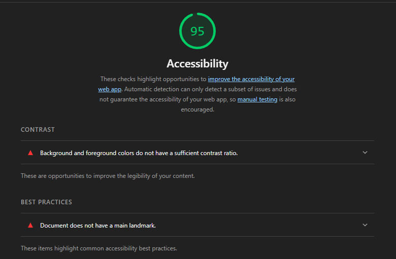
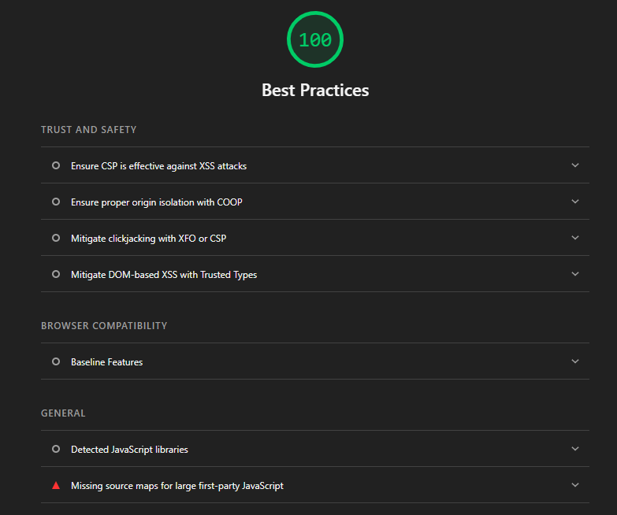
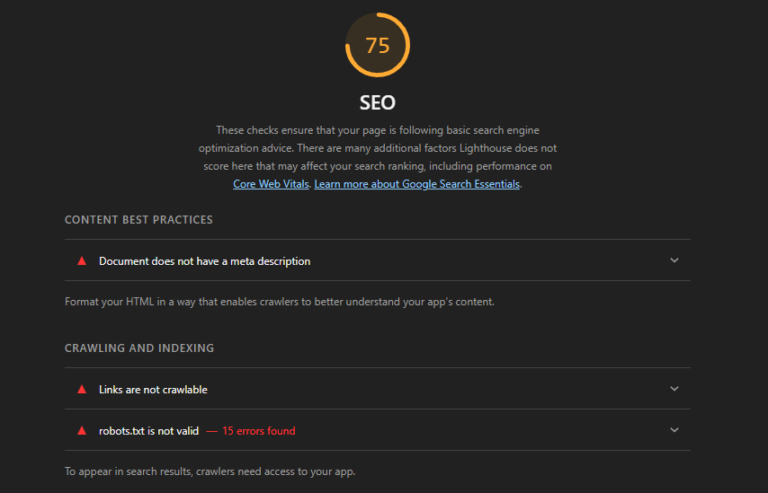

# Capítulo VIII: Experiment-Driven Development

## 8.1. Experiment Planning

### 8.1.1. As-Is Summary.

El estado actual de la gestión de inventarios para los segmentos objetivos se caracteriza por una dependencia crítica en procesos manuales y registros fragmentados. La información reside en cuadernos físicos, archivos de Excel desactualizados y chats de WhatsApp, lo que genera una visibilidad nula del stock en tiempo real. Esta desorganización provoca errores constantes en el control de fechas de vencimiento y una alta carga de ansiedad operativa. Aunque ya se ha definido un stack tecnológico (Spring Boot/Angular) y una arquitectura de software , el estado actual del negocio sigue siendo reactivo e intuitivo, lo que plantea la necesidad de cuestionar si la digitalización propuesta es lo suficientemente simple y óptima para ser adoptada por usuarios con fatiga laboral y baja alfabetización digital.

Problemas identificados y evidencia de respaldo:

| Categoría | Problema identificado | Evidencia de respaldo | Impacto en el usuario / negocio |
|---|---|---|---|
| **Rendimiento** | La aplicación presenta demoras o riesgo de demora en el filtrado de productos por nombre común cuando el catálogo crece. | En las entrevistas del Capítulo II se identificó que los usuarios trabajan con registros en Excel, libretas o revisión manual de stock. Además, el Capítulo III ya contempla la búsqueda y filtrado de productos como una funcionalidad clave para acceder rápidamente a la información. Esto evidencia que la velocidad de búsqueda es crítica para reemplazar métodos manuales durante la atención al cliente. | Si la búsqueda demora más de lo esperado, el usuario puede abandonar la aplicación y volver al cuaderno, Excel o revisión visual, reduciendo la adopción del producto. |
| **Experiencia de usuario** | Los reportes pueden presentar problemas de legibilidad cuando se usan en almacenes con poca iluminación o durante jornadas largas. | En la técnica 5W+1H se identificó que la verificación de productos ocurre en almacenes físicos, con espacio reducido y poca iluminación. Además, el propio diseño experimental considera pruebas A/B de reportes en condiciones de iluminación reducida, lo que respalda la necesidad de validar el contraste visual. | Una mala legibilidad puede generar errores al interpretar reportes de stock, vencimientos o productos críticos, afectando la toma de decisiones del dueño de bodega. |
| **Funcionalidad** | Existe necesidad de un módulo de historial de lotes para controlar entradas, salidas, fechas de vencimiento y trazabilidad del inventario. | Las entrevistas del Capítulo II muestran que los dueños de bodega presentan problemas críticos con fechas de vencimiento, mezcla de lotes y falta de seguimiento al ingresar nuevos productos. También se identificó que el control actual depende de Excel, libretas o memoria visual. | Sin historial de lotes, el usuario no puede anticipar vencimientos, aplicar seguimiento por lote ni reducir pérdidas por productos caducados. |
| **Usabilidad / accesibilidad** | Falta evidencia sobre la necesidad real de soporte multilingüe o localización para usuarios de diferentes regiones. | En Raw Material se declaró como knowledge gap que el equipo no sabe qué tan importante es el soporte multilingüe considerando la diversidad lingüística del mercado objetivo. Por ello, este punto se mantiene como problema potencial que debe ser validado mediante experimentos antes de implementarse como funcionalidad definitiva. | Si el idioma o la terminología local son una barrera, la adopción podría reducirse en mercados fuera de la capital o en zonas con usuarios bilingües. Si no es una barrera real, implementar localización podría generar esfuerzo técnico innecesario. |

Objetivos de mejora:

Para abordar estos problemas, se han establecido los siguientes objetivos de mejora:

- Reducir el tiempo de búsqueda de productos a menos de 1.5 segundos, considerando este valor como el umbral máximo aceptable para evitar frustración durante la atención al cliente.
- Mejorar la legibilidad de los reportes con un nuevo diseño de alto contraste.
- Implementar un módulo de historial de lotes para seguimiento detallado.
- Añadir soporte multilingüe para ampliar la accesibilidad.

### 8.1.2. Raw Material: Assumptions, Knowledge Gaps, Ideas, Claims.

Esta sección consolida las fuentes de inspiración derivadas de la investigación de usuarios, el diseño de interfaces y la arquitectura del sistema:

- **Assumptions (Suposiciones):** Son creencias o expectativas preliminares sobre el comportamiento de los usuarios, el mercado o la tecnología. Estas suposiciones aún no han sido validadas, por lo que no deben interpretarse como resultados comprobados. Su función es servir como punto de partida para formular preguntas experimentales, hipótesis y criterios de validación.

  - **Mejora de eficiencia de búsqueda:** Se asume que los usuarios valoran más la rapidez en la búsqueda de productos por nombre común cuando manejan una gran cantidad de productos o SKUs. Esta suposición deberá validarse midiendo el tiempo de respuesta, el nivel de frustración y la tasa de abandono durante tareas de búsqueda.

  - **Reportes de alto contraste:** Se asume que el rediseño de los reportes con un formato de alto contraste podría mejorar la legibilidad y reducir errores de interpretación en ambientes con poca iluminación. Esta suposición deberá validarse mediante pruebas comparativas entre una versión estándar y una versión de alto contraste.

  - **Módulo de historial de lotes:** Se asume que la implementación de un módulo de historial de lotes podría ayudar a los usuarios a realizar un seguimiento más ordenado de entradas, salidas, fechas de vencimiento y movimientos de inventario. Sin embargo, el porcentaje real de reducción de pérdidas por vencimiento aún no se conoce y deberá validarse mediante un experimento con usuarios.

  - **Soporte multilingüe o localización:** Se asume que adaptar la interfaz a terminología local o a otros idiomas podría mejorar la confianza y accesibilidad de la aplicación en mercados con diversidad lingüística. No obstante, el impacto real sobre la adopción todavía es desconocido y deberá validarse antes de priorizar su implementación completa.

- **Knowledge Gaps (Brechas de Conocimiento):** Son áreas donde se carece de información suficiente, por lo que requieren investigación adicional para validar, ajustar o rechazar las suposiciones planteadas.

  - No sabemos cuál es el tiempo máximo que un bodeguero está dispuesto a tolerar durante una búsqueda de productos antes de frustrarse o abandonar la tarea.
  - No sabemos qué tan dispuestos están los usuarios a ingresar el SKU de cada producto frente a búsquedas por nombre común.
  - No sabemos en qué medida el costo de la suscripción es una barrera frente a las pérdidas actuales por productos vencidos no detectados.
  - No sabemos si el diseño de alto contraste mejora significativamente la lectura de reportes frente a un diseño estándar.
  - No sabemos si el módulo de historial de lotes reduce realmente las pérdidas por vencimiento ni cuál sería el porcentaje de reducción alcanzable.
  - No sabemos si el soporte multilingüe o la localización incrementan realmente la adopción, la confianza o la percepción de cercanía del producto en usuarios de diferentes regiones.

- **Ideas:** Son propuestas de funcionalidades o mejoras basadas en la investigación y el diseño, que aún no han sido validadas:
  - Implementación de flujos de registro de entrada/salida optimizados para dispositivos móviles (Mobile-first) para permitir el conteo a pie de estantería.
  - Centralización de la gestión de proveedores vinculada directamente a la reposición de lotes para automatizar la cadena de suministro.

- **Claims (Afirmaciones):** Son declaraciones realizadas por usuarios, stakeholders o por el propio equipo a partir de entrevistas, observaciones, análisis del contexto del negocio o artefactos previos del proyecto. A diferencia de las assumptions, las claims deben indicar una fuente o evidencia de origen para poder ser verificadas posteriormente. En esta etapa, las claims no se consideran verdades definitivas, sino afirmaciones trazables que deben contrastarse con los experimentos definidos.

| ID | Claim / Afirmación | Fuente o evidencia de origen | Fecha o periodo de referencia | Estado de validación | Relación con experimento |
|---|---|---|---|---|---|
| CL01 | La aplicación puede mejorar la gestión de inventarios frente a métodos manuales como cuadernos, Excel o revisión visual del stock. | Entrevistas iniciales a usuarios del segmento objetivo y análisis del problema presentado en capítulos previos del proyecto. | Periodo de pilotaje | Pendiente de validación experimental. | Se relaciona con las hipótesis sobre reducción de mermas, historial de lotes y percepción de valor del producto. |
| CL02 | La búsqueda por nombre común es importante porque los usuarios no siempre recuerdan o utilizan el SKU de los productos durante la atención al cliente. | Hallazgos de investigación de usuarios y observación del flujo actual de búsqueda manual de productos. | Periodo de pilotaje | Pendiente de validación mediante prueba de latencia y tareas de búsqueda. | Se relaciona con QD2 y con la hipótesis de tolerancia a la latencia de búsqueda. |
| CL03 | Los reportes con mejor contraste podrían facilitar la lectura de información en almacenes o espacios con poca iluminación. | Análisis 5W+1H de la gestión de vencimientos, donde se identifica que la verificación ocurre en espacios físicos reducidos y con iluminación variable. | Periodo de pilotaje | Pendiente de validación mediante prueba A/B de reportes. | Se relaciona con QD3 y con la hipótesis sobre diseño de alto contraste. |
| CL04 | El historial de lotes puede ayudar a controlar entradas, salidas, fechas de vencimiento y trazabilidad de productos. | Problemas identificados en el As-Is Summary y entrevistas sobre gestión manual de vencimientos. | Periodo de pilotaje | Pendiente de validación mediante piloto funcional del módulo de lotes. | Se relaciona con QD1 y con la hipótesis sobre reducción de pérdidas por vencimiento. |
| CL05 | La localización o soporte multilingüe podría mejorar la confianza y accesibilidad del producto en usuarios de distintas regiones. | Knowledge gap identificado por el equipo respecto a diversidad lingüística y adopción en mercados fuera de la capital. | Periodo de pilotaje | Pendiente de validación; no debe asumirse como necesidad confirmada. | Se relaciona con QB2 y con la hipótesis sobre adopción por localización. |


---------
> **Nota de trazabilidad:** Las claims anteriores se documentan con fuente, periodo y estado de validación para evitar que sean interpretadas como hechos comprobados. Su propósito es alimentar el diseño experimental y permitir que cada afirmación pueda ser aceptada, rechazada o reformulada según los resultados obtenidos.

### 8.1.3. Experiment-Ready Questions.

En esta etapa, transformamos las suposiciones y brechas de conocimiento en preguntas concretas que guiarán nuestros experimentos. Estas se dividen en dos categorías principales para asegurar tanto la validación de nuestras premisas como el descubrimiento de nuevas oportunidades.

#### Preguntas Impulsadas por Creencias (Belief-led)
Estas preguntas buscan validar o refutar una premisa específica que el equipo considera verdadera pero que carece de evidencia empírica.
* **BC1:** ¿El uso de un diseño de alto contraste en los reportes reduce realmente los errores de interpretación de datos en un 30% durante jornadas nocturnas?
* **BC2:** ¿La implementación del historial de lotes es el factor determinante para que un usuario decida pagar por la suscripción mensual en lugar de seguir usando Excel?
* **BC3:** ¿Es la búsqueda por nombre común más rápida que el escaneo de SKU para usuarios que manejan menos de 50 productos distintos?

#### Preguntas Exploratorias
Diseñadas para generar conocimiento en áreas donde no tenemos creencias previas o el comportamiento del usuario es incierto.
* **EX1:** ¿Qué criterios específicos utiliza un dueño de bodega para decidir qué productos merecen un seguimiento por lotes y cuáles no?
* **EX2:** ¿Cómo varía la tolerancia a la latencia de búsqueda cuando el usuario está atendiendo a un cliente en paralelo frente a cuando realiza inventario a puerta cerrada?
* **EX3:** ¿Qué otros idiomas o modismos regionales son críticos para que la aplicación se sienta "local" en mercados fuera de la capital?

#### Técnica de las "Cinco Ws (y una H)" para el Descubrimiento de Premisas
Utilizamos esta técnica para profundizar en el problema central de la **gestión manual de vencimientos** y descubrir necesidades ocultas de usuarios como Carla Rodríguez.

| Dimensión | Pregunta | Hallazgo / Premisa Oculta |
|:---|:---|:---|
| **Who (Quién)** | ¿Quién es el responsable de verificar los vencimientos? | Generalmente es el dueño; si lo delega, pierde confianza por falta de un sistema de control. |
| **What (Qué)** | ¿Qué sucede exactamente cuando un producto vence? | Se genera una pérdida neta o se intenta devolver al proveedor, lo cual genera fricción y pérdida de tiempo. |
| **Where (Dónde)**| ¿Dónde ocurre la verificación? | En el almacén físico, a menudo con poca iluminación y espacio reducido (necesidad de movilidad y contraste). |
| **When (Cuándo)** | ¿Cuándo se dan cuenta del vencimiento? | Generalmente cuando el cliente ya tiene el producto en la mano o durante un conteo físico aleatorio. |
| **Why (Por qué)** | ¿Por qué no usan herramientas digitales hoy? | Porque el Excel requiere una computadora y tiempo de oficina que no tienen durante la operación. |
| **How (Cómo)** | ¿Cómo calculan hoy cuándo reponer? | Basándose en la memoria visual de los estantes ("ojímetro"), lo cual es propenso a errores humanos. |

A partir de este análisis, el equipo decidió mantener las alertas preventivas dentro del alcance interno de la aplicación, evitando incorporar canales externos de mensajería en esta etapa. Esta decisión permite reducir complejidad técnica, evitar dependencias externas y concentrar la validación en el comportamiento principal del usuario frente a las alertas generadas por el sistema.

### 8.1.4. Question Backlog.

Esta sección presenta el backlog como una lista priorizada de preguntas de investigación. Su finalidad es ordenar las incertidumbres más importantes del proyecto StockTrack antes de convertirlas en experimentos, hipótesis o funcionalidades To-Be. De esta manera, el equipo evita implementar funcionalidades sin validar primero el riesgo, el impacto y la importancia de cada pregunta.

El sistema de puntuación evalúa cada pregunta del 1 al 5 en cuatro criterios:

- **Confianza / Incertidumbre (C):** mide qué tan poca evidencia tiene actualmente el equipo sobre la pregunta. Un puntaje mayor indica mayor necesidad de validación.
- **Riesgo (R):** mide qué tan crítico sería equivocarse en esa pregunta para el producto o el negocio.
- **Impacto (I):** mide cuánto valor aportaría resolver esa pregunta para el usuario y para la propuesta de valor.
- **Interés (In):** mide la relevancia de la pregunta para stakeholders, usuarios o decisiones estratégicas del proyecto.

Para evitar ambigüedades en la priorización, se define la siguiente regla de desempate:

1. Se prioriza la pregunta con mayor **Riesgo (R)**, porque representa el mayor costo de equivocarse.
2. Si el riesgo es igual, se prioriza la pregunta con mayor **Impacto (I)**, porque aporta mayor valor al producto o al negocio.
3. Si riesgo e impacto son iguales, se prioriza la pregunta que valide primero la **propuesta de valor central del producto**.
4. Si el empate continúa, se prioriza la pregunta que tenga mayor dependencia sobre otras funcionalidades del backlog.
5. Como último criterio, se prioriza la pregunta con mayor **Confianza / Incertidumbre (C)**, porque representa una brecha de conocimiento más urgente.

Bajo esta regla, aunque **QB1** y **QD1** obtienen el mismo puntaje total de 17 y comparten el mismo nivel de riesgo e impacto, se prioriza **QD1** en primer lugar porque valida la propuesta de valor central de StockTrack: reducir pérdidas por vencimiento mediante historial de lotes, visibilidad de productos próximos a vencer y alertas preventivas internas. Luego se prioriza **QB1**, ya que la disposición a pagar por una suscripción depende de que primero exista evidencia clara de valor funcional y económico para el usuario.

#### Broad Backlog (Preguntas de Negocio y Adopción)

Estas preguntas abordan la propuesta de valor, el modelo de negocio y la adopción del producto de manera general.

| ID | Pregunta de Investigación | El "Por qué" (Motivación) | C | R | I | In | Total |
|:---|:---|:---|:---:|:---:|:---:|:---:|:---:|
| QB1 | ¿En qué medida el costo de la suscripción es una barrera frente a las pérdidas actuales por productos vencidos no detectados? | Si el costo supera la percepción de ahorro por reducción de mermas, el modelo de negocio no será sostenible para bodegas y pequeños negocios. Esta pregunta permite validar si el usuario percibe retorno económico antes de adoptar una suscripción. | 2 | 5 | 5 | 5 | **17** |
| QB2 | ¿Qué tan relevante es el soporte multilingüe o la localización para la adopción en mercados con diversidad lingüística? | Validar si el esfuerzo técnico de internacionalización justifica el crecimiento esperado en nuevos segmentos. Esta pregunta se mantiene como exploratoria y de menor prioridad hasta validar primero las funcionalidades centrales del producto. | 3 | 2 | 2 | 3 | **10** |

#### Deep Backlog (Preguntas de Ejecución y UX)

Estas preguntas profundizan en funcionalidades específicas, experiencia de usuario y comportamiento técnico del producto.

| ID | Pregunta de Investigación | El "Por qué" (Motivación) | C | R | I | In | Total |
|:---|:---|:---|:---:|:---:|:---:|:---:|:---:|
| QD1 | ¿La implementación de un historial de lotes reduce efectivamente las pérdidas por vencimiento en un porcentaje medible frente al registro manual? | Es el núcleo de la propuesta de valor de StockTrack para bodegas y pequeños negocios. Si el historial de lotes no ayuda a reducir pérdidas por vencimiento, el producto pierde su principal argumento funcional frente a métodos manuales como cuadernos o Excel. | 4 | 5 | 5 | 3 | **17** |
| QD2 | ¿Cuál es el umbral de tiempo máximo de búsqueda por nombre común que el usuario tolera antes de frustrarse? | La latencia en la búsqueda impacta directamente en la productividad diaria del bodeguero durante la atención al cliente. Si la búsqueda es lenta, el usuario puede abandonar la aplicación y volver a métodos manuales. | 3 | 4 | 4 | 4 | **15** |
| QD3 | ¿Mejora significativamente el diseño de alto contraste la velocidad de interpretación de reportes en entornos de baja iluminación? | Muchos bodegueros operan en almacenes con luz limitada o fatiga visual tras jornadas largas. Validar esta pregunta permite saber si el rediseño visual mejora la lectura de reportes y reduce errores de interpretación. | 4 | 2 | 3 | 3 | **12** |

#### Priorización Consolidada

| Prioridad | ID | Tipo de backlog | Puntaje total | Justificación de prioridad |
|---:|---|---|---:|---|
| 1 | QD1 | Deep Backlog | **17** | Se prioriza primero porque valida la propuesta de valor central de StockTrack: reducir pérdidas por vencimiento mediante historial de lotes, visibilidad de productos próximos a vencer y alertas preventivas internas. Si esta pregunta falla, el producto pierde su principal argumento funcional. |
| 2 | QB1 | Broad Backlog | **17** | Aunque tiene el mismo puntaje que QD1, se ubica después porque la disposición a pagar depende de que el usuario perciba primero un beneficio económico claro. La suscripción solo puede validarse correctamente si existe evidencia de ahorro o reducción de pérdidas. |
| 3 | QD2 | Deep Backlog | **15** | Es clave para la retención del usuario durante la operación diaria. Una búsqueda lenta puede generar frustración, pérdida de confianza y abandono del sistema durante la atención al cliente. |
| 4 | QD3 | Deep Backlog | **12** | Representa una mejora importante de accesibilidad y legibilidad, especialmente en almacenes con poca iluminación, pero no bloquea directamente la propuesta de valor principal. |
| 5 | QB2 | Broad Backlog | **10** | Se mantiene como pregunta de menor prioridad porque la localización o soporte multilingüe debe evaluarse después de validar primero las funcionalidades centrales del producto. |

#### Análisis de Priorización

1. **QD1 - Historial de lotes y reducción de pérdidas:** se atiende primero porque está directamente relacionada con el problema principal del usuario: evitar pérdidas por productos vencidos. Esta pregunta valida si StockTrack realmente genera valor frente al control manual de inventario.

2. **QB1 - Barrera del costo de suscripción:** se atiende después de QD1 porque la viabilidad comercial depende de que el usuario perciba un ahorro o beneficio concreto. Si no se demuestra valor funcional, la pregunta sobre disposición de pago pierde fundamento.

3. **QD2 - Tolerancia a la latencia de búsqueda:** se prioriza como tercer punto porque afecta la experiencia diaria del usuario. Una búsqueda lenta puede impedir que el sistema sea usado durante la atención al cliente.

4. **QD3 - Diseño de alto contraste:** se considera relevante para mejorar la lectura de reportes y reducir errores en ambientes con poca iluminación. Sin embargo, tiene menor riesgo estratégico que las preguntas relacionadas con reducción de mermas, precio y búsqueda.

5. **QB2 - Soporte multilingüe o localización:** se mantiene como pregunta exploratoria de baja prioridad. No se descarta su importancia, pero su validación se realizará después de consolidar el mercado inicial y las funcionalidades principales del producto.

Con esta priorización, el empate entre **QD1** y **QB1** queda resuelto mediante criterios explícitos. La pregunta **QD1** se atiende primero porque valida el valor principal del producto, mientras que **QB1** se evalúa después porque corresponde a la viabilidad comercial del modelo de suscripción.

### 8.1.5. Experiment Cards.

En esta sección se detallan las Tarjetas de Experimento para las preguntas priorizadas en el Question Backlog. Estas tarjetas funcionan como un contrato experimental antes de ejecutar cualquier validación, ya que definen de manera uniforme la pregunta, motivación, hipótesis, experimento, medidas, condiciones y escala de decisión.

Todas las tarjetas siguen la misma estructura para mantener consistencia documental y trazabilidad con las preguntas del backlog.

---

### Tarjeta de Experimento 01: Eficacia del Historial de Lotes (QD1)

**Lado Frontal: El Qué y el Por Qué**

* **ID de pregunta relacionada:** QD1
* **Pregunta:** ¿La implementación de un historial de lotes reduce efectivamente las pérdidas por vencimiento en un porcentaje medible frente al registro manual?
* **Why?:** Esta pregunta valida la propuesta de valor central de StockTrack. Si el historial de lotes no ayuda a reducir pérdidas por productos vencidos, el producto pierde su principal argumento funcional frente a métodos manuales como cuadernos o Excel.
* **Hypothesis:** Creemos que proporcionar una vista de lotes próximos a vencer, junto con alertas preventivas internas dentro de la aplicación, permitirá a los usuarios identificar productos críticos y tomar acciones de venta, devolución o liquidación antes del vencimiento.
* **What:** Un MVP funcional del módulo de historial de lotes conectado a una base de datos de prueba con productos, fechas de ingreso, fechas de vencimiento, estado del lote y alertas internas.
* **Type:** Experiment-Ready.

**Lado Posterior: Configuración**

* **Medidas:**
  - Cantidad de productos vencidos no vendidos durante el periodo de prueba.
  - Valor monetario estimado de productos vencidos.
  - Porcentaje de reducción de merma frente al registro manual previo.
  - Número de acciones registradas sobre productos próximos a vencer.

* **Condiciones:**
  - Usuarios piloto: 5 dueños o encargados de bodega.
  - Duración mínima: 15 días de uso.
  - Condición base: registro manual previo mediante cuaderno, Excel o control visual.
  - Condición experimental: uso del módulo de historial de lotes y alertas internas de StockTrack.

* **Escala:**
  - **Favorable:** reducción de merma igual o mayor a 15% frente al periodo base.
  - **Aceptable:** reducción entre 5% y 14%, con evidencia de uso del módulo y acciones preventivas.
  - **Desfavorable:** reducción menor a 5% o ausencia de uso del módulo.

---

### Tarjeta de Experimento 02: Viabilidad de Suscripción (QB1)

**Lado Frontal: El Qué y el Por Qué**

* **ID de pregunta relacionada:** QB1
* **Pregunta:** ¿En qué medida el costo de la suscripción es una barrera frente a las pérdidas actuales por productos vencidos no detectados?
* **Why?:** Si el costo de StockTrack supera la percepción de ahorro por reducción de mermas, los usuarios no adoptarán la solución a largo plazo. Esta pregunta valida la viabilidad comercial del modelo de suscripción.
* **Hypothesis:** Creemos que los dueños de bodegas estarán dispuestos a considerar una suscripción mensual si el sistema demuestra que el ahorro proyectado por reducción de pérdidas puede ser mayor al costo del plan.
* **What:** Un prototipo de alta fidelidad en Figma que simula una calculadora de retorno de inversión, donde el usuario ingresa sus pérdidas estimadas por productos vencidos y compara el ahorro proyectado con el costo de la suscripción.
* **Type:** Experiment-Ready.

**Lado Posterior: Configuración**

* **Medidas:**
  - Porcentaje de usuarios que califican el precio como “Justo” o “Barato”.
  - Porcentaje de usuarios que hacen clic en “Adquirir Plan” o manifiestan intención de pago.
  - Relación ahorro proyectado / costo de suscripción.
  - Comentarios cualitativos sobre barreras de precio.

* **Condiciones:**
  - Entrevistas guiadas con 10 dueños de bodegas o pequeños negocios.
  - Uso de prototipo de calculadora de ahorro.
  - Presentación del costo mensual junto con el ahorro estimado por reducción de mermas.

* **Escala:**
  - **Favorable:** al menos 70% de usuarios considera el precio “Justo” o “Barato”.
  - **Aceptable:** entre 50% y 69% considera el precio aceptable, pero solicita ajustes o más evidencia de ahorro.
  - **Desfavorable:** menos de 50% considera viable pagar la suscripción.

---

### Tarjeta de Experimento 03: Tolerancia a Latencia de Búsqueda (QD2)

**Lado Frontal: El Qué y el Por Qué**

* **ID de pregunta relacionada:** QD2
* **Pregunta:** ¿Cuál es el umbral de tiempo máximo de búsqueda por nombre común que el usuario tolera antes de frustrarse?
* **Why?:** La fluidez durante la atención al cliente depende de la rapidez de búsqueda. Si el sistema demora demasiado, el usuario puede abandonar la aplicación y volver al cuaderno, Excel o revisión visual.
* **Hypothesis:** Creemos que una respuesta de búsqueda superior a 1.5 segundos incrementará la frustración del usuario y aumentará la probabilidad de abandono durante momentos de alta afluencia de clientes.
* **What:** Un prototipo funcional que permite ajustar artificialmente el tiempo de respuesta del buscador en tres escenarios: 0.5 segundos, 1.5 segundos y 3 segundos.
* **Type:** Experiment-Ready.

**Lado Posterior: Configuración**

* **Medidas:**
  - Tiempo de respuesta de búsqueda.
  - Tasa de abandono de tarea.
  - Nivel de frustración reportado en escala Likert de 1 a 5.
  - Tiempo total para completar una tarea de búsqueda.

* **Condiciones:**
  - Pruebas de usabilidad con 8 usuarios.
  - Simulación de atención bajo presión.
  - Tres escenarios de latencia controlada: 0.5s, 1.5s y 3s.
  - Misma tarea de búsqueda para todos los participantes.

* **Escala:**
  - **Favorable:** búsqueda menor a 1 segundo, frustración ≤ 2/5 y baja tasa de abandono.
  - **Aceptable:** búsqueda entre 1.0 y 1.5 segundos, frustración controlada y abandono menor al escenario de 3s.
  - **Desfavorable:** búsqueda mayor a 1.5 segundos o frustración mayor a 3/5.

---

### Tarjeta de Experimento 04: Impacto del Alto Contraste (QD3)

**Lado Frontal: El Qué y el Por Qué**

* **ID de pregunta relacionada:** QD3
* **Pregunta:** ¿Mejora significativamente el diseño de alto contraste la velocidad de interpretación de reportes en entornos de baja iluminación?
* **Why?:** Muchos usuarios revisan información de inventario en almacenes con iluminación limitada o durante jornadas largas. Un diseño con bajo contraste puede generar fatiga visual, errores de lectura y mala interpretación de los reportes.
* **Hypothesis:** Creemos que un diseño de alto contraste reducirá el tiempo de identificación de productos críticos y disminuirá errores de interpretación en condiciones de baja iluminación.
* **What:** Test A/B con dos versiones del dashboard de reportes: una versión estándar y una versión con paleta de alto contraste.
* **Type:** Experiment-Ready.

**Lado Posterior: Configuración**

* **Medidas:**
  - Tiempo requerido para encontrar un producto crítico en el reporte.
  - Tasa de errores de interpretación.
  - Preferencia visual del usuario.
  - Nivel de claridad percibida en escala Likert de 1 a 5.

* **Condiciones:**
  - Pruebas controladas con 6 usuarios.
  - Ambiente con iluminación reducida.
  - Comparación entre versión estándar y versión de alto contraste.
  - Misma tarea de lectura para ambas versiones.

* **Escala:**
  - **Favorable:** mejora de al menos 20% en velocidad de interpretación y tasa de error ≤ 5%.
  - **Aceptable:** mejora entre 10% y 19%, con preferencia mayoritaria por la versión de alto contraste.
  - **Desfavorable:** mejora menor a 10% o aumento de errores de interpretación.

---

### Tarjeta de Experimento 05: Soporte Multilingüe / Localización (QB2)

**Lado Frontal: El Qué y el Por Qué**

* **ID de pregunta relacionada:** QB2
* **Pregunta:** ¿Qué tan relevante es el soporte multilingüe o la localización para la adopción en mercados con diversidad lingüística?
* **Why?:** Antes de invertir esfuerzo técnico en internacionalización, el equipo necesita validar si la localización realmente aumenta la confianza, comprensión o intención de uso en nuevos segmentos.
* **Hypothesis:** Creemos que ofrecer una interfaz con terminología localizada podría aumentar la confianza del usuario en zonas con diversidad lingüística; sin embargo, este impacto aún debe validarse antes de priorizar su implementación completa.
* **What:** Una landing page de registro y una pantalla de inventario con versión localizada para medir interés, confianza percibida e intención de uso.
* **Type:** Experiment-Ready.

**Lado Posterior: Configuración**

* **Medidas:**
  - Tasa de conversión o registro en la versión localizada.
  - Porcentaje de usuarios que prefieren la versión localizada.
  - Incremento de confianza percibida en escala Likert.
  - Comentarios cualitativos sobre comprensión y cercanía del lenguaje.

* **Condiciones:**
  - Prueba con 10 usuarios de zonas con bilingüismo o terminología local marcada.
  - Comparación entre versión estándar y versión localizada.
  - Recolección de respuestas mediante formulario posterior al uso del prototipo.

* **Escala:**
  - **Favorable:** al menos 20% de usuarios prefiere la versión localizada y se observa incremento de confianza percibida.
  - **Aceptable:** existe interés cualitativo, pero la preferencia no supera el 20%.
  - **Desfavorable:** no hay preferencia por la versión localizada o los usuarios consideran suficiente la versión estándar.

---

> **Nota de estandarización:** Todas las Experiment Cards fueron homologadas con la misma estructura: ID de pregunta relacionada, pregunta, motivación, hipótesis, experimento, tipo, medidas, condiciones y escala. Esto permite mantener trazabilidad entre el Question Backlog, las hipótesis, las métricas y las decisiones posteriores del proceso Experiment-Driven Development.

#### Nota metodológica sobre tamaño de muestra y alcance de los experimentos

Los experimentos definidos en esta sección corresponden a una primera etapa de validación exploratoria del producto. Por ello, los tamaños de muestra planteados no buscan generar conclusiones estadísticamente definitivas, sino obtener evidencia inicial suficiente para tomar decisiones de diseño, priorización y aprendizaje dentro del ciclo de Experiment-Driven Development.

Los umbrales definidos en cada Experiment Card, como reducción de merma, aceptación del precio, frustración, tiempo de búsqueda o preferencia por una versión localizada, deben interpretarse como criterios preliminares de decisión y no como resultados concluyentes del mercado total.

| Experimento | Tamaño de muestra inicial | Propósito del experimento | Limitación reconocida | Decisión correctiva |
|---|---:|---|---|---|
| Historial de lotes | 5 usuarios piloto | Validar si el módulo ayuda a detectar productos próximos a vencer y generar acciones preventivas. | La muestra permite observar comportamiento inicial, pero no confirma una reducción definitiva de mermas en todo el mercado. | Tratar el resultado como evidencia piloto y repetir el experimento con más usuarios o más ciclos de inventario antes del lanzamiento completo. |
| Viabilidad de suscripción | 10 usuarios | Evaluar percepción inicial del precio frente al ahorro proyectado. | La intención de pago declarada puede diferir del pago real. | Complementar con prueba de intención de compra, fake door o preventa antes de definir el modelo final. |
| Latencia de búsqueda | 8 usuarios | Identificar tolerancia inicial frente a diferentes tiempos de respuesta. | La frustración reportada puede variar según experiencia tecnológica, presión de atención y tamaño del catálogo. | Usar el umbral de 1.5 segundos como referencia técnica inicial y validarlo con métricas reales de uso. |
| Alto contraste en reportes | 6 usuarios | Comparar lectura de reportes en condiciones de baja iluminación. | La muestra permite detectar problemas de legibilidad, pero no generaliza a todos los escenarios de uso. | Realizar una segunda prueba con más usuarios y diferentes condiciones de iluminación. |
| Localización o soporte multilingüe | 10 usuarios | Medir interés inicial por una versión localizada. | La preferencia puede variar según región, idioma y familiaridad con herramientas digitales. | Mantener la localización como hipótesis exploratoria y no como funcionalidad prioritaria del MVP. |

En consecuencia, los resultados de estos experimentos se utilizarán para decidir si una hipótesis debe continuar, ajustarse, rediseñarse o descartarse. Para considerar una funcionalidad como validada para producción, el equipo deberá ejecutar un segundo ciclo de validación con mayor cantidad de usuarios, mayor duración o datos reales de uso del sistema.

## 8.2. Experiment Design

### 8.2.1. Hypotheses.

En esta sección se transforman las tarjetas de experimentación definidas en la sección 8.1.5 en hipótesis rigurosas, medibles y falsables. El objetivo es establecer una relación clara entre las preguntas experimentales, las creencias del equipo, las métricas de validación y los criterios que permitirán aceptar, rechazar o replantear cada experimento.

Para cada pregunta experimental se definen dos tipos de hipótesis:

- **Hipótesis alternativa o hipótesis de trabajo:** representa la afirmación que el equipo espera validar mediante el experimento. Esta hipótesis expresa el efecto esperado de una funcionalidad, mejora o decisión de producto sobre el comportamiento del usuario o sobre una métrica del negocio. Debe ser específica, cuantificable y estar conectada con una tarjeta de experimento.

- **Hipótesis nula:** representa el escenario contrario o la ausencia de efecto significativo. Su función es establecer qué resultado indicaría que la funcionalidad propuesta no genera el impacto esperado, que la mejora no es suficiente o que la premisa inicial debe ser rechazada o reformulada.

La hipótesis nula es importante porque permite definir objetivamente qué se considerará un resultado no exitoso. Si los datos obtenidos durante el experimento se acercan más a la hipótesis nula que a la hipótesis de trabajo, el equipo deberá tomar una decisión informada, como rechazar la funcionalidad, rediseñar la experiencia, ajustar el experimento o replantear la suposición inicial.

De esta manera, las hipótesis permiten cerrar el ciclo del Experiment-Driven Development, ya que conectan las preguntas del Question Backlog con experimentos medibles, criterios de éxito y decisiones posteriores basadas en evidencia.

| Question | Belief (Creencia) | Hypothesis (Hipótesis) | Null Hypothesis (Hipótesis Nula) |
| :--- | :--- | :--- | :--- |
| ¿En qué medida el costo de la suscripción es una barrera frente a las pérdidas actuales por productos vencidos? | Creemos que los dueños de bodega no perciben el verdadero costo de sus mermas actuales, por lo que el precio de suscripción se siente como un gasto adicional y no como una inversión. Si logramos visibilizar la pérdida real frente al costo del software, el usuario reevaluará su disposición a pagar. | Los dueños de bodegas aceptarán un costo mensual de $15 USD si el sistema demuestra, mediante un reporte inicial, que sus pérdidas por vencimiento superan los $50 USD mensuales. Al menos el 70% de los usuarios (7 de 10) calificarán el precio como "Justo" o "Barato" tras interactuar con la calculadora de ROI, y harán clic en "Adquirir Plan". Mediremos esto con 10 dueños de bodega en una entrevista guiada con prototipo. | El costo de suscripción seguirá percibido como una barrera independientemente de la comparativa de ahorro presentada. Menos del 70% de los usuarios calificará el precio como "Justo" o "Barato", o no harán clic en "Adquirir Plan" pese a ver el ahorro proyectado, indicando que el precio (o el modelo de negocio) no es viable en su forma actual. |
| ¿La implementación de un historial de lotes reduce efectivamente las pérdidas por vencimiento? | Creemos que los bodegueros pierden dinero por productos vencidos porque no tienen un sistema de alerta temprana; dependen de la memoria visual ("ojímetro") para detectar productos próximos a vencer, lo cual falla sistemáticamente. Dar visibilidad proactiva de los lotes permitirá actuar a tiempo (liquidación o devolución) antes de que el producto se pierda. | Proporcionar una vista de "Lotes Próximos a Vencer" con alertas de 7 días de anticipación permitirá a los usuarios realizar ventas de liquidación, reduciendo las pérdidas físicas en al menos 15-20% respecto al registro manual del mes anterior. Mediremos esto con 5 usuarios "Early Adopters" durante un ciclo de inventario completo (15 días), usando un MVP funcional conectado a una base de datos real con 20 productos de prueba. | El historial de lotes no reducirá significativamente las mermas reales. La reducción observada será menor al 15%, indicando que las alertas no son suficientes para cambiar el comportamiento del usuario, o que el problema de raíz no es la falta de visibilidad sino la falta de tiempo/incentivo para actuar sobre la alerta. |
| ¿Qué tan relevante es el soporte multilingüe para la adopción en mercados con diversidad lingüística? | Creemos que parte de la resistencia a adoptar herramientas digitales en mercados con diversidad lingüística viene de que la tecnología se siente "ajena" cuando no refleja la terminología local. Ofrecer una versión localizada reducirá esa barrera de confianza y aumentará el interés real en registrarse. | Ofrecer la interfaz con terminología localizada (o idiomas originarios según la región) incrementará la tasa de registro en al menos un 20% frente a la versión estándar, y aumentará la confianza percibida del usuario en un 15%. Mediremos esto publicando una landing page y una pantalla de inventario traducidas, midiendo conversión en 10 negocios de zonas con bilingüismo predominante. | La localización no producirá una diferencia significativa en la tasa de registro (menos del 20% elige la versión localizada) ni en la confianza percibida, indicando que el idioma no es una barrera crítica de adopción frente a otros factores como precio o funcionalidad. |
| ¿Cuál es el umbral de tiempo máximo de búsqueda por nombre común que el usuario tolera antes de frustrarse? | Creemos que la fluidez en la atención al cliente depende directamente de la rapidez de la app; si la búsqueda es lenta, el usuario abandona la herramienta y vuelve al cuaderno físico, especialmente bajo presión de atención al cliente. | Una respuesta de búsqueda superior a 1.5 segundos incrementará la frustración y la probabilidad de abandono de tarea durante la atención al cliente. Si la búsqueda se mantiene por debajo de 1.5 segundos, se espera minimizar la frustración reportada (≤2/5 en escala Likert) y reducir la tasa de abandono. Esto se medirá con 8 usuarios bajo tres escalones de latencia simulada (0.5s, 1.5s y 3s) en un escenario de atención bajo presión. | La latencia de búsqueda no tiene un efecto medible sobre el abandono de tarea ni la frustración reportada dentro del rango probado (0.5s-3s); los usuarios toleran tiempos de respuesta más altos de lo esperado, o abandonan independientemente de la velocidad por otras razones (ej. interfaz confusa). |
| ¿Mejora significativamente el diseño de alto contraste la velocidad de interpretación de reportes? | Creemos que los almacenes de las bodegas suelen tener iluminación deficiente y los usuarios presentan fatiga visual tras jornadas largas, lo cual genera errores de interpretación en reportes con bajo contraste. Un rediseño visual de alto contraste debería reducir significativamente el tiempo y los errores de lectura bajo estas condiciones. | Un diseño de alto contraste reducirá el tiempo de identificación de productos críticos en al menos un 20-25% bajo condiciones de poca luz (<100 lux), y reducirá la tasa de error de lectura a ≤5%. Mediremos esto con un Test A/B con 6 usuarios comparando la versión estándar vs. la versión de alto contraste del dashboard de reportes. | El diseño de alto contraste no produce una mejora medible en el tiempo de identificación (mejora <20%) ni en la tasa de error de lectura frente a la versión estándar, bajo las mismas condiciones de iluminación reducida. |


---

> **Nota de trazabilidad:** las hipótesis 4 y 5 formalizan las Tarjetas de Experimento 03 (QD2) y 04 (QD3) respectivamente, que ya contaban con una hipótesis de trabajo implícita en su "Lado Frontal" pero no estaban numeradas en la versión anterior de esta sección.

### 8.2.2. Domain Business Metrics


Esta sección define las métricas de negocio a nivel de dominio que se verán impactadas por los experimentos planificados. Estas métricas son de alto nivel y reflejan los objetivos estratégicos de StockTrack, alineados con los problemas identificados en el As-Is Summary, las preguntas experimentales, las hipótesis y las Experiment Cards.

A diferencia de las métricas operativas específicas de cada experimento, las métricas de dominio permiten evaluar si los aprendizajes obtenidos tienen impacto real sobre el negocio. Por ello, cada métrica incluye su definición, fórmula de cálculo, datos requeridos, técnica de recolección, baseline, objetivo y relación con las hipótesis experimentales.

#### Métricas de Dominio Identificadas

| Métrica de dominio | Definición | Fórmula de cálculo | Datos requeridos | Técnica de recolección | Baseline actual | Objetivo To-Be | Experimento relacionado |
|---|---|---|---|---|---|---|---|
| **Tasa de Merma por Vencimiento**<br>Merchandise Shrinkage Rate | Porcentaje del inventario perdido por productos vencidos que no fueron vendidos ni devueltos a tiempo. | `Tasa de Merma (%) = (Valor monetario de productos vencidos / Valor total del inventario gestionado) × 100`<br><br>También puede calcularse por unidades:<br>`Tasa de Merma por unidades (%) = (Unidades vencidas no recuperadas / Total de unidades gestionadas) × 100` | Valor monetario de productos vencidos, valor total del inventario, unidades vencidas no vendidas, total de unidades gestionadas. | Registro de inventario, historial de lotes, reporte de productos vencidos y validación manual del dueño de bodega. | Sin visibilidad centralizada de fechas de vencimiento. El control depende del cuaderno, Excel o memoria visual del dueño. | Reducir las mermas reales en al menos **15%** mediante alertas preventivas de vencimiento. | **H2:** Eficacia del historial de lotes. |
| **Reducción de Merma Real**<br>Shrinkage Reduction Rate | Porcentaje de disminución de pérdidas por vencimiento luego de implementar alertas o historial de lotes. | `Reducción de Merma (%) = ((Merma baseline - Merma durante experimento) / Merma baseline) × 100` | Merma registrada antes del experimento y merma registrada durante el experimento. | Comparación entre registro manual previo y datos generados por el MVP durante el piloto. | Pérdidas no cuantificadas con precisión por ausencia de control sistemático. | Alcanzar una reducción mínima de **15%** respecto al periodo base. | **H2:** Eficacia del historial de lotes. |
| **Percepción de Valor del Precio**<br>Price Value Perception | Nivel en que el usuario considera que el precio de la suscripción es justo en comparación con el ahorro proyectado por reducción de mermas. | `Percepción de precio justo (%) = (Usuarios que califican el precio como "Justo" o "Barato" / Total de usuarios evaluados) × 100` | Respuestas de usuarios sobre percepción del precio, cantidad total de usuarios evaluados. | Entrevista guiada con prototipo, formulario de evaluación y calculadora de ROI. | El usuario percibe la suscripción como gasto adicional porque no conoce cuánto pierde mensualmente por vencimientos. | Lograr que al menos **70%** de usuarios piloto califiquen el precio como “Justo” o “Barato”. | **H1:** Viabilidad del modelo de suscripción. |
| **Relación Ahorro / Costo de Suscripción**<br>Savings-to-Subscription Ratio | Compara el ahorro mensual proyectado por reducción de mermas frente al costo mensual del plan. | `Relación Ahorro/Costo = Ahorro mensual proyectado / Costo mensual de suscripción`<br><br>Con el caso base del experimento:<br>`Relación Ahorro/Costo = 50 / 15 = 3.33` | Ahorro mensual proyectado, costo mensual del plan, monto estimado de pérdidas actuales por vencimiento. | Calculadora de ROI, entrevista con dueño de bodega y estimación de pérdidas mensuales. | El usuario no cuenta con una herramienta que compare pérdidas actuales frente al precio del software. | Lograr que el ahorro proyectado sea mayor que el costo de suscripción y que el usuario perciba retorno económico claro. | **H1:** Viabilidad del modelo de suscripción. |
| **Eficiencia Operativa de Búsqueda**<br>Search Task Efficiency | Capacidad del usuario para encontrar productos o lotes dentro del sistema en un tiempo aceptable durante la atención al cliente. | `Tiempo promedio de búsqueda = Suma de tiempos de respuesta / Número total de búsquedas realizadas`<br><br>`Tasa de abandono (%) = (Búsquedas abandonadas / Total de tareas de búsqueda) × 100` | Tiempo de respuesta del buscador, cantidad de búsquedas realizadas, búsquedas completadas y búsquedas abandonadas. | Chrome DevTools, registros del frontend, observación durante prueba de usuario y tracking de eventos. | Búsqueda manual en cuaderno o Excel, sin tiempo estandarizado y con alta fricción durante la atención al cliente. | Mantener el tiempo de búsqueda por debajo de **1.5 segundos** y reducir el abandono de tarea. | **H4:** Tolerancia a la latencia de búsqueda. |
| **Confianza y Legibilidad de Reportes**<br>Report Trust & Readability | Grado en que el usuario puede leer, interpretar y tomar decisiones correctas usando los reportes del sistema. | `Mejora de tiempo de lectura (%) = ((Tiempo versión estándar - Tiempo versión alto contraste) / Tiempo versión estándar) × 100`<br><br>`Tasa de error de lectura (%) = (Errores de interpretación / Total de intentos de lectura) × 100` | Tiempo de lectura, cantidad de errores de interpretación, número total de intentos, condiciones de iluminación. | Test A/B, observación directa, cronometraje de tareas y prueba bajo baja iluminación. | Reportes con contraste insuficiente, generando riesgo de errores de lectura en ambientes con poca luz. | Reducir el tiempo de interpretación en al menos **20%** y mantener la tasa de error en **≤5%**. | **H5:** Impacto del diseño de alto contraste. |
| **Alcance y Adopción Multilingüe**<br>Localized Market Reach | Nivel de interés y adopción de usuarios cuando se ofrece una versión localizada o adaptada al idioma/región. | `Tasa de adopción localizada (%) = (Usuarios que eligen versión localizada / Total de usuarios evaluados) × 100`<br><br>`Incremento de confianza (%) = ((Promedio confianza localizada - Promedio confianza estándar) / Promedio confianza estándar) × 100` | Usuarios que seleccionan versión localizada, total de usuarios evaluados, puntaje de confianza en escala Likert. | Landing page, prototipo localizado, formulario de registro y encuesta posterior. | La interfaz se encuentra en español estándar y no existe evidencia validada sobre demanda multilingüe. | Lograr que al menos **20%** de usuarios de zonas bilingües prefieran la versión localizada y aumentar la confianza percibida en **15%**. | **H3:** Adopción por localización. |

#### Alineación con Objetivos de Negocio

Estas métricas de dominio se alinean con los objetivos estratégicos de StockTrack porque permiten evaluar si las mejoras propuestas generan impacto real sobre el negocio y sobre el usuario final.

- **Tasa de Merma por Vencimiento → Propuesta de Valor Central:** permite comprobar si StockTrack ayuda realmente a reducir pérdidas por productos vencidos.
- **Reducción de Merma Real → Validación económica del producto:** demuestra si el historial de lotes y las alertas generan ahorro medible.
- **Percepción de Valor del Precio → Viabilidad del Modelo de Negocio:** valida si el usuario considera razonable pagar por la solución.
- **Relación Ahorro / Costo de Suscripción → Argumento comercial:** permite comparar el costo del software frente al ahorro potencial generado.
- **Eficiencia Operativa de Búsqueda → Retención diaria:** evalúa si el sistema es suficientemente rápido para ser usado durante la atención al cliente.
- **Confianza y Legibilidad de Reportes → Reducción de errores operativos:** mide si los reportes ayudan a tomar decisiones correctas sin confusión visual.
- **Alcance y Adopción Multilingüe → Expansión de mercado:** permite decidir si conviene invertir en localización antes de escalar a mercados con diversidad lingüística.

### 8.2.3. Measures.

Esta sección define las métricas específicas que se utilizarán para medir el éxito de cada una de las 5 hipótesis formuladas en la sección 8.2.1. Cada métrica es medible, cuantificable, y directamente relacionada con los criterios de éxito establecidos en las Tarjetas de Experimento.
 
---
 
### Hipótesis 1: Viabilidad del Modelo de Suscripción
 
**Question:** ¿En qué medida el costo de la suscripción es una barrera frente a las pérdidas actuales por productos vencidos?
 
**Métricas:**
 
- **Tasa de Conversión Percibida (Perceived Conversion Rate):** Porcentaje de usuarios que hacen clic en "Adquirir Plan" tras interactuar con la calculadora de ROI. **Criterio de éxito: ≥70%** (7 de 10 usuarios).
- **Índice de Justicia de Precio (Price Fairness Score):** Porcentaje de usuarios que califican el precio como "Justo" o "Barato" frente al ahorro proyectado. **Criterio de éxito: ≥70%.**
---
 
### Hipótesis 2: Eficacia del Historial de Lotes
 
**Question:** ¿La implementación de un historial de lotes reduce efectivamente las pérdidas por vencimiento?
 
**Métricas:**
 
- **Reducción de Mermas Reales (Shrinkage Reduction Rate):** Comparación de productos vencidos sin vender, devolver o liquidar durante un periodo experimental de 15 días frente a un periodo de control también de 15 días. Ambos periodos deben evaluar las mismas categorías de productos y usar el mismo criterio de vencimiento. El registro manual solo será usado como línea base referencial; la medición principal se realizará con los registros internos del sistema. **Criterio de éxito: reducción ≥15%.**

- **Tasa de Acción sobre Alertas (Alert Action Rate):** Porcentaje de alertas internas de "7 días para vencer" que derivan en una acción del usuario dentro de las 48 horas siguientes. La acción puede ser vender, liquidar, devolver, marcar como gestionado o actualizar el estado del lote dentro de StockTrack. **Criterio de éxito: ≥60%.**

- **Confiabilidad del Registro Digital (Digital Record Reliability):** Porcentaje de lotes evaluados que cuentan con datos completos dentro del sistema: producto, fecha de ingreso, fecha de vencimiento, estado del lote y acción registrada. **Criterio de éxito: ≥90%.**

> **Nota:** Para evitar depender únicamente de registros manuales, el registro manual se utilizará solo como referencia inicial. La validación principal de esta hipótesis se basará en eventos y datos registrados dentro de StockTrack, como lotes creados, alertas generadas, acciones realizadas y productos marcados como gestionados o vencidos.
---
 
### Hipótesis 3: Adopción por Localización
 
**Question:** ¿Qué tan relevante es el soporte multilingüe para la adopción en mercados con diversidad lingüística?
 
**Métricas:**
 
- **Tasa de Registro Localizado (Localized Sign-up Rate):** Porcentaje de nuevos interesados que optan por la versión localizada al momento del registro. **Criterio de éxito: ≥20%.**
- **Puntuación de Confianza Percibida (Trust Perception Score):** Escala Likert 1-5 sobre "siento que esta aplicación fue hecha para mi negocio". **Criterio de éxito: incremento ≥15% frente a la versión estándar.**
---
 
### Hipótesis 4: Tolerancia a la Latencia de Búsqueda

**Question:** ¿Cuál es el umbral de tiempo máximo de búsqueda por nombre común que el usuario tolera antes de frustrarse?

**Medidas seleccionadas:**

- **Tiempo de Respuesta de Búsqueda (Search Response Time):** tiempo en segundos desde que el usuario ingresa el término de búsqueda hasta que visualiza los resultados. **Criterio de éxito: < 1.5 segundos.**

- **Tasa de Abandono de Tarea (Task Abandonment Rate):** porcentaje de búsquedas interrumpidas antes de visualizar resultados. **Criterio de éxito: abandono menor en el escenario de 1.5s frente al escenario de 3s.**

- **Nivel de Frustración (Frustration Score):** escala Likert de 1 a 5 reportada por el usuario después de cada escenario de latencia.

| Puntaje | Interpretación |
|---:|---|
| 1 | Sin frustración. El usuario percibe la búsqueda como rápida y natural. |
| 2 | Frustración baja. El usuario nota una espera mínima, pero no afecta su intención de uso. |
| 3 | Frustración moderada. El usuario percibe demora y podría perder fluidez durante la atención. |
| 4 | Frustración alta. El usuario considera que la demora afecta su trabajo y podría abandonar la tarea. |
| 5 | Frustración crítica. El usuario rechaza la experiencia y probablemente volvería a un método manual. |

**Interpretación por escenario de latencia:**

| Escenario de latencia | Resultado esperado | Interpretación del resultado |
|---|---|---|
| **0.5 segundos** | Frustración esperada entre **1 y 2** | Se considera el escenario ideal. Si el usuario reporta frustración alta incluso con 0.5s, el problema no estaría en la latencia, sino en la interfaz, claridad de resultados o flujo de búsqueda. |
| **1.5 segundos** | Frustración esperada máxima de **2/5** | Se considera el umbral máximo aceptable. Si la frustración supera 2/5, el tiempo de respuesta debe optimizarse antes del lanzamiento. |
| **3 segundos** | Frustración esperada mayor a **3/5** | Se considera un escenario desfavorable. Si el usuario reporta frustración alta o abandona la tarea, se confirma que tiempos superiores a 1.5s afectan la experiencia. |

**Criterio de éxito de la medida:**

El experimento será considerado favorable si, en el escenario de **1.5 segundos**, el nivel de frustración promedio se mantiene en **≤ 2/5** y la tasa de abandono es menor que en el escenario de **3 segundos**.

Si el escenario de **1.5 segundos** genera frustración promedio mayor a **2/5**, el equipo deberá ajustar el umbral técnico objetivo por debajo de 1.5 segundos o rediseñar el flujo de búsqueda para reducir la percepción de espera.

 
### Hipótesis 5: Impacto del Alto Contraste
 
**Question:** ¿Mejora significativamente el diseño de alto contraste la velocidad de interpretación de reportes?
 
**Métricas:**
 
- **Tiempo de Identificación (Identification Time):** Segundos requeridos para localizar la fecha de vencimiento de un producto en el reporte. **Criterio de éxito: mejora ≥20% frente a la versión estándar.**
- **Tasa de Error de Lectura (Reading Error Rate):** Porcentaje de respuestas incorrectas al identificar un dato bajo iluminación reducida (<100 lux). **Criterio de éxito: ≤5% en la versión de alto contraste.**
---
 
**Resumen de Métricas por Tipo:**
 
- **Métricas de Eficiencia:** Search Response Time, Identification Time
- **Métricas de Calidad:** Reading Error Rate, Task Abandonment Rate
- **Métricas de Adopción:** Perceived Conversion Rate, Localized Sign-up Rate, Alert Action Rate
- **Métricas de Satisfacción:** Price Fairness Score, Trust Perception Score, Frustration Score
- **Métricas de Impacto Operativo:** Shrinkage Reduction Rate

### 8.2.4. Conditions.


Antes de ejecutar los experimentos, se define un criterio de asignación para diferenciar claramente la condición experimental y la condición de control. Esta asignación busca reducir sesgos y asegurar que los resultados puedan compararse de forma ordenada.

Para los experimentos con usuarios, se utilizará una asignación simple y balanceada:

- Cuando existan dos grupos, los participantes se dividirán en **grupo experimental** y **grupo de control** de forma alternada según el orden de participación. Por ejemplo, el primer usuario irá al grupo experimental, el segundo al grupo de control, el tercero al grupo experimental y así sucesivamente.
- Cuando el experimento compare dos versiones de una interfaz, como el diseño estándar frente al diseño de alto contraste, se usará una comparación controlada donde todos los usuarios realizan la misma tarea bajo condiciones equivalentes.
- En los experimentos de latencia, todos los usuarios serán expuestos a los mismos escenarios de tiempo de respuesta definidos previamente, manteniendo el mismo flujo y tarea de búsqueda.
- En todos los casos, las condiciones deberán usar tareas similares, duración equivalente, criterios de medición iguales y el mismo tipo de usuario objetivo para que la comparación sea válida.

De esta manera, cada hipótesis mantiene una condición experimental y una condición de control comparable, evitando que los resultados se vean afectados por diferencias en tiempo, perfil de usuario, tarea evaluada o contexto de uso.

| Question | ¿En qué medida el costo de la suscripción es una barrera frente a las pérdidas actuales por productos vencidos? |
| :--- | :--- |
| **Condición Experimental** | El usuario interactúa con una calculadora de ROI que proyecta el ahorro mensual frente al costo del servicio. |
| **Condición de Control** | El usuario visualiza únicamente el precio de la suscripción sin información comparativa sobre ahorro de mermas. |

---

| Question | ¿La implementación de un historial de lotes reduce efectivamente las pérdidas por vencimiento? |
| :--- | :--- |
| **Condición Experimental** | Durante un periodo de **15 días**, los usuarios gestionan productos con fecha de vencimiento usando el módulo de historial de lotes de StockTrack. El sistema muestra lotes próximos a vencer, estado del lote y alertas preventivas internas dentro de la aplicación. |
| **Condición de Control** | Durante un periodo también de **15 días**, los usuarios gestionan productos equivalentes mediante el método manual habitual, como cuaderno, Excel o revisión visual, sin historial de lotes digital ni alertas internas. |


---

| Question | ¿Qué tan relevante es el soporte multilingüe para la adopción en mercados con diversidad lingüística? |
| :--- | :--- |
| **Condición Experimental** | Los usuarios acceden a una versión de la interfaz con terminología localizada (ej. idiomas originarios o inglés técnico). |
| **Condición de Control** | Los usuarios acceden a la versión estándar de la aplicación exclusivamente en español. |

---

| Question | ¿Cuál es el umbral de tiempo máximo de búsqueda por nombre común que el usuario tolera antes de frustrarse? |
| :--- | :--- |
| **Condición Experimental** | Los usuarios realizan búsquedas con una latencia optimizada de 1.5 segundos. |
| **Condición de Control** | Los usuarios realizan búsquedas con una latencia artificial elevada de 3 segundos para medir la fricción. |

---

| Question | ¿Mejora significativamente el diseño de alto contraste la velocidad de interpretación de reportes? |
| :--- | :--- |
| **Condición Experimental** | Los usuarios interactúan con el dashboard mediante una paleta de colores de alto contraste bajo iluminación reducida. |
| **Condición de Control** | Los usuarios interactúan con el diseño estándar del dashboard bajo las mismas condiciones de baja iluminación. |

### 8.2.5. Scale Calculations and Decisions.

#### Criterio de interpretación de escalas

Las escalas de decisión presentadas en esta sección se utilizan como criterios preliminares para interpretar los resultados de los experimentos piloto. Debido a que los tamaños de muestra son reducidos, los rangos definidos como favorable, aceptable o desfavorable no deben entenderse como evidencia estadística concluyente, sino como una guía para tomar decisiones iniciales de producto.

Por ello, cada escala será interpretada considerando tres elementos:

1. **Resultado cuantitativo:** cumplimiento o no del umbral definido.
2. **Evidencia cualitativa:** comentarios, observaciones y dificultades reportadas por los usuarios.
3. **Consistencia del comportamiento observado:** repetición del patrón en más de un usuario o escenario.

Si un experimento obtiene resultado favorable con una muestra pequeña, la funcionalidad no se considerará automáticamente validada para producción. Primero deberá pasar por un segundo ciclo de validación con mayor muestra, mayor duración o datos reales de uso.

Para cada hipótesis, definimos una escala de decisión basada en las métricas clave identificadas en la sección 8.2.3. Esta escala determina si los resultados son **ideales** (validan completamente la hipótesis), **aceptables** (validan parcialmente, requieren refinamiento), o **desfavorables** (invalidan la hipótesis, requieren rediseño o descarte de la funcionalidad).

#### Convención para interpretar límites

Para evitar ambigüedades en la interpretación de resultados, todos los rangos de decisión se expresan mediante límites inclusivos o exclusivos:

- El símbolo **<** significa “menor que” y no incluye el valor indicado.
- El símbolo **≤** significa “menor o igual que” e incluye el valor indicado.
- El símbolo **>** significa “mayor que” y no incluye el valor indicado.
- El símbolo **≥** significa “mayor o igual que” e incluye el valor indicado.

Cuando una métrica se ubique exactamente en un límite, se aplicará la categoría que incluya explícitamente dicho valor. Por ejemplo, si una métrica exige **≥ 80%**, un resultado de **80%** se considera dentro de la categoría ideal.
 
---
 
### Hipótesis 1: Viabilidad del Modelo de Suscripción
 
| Métrica de la Hipótesis | Desfavorable (Fracaso) | Aceptable (Mejora Mínima) | Ideal (Éxito de la Hipótesis) |
| --- | --- | --- | --- |
| **Índice de Justicia de Precio** | < 60% califica "Justo/Barato" | ≥ 60% y < 80% | **≥ 80%** |
| **Tasa de Conversión Percibida** | < 50% hace clic en "Adquirir Plan" | ≥ 50% y < 70% | **≥ 70%** |
 
**Decisión:**
 
- **Ideal:** El precio se valida tal como está planteado; se aprueba avanzar directamente al desarrollo del flujo de pago.
- **Aceptable:** El precio es viable pero requiere reforzar la narrativa de ahorro (ej. mejorar la calculadora de ROI, agregar testimonios) antes de lanzar el cobro real.
- **Desfavorable:** Se rechaza el precio actual; se requiere replantear el modelo (ej. plan freemium, precio escalonado por tamaño de bodega) antes de continuar.
---
 
### Hipótesis 2: Eficacia del Historial de Lotes
 
| Métrica de la Hipótesis | Desfavorable (Fracaso) | Aceptable (Mejora Mínima) | Ideal (Éxito de la Hipótesis) |
| --- | --- | --- | --- |
| **Reducción de Mermas Reales** | < 15% | ≥ 15% y < 20% | **≥ 20%** |
| **Tasa de Acción sobre Alertas** | < 40% | ≥ 40% y < 60% | **≥ 60%** |
 
**Decisión:**
 
- **Ideal:** El módulo de lotes se valida como núcleo de la propuesta de valor; se aprueba para producción sin cambios mayores.
- **Aceptable:** El módulo ayuda, pero no es suficiente por sí solo; se recomienda mejorar la visibilidad de las alertas dentro de la aplicación mediante recordatorios internos, priorización visual y seguimiento de alertas pendientes antes de producción.
- **Desfavorable:** Se rechaza la hipótesis; el problema de raíz no es la visibilidad de fechas sino la falta de tiempo/incentivo para actuar. Requiere rediseño del flujo de alertas o investigación adicional.
---
 
### Hipótesis 3: Adopción por Localización
 
| Métrica de la Hipótesis | Desfavorable (Fracaso) | Aceptable (Mejora Mínima) | Ideal (Éxito de la Hipótesis) |
| --- | --- | --- | --- |
| **Tasa de Registro Localizado** | < 20% | ≥ 20% y < 30% | **≥ 30%** |
| **Incremento en Confianza Percibida** | < 10% | ≥ 10% y < 15% | **≥ 15%** |
 
**Decisión:**
 
- **Ideal:** La localización es un driver de adopción claro; se prioriza la internacionalización completa en el roadmap.
- **Aceptable:** Existe interés moderado; se pospone la inversión completa, pero se mantiene la opción de idioma como mejora incremental.
- **Desfavorable:** El idioma no es una barrera crítica; se descarta la internacionalización como prioridad y se reasignan recursos a otras funcionalidades (ej. H1, H2).
---
 
### Hipótesis 4: Tolerancia a la Latencia de Búsqueda
 
| Métrica de la Hipótesis | Desfavorable (Fracaso) | Aceptable (Mejora Mínima) | Ideal (Éxito de la Hipótesis) |
| --- | --- | --- | --- |
| **Tiempo de Respuesta de Búsqueda** | > 1.5 segundos | ≥ 1.0 y ≤ 1.5 segundos | < 1.0 segundo |
| **Nivel de Frustración en escenario de 0.5s** | > 2/5 | = 2/5 | = 1/5 |
| **Nivel de Frustración en escenario de 1.5s** | > 2/5 | = 2/5 | = 1/5 |
| **Nivel de Frustración en escenario de 3s** | ≤ 2/5 sin diferencia frente a 1.5s | = 3/5 | > 3/5, confirmando que 3s genera rechazo o incomodidad |
| **Tasa de Abandono de Tarea** | Alta o similar al escenario de 3s | Menor que en el escenario de 3s | Claramente menor que en el escenario de 3s |

 
**Decisión:**
 
- **Ideal:** la búsqueda responde por debajo de 1 segundo o se mantiene en el umbral de 1.5 segundos con frustración baja. El usuario puede completar la tarea sin abandonar el flujo.
- **Aceptable:** la búsqueda responde entre 1.0 y 1.5 segundos, con frustración controlada. Se puede mantener el umbral, pero se recomienda optimizar índices, consultas o caché antes de escalar.
- **Desfavorable:** la búsqueda supera 1.5 segundos o genera frustración mayor a 2/5 en el escenario de 1.5s. Se requiere optimización técnica antes de pasar a producción.

**Regla específica de interpretación:**

El escenario de **3 segundos** funciona como punto de comparación negativo. Si los usuarios reportan frustración alta en 3s y frustración baja en 1.5s, se confirma que el umbral de 1.5 segundos es razonable.  
Si no existe diferencia clara entre 1.5s y 3s, el equipo deberá revisar si el problema está en la interfaz de búsqueda, en la claridad de los resultados o en la forma en que se ejecutó la prueba.

---
 
### Hipótesis 5: Impacto del Alto Contraste
 
| Métrica de la Hipótesis | Desfavorable (Fracaso) | Aceptable (Mejora Mínima) | Ideal (Éxito de la Hipótesis) |
| --- | --- | --- | --- |
| **Mejora en Tiempo de Identificación** | < 20% | ≥ 20% y < 25% | **≥ 25%** |
| **Tasa de Error de Lectura (alto contraste)** | > 10% | > 5% y ≤ 10% | **≤ 5%** |
 
**Decisión:**
 
- **Ideal:** El rediseño de alto contraste se valida completamente; se aprueba como diseño por defecto de los reportes.
- **Aceptable:** Hay mejora real pero modesta; se mantiene como opción de accesibilidad (toggle) en lugar de reemplazar el diseño estándar.
- **Desfavorable:** El esfuerzo de rediseño no se justifica frente a otras mejoras de usabilidad; se descarta o se prioriza más abajo en el backlog.
---
 
#### Resumen de Criterios de Decisión Global

Para determinar si el conjunto completo de experimentos justifica avanzar de prototipo/MVP a producto comercial, no se evaluarán todas las hipótesis con el mismo peso. Esto se debe a que algunas hipótesis validan aspectos críticos del producto, mientras que otras corresponden a mejoras complementarias o exploratorias.

Las hipótesis de mayor peso son **H2** y **H1**, porque validan la propuesta de valor central y la viabilidad económica del producto. En cambio, hipótesis como localización o alto contraste son importantes, pero no bloquean directamente el MVP principal.

##### Ponderación de hipótesis

| Hipótesis | Enfoque evaluado | Peso | Justificación |
|---|---|---:|---|
| **H2** | Eficacia del historial de lotes | **30%** | Valida si StockTrack realmente ayuda a reducir pérdidas por vencimiento, que es la propuesta de valor central del producto. |
| **H1** | Viabilidad del modelo de suscripción | **25%** | Valida si el usuario percibe suficiente valor económico como para pagar por la solución. |
| **H4** | Tolerancia a la latencia de búsqueda | **20%** | Afecta directamente la experiencia diaria del usuario durante la atención al cliente. |
| **H5** | Impacto del alto contraste | **15%** | Mejora la legibilidad y reduce errores de interpretación, pero no bloquea directamente la propuesta principal. |
| **H3** | Adopción por localización | **10%** | Es una hipótesis exploratoria de expansión futura, por lo que tiene menor prioridad dentro del MVP actual. |

##### Valor asignado según resultado

Cada hipótesis recibirá un valor según el resultado obtenido en su escala individual:

| Resultado de la hipótesis | Valor asignado |
|---|---:|
| **Ideal** | 1.0 |
| **Aceptable** | 0.5 |
| **Desfavorable** | 0.0 |

##### Fórmula de decisión global

El resultado global se calculará aplicando la siguiente fórmula ponderada:

`Resultado Global = (H1 × 0.25) + (H2 × 0.30) + (H3 × 0.10) + (H4 × 0.20) + (H5 × 0.15)`

##### Interpretación del resultado global

| Resultado Global | Decisión |
|---:|---|
| **≥ 0.75** | **Avance a Desarrollo Completo Aprobado.** El conjunto de experimentos entrega evidencia suficiente para avanzar con las funcionalidades principales hacia el backlog To-Be. |
| **0.50 - 0.74** | **Avance Condicional.** Se puede avanzar parcialmente, pero las hipótesis con resultado aceptable o desfavorable deberán ajustarse, rediseñarse o validarse en un segundo ciclo. |
| **< 0.50** | **Rechazo o Pivote del Producto.** No se recomienda avanzar a implementación completa hasta replantear las hipótesis críticas, rediseñar los experimentos o realizar investigación adicional. |

##### Reglas de bloqueo

Además del resultado ponderado, se definen reglas de bloqueo para evitar que mejoras secundarias compensen fallos en las hipótesis críticas:

- Si **H2** obtiene resultado **Desfavorable**, no se debe priorizar el lanzamiento completo del módulo de historial de lotes, aunque otras hipótesis obtengan resultados ideales.
- Si **H1** obtiene resultado **Desfavorable**, el modelo de suscripción debe replantearse antes de definir el flujo de pago o la estrategia comercial.
- Si **H4** obtiene resultado **Desfavorable**, se debe optimizar la búsqueda antes del lanzamiento, porque una mala experiencia de búsqueda puede afectar la adopción diaria del producto.
- Si **H3** obtiene resultado **Desfavorable**, no afecta el MVP principal, ya que la localización se mantiene como funcionalidad exploratoria de expansión futura.
- Si **H5** obtiene resultado **Desfavorable**, el rediseño de alto contraste puede mantenerse como mejora futura o accesibilidad opcional, sin bloquear el desarrollo principal.

##### Justificación

Esta escala ponderada permite tomar una decisión más realista que una regla simple de “4 de 5 hipótesis aprobadas”. No todas las hipótesis tienen el mismo impacto sobre el producto: **H2** valida si StockTrack resuelve el problema principal de pérdidas por vencimiento, mientras que **H1** valida si esa solución puede sostenerse comercialmente mediante una suscripción.

Por ello, el avance del producto dependerá principalmente de la validación de las hipótesis críticas. Las hipótesis complementarias, como localización o alto contraste, ayudan a mejorar el producto, pero no deben compensar fallos en la propuesta de valor central.

### 8.2.6. Methods Selection.
 
Para recolectar los datos de las métricas definidas en la sección 8.2.3 y evaluar los resultados según la escala de decisión de 8.2.5, se seleccionaron los siguientes métodos de experimentación y recolección de datos.
 
---
 
#### Hipótesis 1: Viabilidad del Modelo de Suscripción
 
**Método: Entrevista Guiada con Prototipo (Concierge)**
 
- **Propósito:** medir la disposición a pagar y la percepción de valor del precio.
- **Ejecución:** se entrevista a cada uno de los 10 dueños de bodega mientras interactúan con el prototipo Figma de la calculadora de ROI, registrando si hacen clic en "Adquirir Plan" y su calificación verbal del precio.
- **Herramientas:** Figma, guion de entrevista semiestructurado, planilla de registro de respuestas.
---
 
#### Hipótesis 2: Eficacia del Historial de Lotes
 
**Método: Piloto de Campo sobre Producción Real (Field Trial)**
 
- **Propósito:** medir el impacto real del módulo de lotes sobre las mermas, usando la aplicación ya desplegada en producción en lugar de un entorno aislado.
- **Ejecución:** los 5 "Early Adopters" usan el módulo de lotes directamente en el frontend desplegado ([front-inventiapp.vercel.app](https://front-inventiapp.vercel.app/auth/login)), conectado al backend real en Railway, con cuentas de prueba dedicadas (ver nota de 8.2.4); durante un ciclo completo de inventario (15 días) se compara el conteo de productos vencidos no vendidos contra un periodo de control también de 15 días usando su método manual habitual. Adicionalmente, se registrará si cada alerta de "7 días para vencer" deriva en una acción (venta de liquidación o devolución) dentro de las 48 horas siguientes, usando los eventos `batch_alert_triggered` y `batch_alert_action` (ver 8.2.8), para calcular la Tasa de Acción sobre Alertas.
- **Herramientas:** módulo de lotes en producción (Spring Boot/Angular sobre Railway + Vercel), planilla de comparación pre/post.
---
 
#### Hipótesis 3: Adopción por Localización
 
**Método: Prueba de Puerta Falsa (Fake Door / Smoke Test)**
 
- **Propósito:** medir el interés real, no solo declarado, en una versión localizada de StockTrack antes de invertir esfuerzo técnico en una implementación completa de internacionalización.
- **Ejecución:** se publica una landing page y una pantalla de inventario con dos variantes: versión estándar y versión localizada. Para controlar variables externas, ambas versiones usarán el mismo diseño visual, el mismo mensaje comercial, el mismo botón de registro, el mismo canal de difusión, el mismo periodo de exposición y el mismo tipo de usuario objetivo. La única diferencia evaluada será el lenguaje o terminología localizada. La prueba tendrá como muestra mínima inicial 10 usuarios o negocios de zonas con diversidad lingüística, entendiendo que se trata de un experimento exploratorio y no de una validación estadística definitiva. Se medirá cuántos usuarios completan el registro en la versión localizada frente a la estándar. Al finalizar, se aplicará una encuesta corta en Google Forms con una pregunta de confianza percibida en escala Likert 1-5: "siento que esta aplicación fue hecha para mi negocio".
- **Herramientas:** landing page bilingüe o localizada, formulario de registro, Google Forms, herramienta de analítica web y planilla de comparación de resultados.
---
 
#### Hipótesis 4: Tolerancia a la Latencia de Búsqueda
 
**Método: Medición de Línea Base con Lighthouse/Chrome DevTools + Network Throttling**
 
- **Propósito:** identificar el umbral de tiempo de respuesta a partir del cual el usuario se frustra o abandona la tarea, partiendo primero de una línea base real del sistema desplegado. Esta medición permite verificar si el flujo de búsqueda actual ya cumple o supera el umbral máximo aceptable de **1.5 segundos** antes de simular otros escenarios de latencia.
- **Ejecución:** primero se mide la latencia base real del flujo de búsqueda sobre la app desplegada usando **Chrome DevTools**, la pestaña **Network** y una revisión de rendimiento con **Lighthouse**. Esta medición sin throttling servirá como línea base técnica inicial. Luego, 8 usuarios realizan búsquedas sobre la misma app real bajo tres escalones de latencia simulados con **Network Throttling** de DevTools: **0.5s**, **1.5s** y **3s**, en un escenario de "atención bajo presión". Durante la prueba se registra el tiempo de respuesta, la tasa de abandono y el nivel de frustración reportado en escala Likert.
- **Herramientas:** Chrome DevTools, Lighthouse, Network Throttling, app real desplegada en Vercel + Railway, encuesta Likert post-tarea y planilla de registro de resultados.
---
 
#### Hipótesis 5: Impacto del Alto Contraste
 
**Método: Test A/B Controlado en Laboratorio**
 
- **Propósito:** cuantificar la mejora real en velocidad de lectura bajo condiciones de baja iluminación.
- **Ejecución:** 6 usuarios resuelven la misma tarea de lectura (encontrar fecha de vencimiento) en ambas versiones del dashboard, en una sala con <100 lux. Además del tiempo, se registrará si la fecha identificada por el usuario fue correcta o incorrecta frente al dato real del reporte, para calcular la Tasa de Error de Lectura en cada versión.
- **Herramientas:** dos versiones del dashboard, cronómetro, luxómetro.
---
 
#### Resumen de Métodos Seleccionados
 
| Método | Hipótesis que Valida | Tipo de Datos | Herramientas Principales |
| --- | --- | --- | --- |
| Entrevista guiada (Concierge) | H1 | Cualitativo/Cuantitativo | Figma, guion de entrevista |
| Piloto de campo sobre producción real | H2 | Cuantitativo | App real (Railway + Vercel), planilla pre/post |
| Fake Door / Smoke Test | H3 | Cuantitativo | Landing page, analítica web |
| Medición de latencia real + Throttling (DevTools) | H4 | Cuantitativo | Chrome DevTools, app real, encuesta Likert |
| Test A/B de laboratorio | H5 | Cuantitativo | Dos versiones del dashboard, luxómetro |
 
**Justificación de la Selección:**
 
- **Entrevista guiada y Fake Door** (H1, H3) usan prototipos/landing pages aisladas porque buscan validar interés antes de comprometer el flujo real de cobro o de registro.
- **Piloto de campo y Medición de Latencia Real** (H2, H4) se ejecutan directamente sobre la aplicación en producción ([backend-stocktrack-production.up.railway.app](https://backend-stocktrack-production.up.railway.app/swagger-ui/index.html) + [front-inventiapp.vercel.app](https://front-inventiapp.vercel.app/auth/login)), ya que ambas dependen de medir comportamiento y rendimiento real del sistema que efectivamente se va a lanzar, no de un sustituto.
- **Test A/B** (H5) se mantiene en prototipo porque la versión de alto contraste todavía no existe como feature desplegada en producción.
- Todos los métodos incluyen una componente de encuesta o entrevista que captura percepción de valor y satisfacción, complementando las métricas cuantitativas de comportamiento.
---
 
#### Comparativa de Herramientas de Medición
 
Adicionalmente, se evaluaron las siguientes herramientas para ejecutar los métodos anteriores, comparando precio, capacidad de análisis, sencillez y ventajas:
 
| Herramienta | Chrome DevTools | Google Forms | Google Analytics | Lighthouse |
| --- | --- | --- | --- | --- |
| **Precio** | Gratuito, integrado en el navegador | Gratuito | Gratuito / créditos gratis | Gratuito, ejecución local o en CI |
| **Capacidad de Análisis** | Medición precisa de latencia de red real y simulación de throttling | Captura de respuestas cualitativas (Likert, abiertas) | Tráfico, conversión y comportamiento de usuarios en landing pages | Performance, Accessibility, Best Practices y SEO de una pantalla específica |
| **Sencillez** | Requiere conocimiento técnico básico (pestaña Network) | Muy sencillo, sin curva de aprendizaje | Aprendizaje sencillo de las métricas principales | Información resumida en puntajes (0-100) por categoría |
| **Ventajas** | Mide la app real sin necesidad de infraestructura adicional; clave para H4 | Recolección rápida de percepción de usuario para H1, H3 y H5 | Mide conversión real (registro) sin instrumentación manual; clave para H3 | Detecta si un mal rendimiento técnico podría contaminar los resultados de H4 y H5 |
 
**Justificación de la selección de herramientas:** se priorizaron herramientas gratuitas y de bajo esfuerzo de configuración, dado que el objetivo de esta fase es validar hipótesis rápidamente sobre la app ya desplegada, sin necesidad de instrumentar todavía un sistema de analítica completo — esa decisión se retoma con mayor profundidad en 8.2.7 y 8.2.8.

### 8.2.7. Data Analytics: Goals, KPIs and Metrics Selection.

Previo al despliegue con usuarios, validamos la estabilidad y eficiencia técnica de nuestra aplicación experimental. Mediante Google Lighthouse, examinamos el rendimiento, la accesibilidad y el cumplimiento de estándares en las secciones más críticas.

**Pantalla: Dashboard**


 

 
**Performance (62):** Puntaje "naranja" (mejorable). El First Contentful Paint y el Largest Contentful Paint se ubican en 3.4s y el Speed Index en 7.6s, valores por encima del umbral de tolerancia de 1.5-2s definido como Condición Experimental para H4 (8.2.4). Esto confirma cuantitativamente el problema de rendimiento señalado en el As-Is (8.1.1).
 

 
**Accessibility (94):** Puntaje alto, pero Lighthouse detecta automáticamente que el contraste entre el fondo y el primer plano no es suficiente, además de la ausencia de un landmark principal en el documento. Este hallazgo es **evidencia técnica directa del problema de bajo contraste** descrito en el As-Is (8.1.1) y valida objetivamente la necesidad del experimento de Hipótesis 5, antes incluso de ejecutar el Test A/B con usuarios.
 

 
**Best Practices (100):** Puntaje perfecto. La aplicación mitiga ataques XSS, aplica aislamiento de origen (COOP) y protección contra clickjacking, sin vulnerabilidades de seguridad evidentes.
 

 
**SEO (75):** Aceptable pero poco relevante: el dashboard es una pantalla interna que requiere autenticación, por lo que no necesita ser indexada por motores de búsqueda (de ahí las alertas de `robots.txt` inválido y enlaces no rastreables).

---

**Pantalla: Inventario**
 

 

 
**Performance (54):** Es el puntaje más bajo de las dos pantallas auditadas. El FCP y el LCP suben a 6.7s y el Speed Index a 9.6s, casi el doble que en el Dashboard. Dado que esta es precisamente la pantalla donde ocurre la **búsqueda de productos por nombre** (el problema de rendimiento ya identificado en 8.1.1 y el foco de Hipótesis 4), este resultado funciona como **línea base real previa al experimento**: confirma que, incluso sin throttling artificial, la latencia base del sistema ya se acerca al umbral de frustración (>1.5s) definido en la Escala de Decisión de H4 (8.2.5).
 

 
**Accessibility (95):** Igual que en el Dashboard, se repite la alerta de contraste insuficiente entre fondo y primer plano. Que el mismo issue aparezca en ambas pantallas refuerza que el bajo contraste **no es un caso aislado sino un patrón de diseño transversal** en la aplicación, consistente con la Tarjeta de Experimento 04 e Hipótesis 5.
 

 
**Best Practices (100):** Puntaje perfecto, con detección correcta de las librerías de JavaScript utilizadas; se señala como mejora menor la ausencia de source maps para JavaScript de primera parte (no crítico para el experimento).
 

 
**SEO (75):** Mismos hallazgos que en el Dashboard (meta descripción ausente, `robots.txt` inválido); poco relevante dado que es una pantalla protegida por login.
 
---

#### Mecanismo de Re-Auditoría Técnica

Después de implementar mejoras relacionadas con rendimiento, accesibilidad o contraste visual, el equipo ejecutará una segunda auditoría técnica para comparar los resultados antes y después de los cambios. Esta re-auditoría permitirá verificar si las acciones correctivas realmente mejoraron la experiencia del usuario y si las hipótesis técnicas pueden avanzar al backlog To-Be con evidencia suficiente.

La re-auditoría se aplicará principalmente sobre las pantallas relacionadas con las hipótesis **H4** y **H5**:

| Hipótesis relacionada | Pantalla o flujo evaluado | Herramienta de re-auditoría | Objetivo de comparación |
|---|---|---|---|
| **H4 - Tolerancia a la Latencia de Búsqueda** | Flujo de búsqueda de productos en Inventario | Chrome DevTools, Network, Lighthouse y registros de tiempo de respuesta | Comparar la latencia base antes y después de optimizar búsqueda, consultas, paginación, índices o caché. |
| **H5 - Impacto del Alto Contraste** | Pantalla de Reportes | Lighthouse Accessibility, prueba A/B y observación de lectura | Comparar legibilidad, contraste, tiempo de interpretación y errores de lectura entre la versión estándar y la versión mejorada. |

La re-auditoría seguirá estos pasos:

1. Registrar los resultados iniciales obtenidos en la auditoría base.
2. Implementar las mejoras necesarias en rendimiento, contraste o accesibilidad.
3. Ejecutar nuevamente Lighthouse y Chrome DevTools sobre las mismas pantallas.
4. Comparar los resultados antes y después usando las mismas condiciones de prueba.
5. Documentar capturas, puntajes, métricas y conclusiones en el informe.
6. Decidir si la mejora queda validada, si requiere un segundo ajuste o si debe mantenerse como deuda técnica.

Para mantener trazabilidad, las capturas de re-auditoría deberán almacenarse con nombres diferenciados:

IMAGENES A AGREGARRRR

- lighthouse-inventario-before.png
- lighthouse-inventario-after.png
- lighthouse-reportes-before.png
- lighthouse-reportes-after.png
- devtools-search-before.png
- devtools-search-after.png

### 8.2.8. Web and Mobile Tracking Plan.

Para recolectar de forma automática los datos cuantitativos definidos en las Métricas (8.2.3) y complementar la auditoría técnica de 8.2.7, se implementará un plan de Event Tracking sobre la aplicación web desplegada, registrando los eventos en una tabla `experiment_events` en el entorno de staging del backend (Spring Boot + Railway).

**No todas las hipótesis generan eventos automatizados.** Siguiendo la misma lógica de los Métodos de 8.2.6, solo se instrumentan las hipótesis que corren sobre **software real y desplegado**:

| Hipótesis | Método (8.2.6) | ¿Corre sobre app real? | ¿Genera eventos en `experiment_events`? |
| :--- | :--- | :---: | :---: |
| H1 — Suscripción | Entrevista guiada sobre **prototipo Figma** | No | No (registro manual) |
| H2 — Historial de Lotes | Piloto de campo sobre **MVP funcional en producción** | Sí | Sí |
| H3 — Localización | **Fake Door** (landing + formulario reales) | Sí | Sí |
| H4 — Latencia de Búsqueda | DevTools Throttling sobre **app real** | Sí | Sí |
| H5 — Alto Contraste | Test A/B en **laboratorio** (cronómetro + luxómetro) | No | No (registro manual) |

---

#### Eventos a Rastrear

Se creará una tabla `experiment_events` en la base de datos de staging para registrar las acciones relacionadas con las hipótesis que sí se ejecutan sobre software real: **H2**, **H3** y **H4**.

---

#### 1. Hipótesis 2: Eficacia del Historial de Lotes

**Evento: `batch_alert_triggered`**

- **Disparador:** el sistema genera una alerta interna de "7 días para vencer" durante la verificación diaria de lotes.
- **Datos a capturar:**
  - `event_name`: "batch_alert_triggered"
  - `alert_id`: [ID de la alerta generada]
  - `batch_id`: [ID del lote]
  - `user_id`: [ID del dueño de bodega]
  - `timestamp`: fecha y hora del evento

**Evento: `batch_alert_action`**

- **Disparador:** el usuario registra una acción de mitigación sobre una alerta, como liquidación, devolución, venta rápida o marcado del lote como gestionado. El cruce entre este evento y `batch_alert_triggered`, dentro de una ventana de 48 horas, permite calcular la métrica **Alert Action Rate** definida en la sección 8.2.3.
- **Datos a capturar:**
  - `event_name`: "batch_alert_action"
  - `alert_id`: [ID de la alerta atendida]
  - `batch_id`: [ID del lote]
  - `user_id`: [ID del dueño de bodega]
  - `action_type`: ["liquidacion", "devolucion", "venta_rapida" o "gestionado"]
  - `action_within_48h`: [true si la acción ocurrió dentro de las 48 horas posteriores a la alerta; false en caso contrario]
  - `timestamp`: fecha y hora del evento

**Evento: `batch_history_viewed`**

- **Disparador:** el usuario consulta el historial de entradas, salidas o movimientos de un lote.
- **Datos a capturar:**
  - `event_name`: "batch_history_viewed"
  - `batch_id`: [ID del lote consultado]
  - `user_id`: [ID del dueño de bodega]
  - `timestamp`: fecha y hora del evento

---

#### 2. Hipótesis 3: Adopción por Localización

**Evento: `localized_signup_completed`**

- **Disparador:** un visitante completa el registro en la landing page o pantalla de inventario usada para la prueba Fake Door.
- **Datos a capturar:**
  - `event_name`: "localized_signup_completed"
  - `session_id`: [identificador de sesión del visitante]
  - `variant`: ["localizada" o "estandar"]
  - `timestamp`: fecha y hora del evento

---

#### 3. Hipótesis 4: Tolerancia a la Latencia de Búsqueda

**Evento: `product_search_performed`**

- **Disparador:** cada búsqueda de producto por nombre común ejecutada en la pantalla de Inventario, tanto en condiciones normales como durante las sesiones con Network Throttling.
- **Datos a capturar:**
  - `event_name`: "product_search_performed"
  - `user_id`: [ID del dueño de bodega]
  - `experiment_session_id`: [ID de la sesión experimental]
  - `test_scenario`: ["baseline", "throttling_500ms", "throttling_1500ms", "throttling_3000ms"]
  - `response_time_ms`: [tiempo medido entre el ingreso del término y la respuesta]
  - `result_count`: [cantidad de coincidencias devueltas]
  - `search_term_length`: [cantidad de caracteres del término buscado]
  - `timestamp`: fecha y hora del evento

**Evento: `search_task_abandoned`**

- **Disparador:** el usuario abandona la búsqueda antes de recibir resultados o decide no continuar con la tarea de búsqueda.
- **Datos a capturar:**
  - `event_name`: "search_task_abandoned"
  - `user_id`: [ID del dueño de bodega]
  - `experiment_session_id`: [ID de la sesión experimental]
  - `test_scenario`: ["baseline", "throttling_500ms", "throttling_1500ms", "throttling_3000ms"]
  - `elapsed_time_ms`: [tiempo transcurrido antes del abandono]
  - `timestamp`: fecha y hora del evento

---

#### Captura de Datos para Hipótesis 1 y 5

Como se explicó previamente, **H1** y **H5** no se registran mediante `experiment_events`, porque no se ejecutan directamente sobre el sistema desplegado en producción.

H1 se valida mediante entrevista guiada sobre un prototipo Figma, mientras que H5 se valida mediante un test A/B controlado en laboratorio. Por ello, sus datos serán registrados manualmente en una planilla de Google Sheets.

| Hipótesis | Dónde se registra | Campos capturados |
| :--- | :--- | :--- |
| H1 — Viabilidad del Modelo de Suscripción | Planilla de entrevista guiada | `usuario_id`, `clic_adquirir_plan`, `calificacion_precio`, `perdida_estimada_usd`, `comentario_precio` |
| H5 — Impacto del Alto Contraste | Planilla de laboratorio | `usuario_id`, `version`, `tiempo_identificacion_seg`, `respuesta_correcta`, `nivel_claridad_likert` |

---

#### Estructura de la Tabla `experiment_events`

Para evitar problemas de rendimiento al calcular métricas frecuentes como **Alert Action Rate**, los campos usados en filtros, agrupaciones o uniones no dependerán únicamente del campo `payload` JSON. El `payload` se mantendrá para guardar información adicional del evento, pero los datos críticos también se almacenarán como columnas consultables e indexables.

```sql
CREATE TABLE experiment_events (
    event_id BIGINT AUTO_INCREMENT PRIMARY KEY,
    event_name VARCHAR(50) NOT NULL,
    user_id BIGINT,
    session_id VARCHAR(100),

    alert_id BIGINT,
    batch_id BIGINT,
    action_type VARCHAR(50),
    action_within_48h BOOLEAN,

    test_scenario VARCHAR(50),
    response_time_ms INT,
    variant VARCHAR(50),

    payload JSON,
    created_at DATETIME DEFAULT CURRENT_TIMESTAMP,

    INDEX idx_event_name_created_at (event_name, created_at),
    INDEX idx_user_id (user_id),
    INDEX idx_alert_id (alert_id),
    INDEX idx_batch_id (batch_id),
    INDEX idx_alert_action (event_name, action_within_48h, created_at),
    INDEX idx_search_scenario (event_name, test_scenario, created_at),
    INDEX idx_localized_variant (event_name, variant)
);
```

Con esta estructura, los eventos mantienen flexibilidad mediante `payload`, pero las métricas principales pueden calcularse usando columnas indexadas. Esto evita consultas pesadas sobre campos internos del JSON cuando se calculen métricas como alertas atendidas, escenarios de latencia o registros por variante localizada.

---

#### Consideración Técnica sobre el Uso de JSON

El campo `payload` será utilizado únicamente para almacenar información complementaria o detalles adicionales del evento. Sin embargo, las métricas principales no deben depender exclusivamente de consultas sobre JSON, ya que esto puede generar problemas de rendimiento cuando aumente la cantidad de registros.

Por esta razón, los campos más importantes para análisis se guardan también como columnas normales:

| Métrica | Campos optimizados |
|---|---|
| Alert Action Rate | `event_name`, `alert_id`, `batch_id`, `action_within_48h`, `created_at` |
| Search Response Time | `event_name`, `test_scenario`, `response_time_ms`, `created_at` |
| Search Task Abandonment | `event_name`, `test_scenario`, `created_at` |
| Localized Signup Rate | `event_name`, `variant`, `created_at` |

De esta forma, el sistema puede consultar métricas críticas usando índices y no únicamente propiedades internas de `payload`.

---

#### Herramienta de Análisis

Los datos se almacenarán en `experiment_events` y se consultarán mediante SQL para alimentar los reportes de las hipótesis que sí corren sobre software real: **H2**, **H3** y **H4**.

---

#### Ejemplo de Queries SQL

**Alert Action Rate H2 — porcentaje de alertas atendidas dentro de 48 horas**

```sql
SELECT
    COUNT(DISTINCT t.alert_id) AS alertas_generadas,
    COUNT(DISTINCT a.alert_id) AS alertas_atendidas_48h,
    ROUND(
        COUNT(DISTINCT a.alert_id) * 100.0 / NULLIF(COUNT(DISTINCT t.alert_id), 0),
        1
    ) AS alert_action_rate_pct
FROM experiment_events t
LEFT JOIN experiment_events a
    ON a.event_name = 'batch_alert_action'
    AND a.alert_id = t.alert_id
    AND a.action_within_48h = TRUE
WHERE t.event_name = 'batch_alert_triggered'
  AND t.created_at BETWEEN '2026-01-01' AND '2026-01-31';
```

Esta consulta usa las columnas `alert_id`, `event_name`, `created_at` y `action_within_48h`, evitando depender directamente de `payload->>'$.alert_id'` para los filtros principales.

---

**Search Response Time promedio por escenario H4**

```sql
SELECT
    test_scenario,
    COUNT(*) AS total_searches,
    ROUND(AVG(response_time_ms), 2) AS avg_response_time_ms,
    MIN(response_time_ms) AS min_response_time_ms,
    MAX(response_time_ms) AS max_response_time_ms
FROM experiment_events
WHERE event_name = 'product_search_performed'
  AND created_at BETWEEN '2026-01-01' AND '2026-01-31'
GROUP BY test_scenario
ORDER BY avg_response_time_ms;
```

Esta consulta diferencia claramente entre búsquedas normales y búsquedas bajo throttling mediante el campo `test_scenario`.

---

**Abandono de tarea por escenario de latencia H4**

```sql
SELECT
    test_scenario,
    COUNT(*) AS total_abandonos
FROM experiment_events
WHERE event_name = 'search_task_abandoned'
  AND created_at BETWEEN '2026-01-01' AND '2026-01-31'
GROUP BY test_scenario;
```

Esta consulta permite identificar en qué escenario de latencia los usuarios abandonan con mayor frecuencia la tarea de búsqueda.

---

**Registros completados por variante localizada H3**

```sql
SELECT
    variant AS variante,
    COUNT(*) AS registros_completados
FROM experiment_events
WHERE event_name = 'localized_signup_completed'
  AND created_at BETWEEN '2026-01-01' AND '2026-01-31'
GROUP BY variant;
```

Esta consulta permite comparar cuántos usuarios completaron el registro en la versión localizada frente a la versión estándar.

---

#### Relación con las Métricas e Hipótesis

| Hipótesis | Evento principal | Métrica relacionada | Uso del dato |
|---|---|---|---|
| H2 | `batch_alert_triggered` y `batch_alert_action` | Tasa de Acción sobre Alertas | Medir si las alertas internas generan acciones dentro de 48 horas. |
| H2 | `batch_history_viewed` | Uso del historial de lotes | Identificar si el usuario consulta el historial para tomar decisiones. |
| H3 | `localized_signup_completed` | Tasa de Registro Localizado | Comparar registros entre versión localizada y versión estándar. |
| H4 | `product_search_performed` | Tiempo de Respuesta de Búsqueda | Medir latencia promedio por escenario. |
| H4 | `search_task_abandoned` | Tasa de Abandono de Tarea | Medir abandono según el escenario de latencia. |

Estos datos cuantitativos se complementarán con los datos cualitativos obtenidos de entrevistas, encuestas y observaciones para generar el análisis completo de resultados.

## 8.3. Experimentation
La fase de experimentación traduce los aprendizajes en validación (definidos como hipótesis en 8.2) en requerimientos concretos para el siguiente ciclo. A diferencia de las User Stories del estado **As-Is** (sección 3.2), las **To-Be User Stories** representan únicamente los *incrementos* que el equipo decidió construir como resultado del proceso de Experiment-Driven Development. Por ello no reescriben funcionalidad ya existente (ej. el registro de lotes de US14, la búsqueda de US08 o las notificaciones de US05), sino que la extienden con las mejoras que cada experimento busca validar. Cada historia es trazable a una de las cinco hipótesis de 8.2.1 y a su Tarjeta de Experimento (8.1.5).

#### Épicas incorporadas (extensión de la sección 3.2)

<table border="1" cellspacing="0" cellpadding="8" style="border-collapse:collapse; width:100%;">
  <thead>
    <tr>
      <th style="width:10%;">Epic ID</th>
      <th style="width:20%;">Título</th>
      <th style="width:55%;">Descripción</th>
      <th style="width:15%;">HUs asociadas</th>
    </tr>
  </thead>
  <tbody>
    <tr>
      <td>EP-11</td>
      <td>Monetización y Suscripción</td>
      <td>Agrupa las funcionalidades orientadas a validar la viabilidad económica de StockTrack, estimar el ahorro generado por la reducción de mermas, comparar dicho ahorro frente al costo del plan y gestionar la contratación de una suscripción. Esta épica permite conectar el valor funcional del producto con una decisión comercial informada por parte del dueño de bodega.
      </td>
      <td>US19, US20, TS15</td>
    </tr>
    <tr>
      <td>EP-12</td>
      <td>Internacionalización y Localización</td>
          <td>Agrupa funcionalidades orientadas a evaluar si la adaptación del lenguaje, la terminología local o el idioma de la interfaz mejora la confianza, comprensión y facilidad de adopción de StockTrack en usuarios de zonas con diversidad lingüística. Esta épica se mantiene como exploratoria y post-MVP, ya que su implementación dependerá de los resultados obtenidos en la hipótesis de adopción por localización.</td>
      <td>US22, TS17</td>
    </tr>
  </tbody>
</table>

### 8.3.1. To-Be User Stories.
<table border="1" cellspacing="0" cellpadding="8" style="border-collapse:collapse; width:100%;">
    <tr>
        <th>Story ID</th>
        <th>User</th>
        <th>Priority</th>
        <th>Epic</th>
    </tr>
    <tr>
        <td align="center">US15</td>
        <td align="center">Dueño de bodega</td>
        <td align="center">Alta</td>
        <td align="center">EP-01</td>
    </tr>
    <tr>
        <th>Title</th>
        <td colspan="3">Optimizar la búsqueda de productos por nombre común</td>
    </tr>
    <tr>
        <th colspan="4">Description</th>
    </tr>
    <tr>
        <td colspan="4">
            <strong> Como </strong> dueño de bodega <br>
            <strong> Quiero </strong> buscar productos por nombre común con un tiempo de respuesta menor a 1.5 segundos <br>
            <strong> Para </strong> atender al cliente sin interrumpir la venta ni volver al registro manual.
        </td>
    </tr>
    <tr>
        <th colspan="4">Acceptance Criteria</th>
    </tr>
    <tr>
        <td colspan="4">
            <strong> Escenario 1: Respuesta dentro del umbral de tolerancia</strong> <br><br>
            <strong> Dado que </strong> existen productos registrados en el inventario <br>
            <strong> Cuando </strong> el usuario busca un producto por su nombre común exacto o registrado <br>
            <strong> Entonces </strong> el sistema devuelve los resultados coincidentes en menos de 1.5 segundos.
            <br><br>
            <strong> Escenario 2: Visualización de resultados coincidentes</strong> <br><br>
            <strong> Dado que </strong> existen productos cuyo nombre coincide con el término ingresado <br>
            <strong> Cuando </strong> el usuario ejecuta la búsqueda <br>
            <strong> Entonces </strong> el sistema muestra los productos coincidentes con su nombre, stock disponible y estado principal.
            <br><br>
            <strong> Escenario 3: Búsqueda sin resultados</strong> <br><br>
            <strong> Dado que </strong> el término buscado no corresponde a ningún producto registrado <br>
            <strong> Cuando </strong> se procesa la búsqueda <br>
            <strong> Entonces </strong> el sistema informa la ausencia de coincidencias dentro del mismo umbral de 1.5 segundos.
            <br><br>
            <strong> Escenario 4: Registro del evento de búsqueda</strong> <br><br>
            <strong> Dado que </strong> el usuario realiza una búsqueda de producto por nombre común <br>
            <strong> Cuando </strong> el sistema devuelve una respuesta <br>
            <strong> Entonces </strong> se registra el evento <code>product_search_performed</code> con el tiempo de respuesta y el escenario de prueba correspondiente.
       </td>
     </tr>
</table>

<p><em>Trazabilidad: Hipótesis 4 — Tolerancia a la Latencia de Búsqueda; QD2 — Umbral máximo de búsqueda tolerado por el usuario.</em></p>

<p><em>Nota de alcance: Esta historia se limita a optimizar el rendimiento de la búsqueda por nombre común. No incluye búsqueda aproximada, autocorrección, sugerencias inteligentes ni coincidencias difusas. Esas mejoras podrán evaluarse como funcionalidades futuras si los resultados de H4 evidencian que el rendimiento base cumple el umbral esperado.</em></p>

<p><em>Trazabilidad: Hipótesis 4 (Tolerancia a la Latencia de Búsqueda) — QD2.</em></p>

<table border="1" cellspacing="0" cellpadding="8" style="border-collapse:collapse; width:100%;">
    <tr>
        <th>Story ID</th>
        <th>User</th>
        <th>Priority</th>
        <th>Epic</th>
    </tr>
    <tr>
        <td align="center">US16</td>
        <td align="center">Dueño de bodega</td>
        <td align="center">Media</td>
        <td align="center">EP-07</td>
    </tr>
    <tr>
        <th>Title</th>
        <td colspan="3">Visualizar reportes en modo de alto contraste</td>
    </tr>
    <tr>
        <th colspan="4">Description</th>
    </tr>
    <tr>
        <td colspan="4">
            <strong> Como </strong> dueño de bodega <br>
            <strong> Quiero </strong> activar un modo de alto contraste en los reportes <br>
            <strong> Para </strong>evaluar si la información crítica del inventario puede leerse con mayor claridad en condiciones de baja iluminación o fatiga visual.
        </td>
    </tr>
    <tr>
    <th colspan="4">Acceptance Criteria</th>
</tr>
<tr>
    <td colspan="4">
        <strong> Escenario 1: Activación del modo de alto contraste</strong> <br><br>
        <strong> Dado que </strong> el dueño de bodega se encuentra en la pantalla de reportes <br>
        <strong> Cuando </strong> activa la opción de modo de alto contraste <br>
        <strong> Entonces </strong> el sistema debe mostrar la pantalla de reportes en una variante visual diferenciada para evaluación.
        <br><br>
        <strong> Escenario 2: Conservación de la información del reporte</strong> <br><br>
        <strong> Dado que </strong> el modo de alto contraste está activado <br>
        <strong> Cuando </strong> el usuario visualiza indicadores, fechas de vencimiento, cantidades o alertas del reporte <br>
        <strong> Entonces </strong> el sistema debe mostrar la misma información funcional que la versión estándar, sin alterar datos ni cálculos.
        <br><br>
        <strong> Escenario 3: Desactivación del modo de alto contraste</strong> <br><br>
        <strong> Dado que </strong> el modo de alto contraste está activado <br>
        <strong> Cuando </strong> el usuario desactiva esta opción <br>
        <strong> Entonces </strong> el sistema debe regresar a la versión estándar de la pantalla de reportes.
        <br><br>
        <strong> Escenario 4: Registro para evaluación experimental</strong> <br><br>
        <strong> Dado que </strong> existen una versión estándar y una versión de alto contraste del reporte <br>
        <strong> Cuando </strong> el usuario realiza una tarea de lectura durante la prueba A/B <br>
        <strong> Entonces </strong> el equipo debe poder registrar el tiempo de lectura, errores de interpretación y claridad percibida para evaluar la hipótesis.
    </td>
</tr>
</table>

<p><em>Trazabilidad: Hipótesis 5 (Impacto del Alto Contraste) — QD3. Según la decisión "Aceptable" de 8.2.5, se implementa como opción de accesibilidad y no como reemplazo del diseño estándar.</em></p>

<table border="1" cellspacing="0" cellpadding="8" style="border-collapse:collapse; width:100%;">
    <tr>
        <th>Story ID</th>
        <th>User</th>
        <th>Priority</th>
        <th>Epic</th>
    </tr>
    <tr>
        <td align="center">US17</td>
        <td align="center">Dueño de bodega</td>
        <td align="center">Alta</td>
        <td align="center">EP-06</td>
    </tr>
    <tr>
        <th>Title</th>
        <td colspan="3">Registrar acción de mitigación sobre alertas de vencimiento próximo</td>
    </tr>
    <tr>
        <th colspan="4">Description</th>
    </tr>
    <tr>
        <td colspan="4">
            <strong> Como </strong> dueño de bodega <br>
            <strong> Quiero </strong> recibir una alerta anticipada cuando un lote está próximo a vencer y registrar la acción que tomo <br>
            <strong> Para </strong> actuar a tiempo y dar seguimiento a la efectividad de las alertas.
        </td>
    </tr>
    <tr>
        <th colspan="4">Acceptance Criteria</th>
    </tr>
    <tr>
        <td colspan="4">
            <strong> Escenario 1: Generación de alerta anticipada (7 días)</strong> <br><br>
            <strong> Dado que </strong> existe un lote cuya fecha de vencimiento ocurre dentro de 7 días <br>
            <strong> Cuando </strong> el sistema ejecuta la verificación diaria de vencimientos <br>
            <strong> Entonces </strong> el sistema genera una alerta de vencimiento próximo para ese lote.
            <br><br>
            <strong> Escenario 2: Registro de la acción de mitigación</strong> <br><br>
            <strong> Dado que </strong> el usuario atiende una alerta de vencimiento próximo <br>
            <strong> Cuando </strong> registra la acción tomada (liquidación o devolución al proveedor) <br>
            <strong> Entonces </strong> el sistema asocia la acción y su fecha a la alerta y la marca como atendida.
            <br><br>
            <strong> Escenario 3: Alerta sin atención</strong> <br><br>
            <strong> Dado que </strong> una alerta de vencimiento próximo no recibe ninguna acción dentro de 48 horas <br>
            <strong> Cuando </strong> transcurre dicho plazo <br>
            <strong> Entonces </strong> el sistema mantiene la alerta como pendiente para su seguimiento.
        </td>
    </tr>
</table>

<p><em>Trazabilidad: Hipótesis 2 (Eficacia del Historial de Lotes) — QD1. Sustenta la métrica Alert Action Rate (8.2.3) y los eventos batch_alert_triggered / batch_alert_action (8.2.6).</em></p>

<table border="1" cellspacing="0" cellpadding="8" style="border-collapse:collapse; width:100%;">
    <tr>
        <th>Story ID</th>
        <th>User</th>
        <th>Priority</th>
        <th>Epic</th>
    </tr>
    <tr>
        <td align="center">US18</td>
        <td align="center">Dueño de bodega</td>
        <td align="center">Alta</td>
        <td align="center">EP-11</td>
    </tr>
    <tr>
        <th>Title</th>
        <td colspan="3">Consultar el historial de movimientos por lote</td>
    </tr>
    <tr>
        <th colspan="4">Description</th>
    </tr>
    <tr>
        <td colspan="4">
            <strong> Como </strong> dueño de bodega <br>
            <strong> Quiero </strong> consultar el historial de entradas, salidas y acciones registradas sobre cada lote <br>
            <strong> Para </strong> conocer la trazabilidad del producto y entender qué ocurrió antes de que un lote sea vendido, devuelto, liquidado, gestionado o vencido.
        </td>
    </tr>
    <tr>
        <th colspan="4">Acceptance Criteria</th>
    </tr>
    <tr>
        <td colspan="4">
            <strong>Escenario 1: Visualización del historial de un lote</strong><br><br>
            <strong>Dado</strong> que existe un lote registrado en el inventario,<br>
            <strong>Cuando</strong> el usuario consulta el historial del lote,<br>
            <strong>Entonces</strong> el sistema debe mostrar los movimientos asociados al lote en orden cronológico.
            <br><br>
            <strong>Escenario 2: Registro de entrada de lote</strong><br><br>
            <strong>Dado</strong> que se registra un nuevo lote en el sistema,<br>
            <strong>Cuando</strong> el lote queda creado con producto, cantidad, fecha de ingreso y fecha de vencimiento,<br>
            <strong>Entonces</strong> el sistema debe mostrar una entrada inicial en el historial del lote.
            <br><br>
            <strong>Escenario 3: Registro de salida de lote</strong><br><br>
            <strong>Dado</strong> que existe un lote con stock disponible,<br>
            <strong>Cuando</strong> el usuario registra una salida por venta, devolución, liquidación o ajuste de inventario,<br>
            <strong>Entonces</strong> el sistema debe mostrar el movimiento de salida indicando tipo de movimiento, cantidad, fecha y usuario responsable.
            <br><br>
            <strong>Escenario 4: Registro de acción sobre alerta</strong><br><br>
            <strong>Dado</strong> que existe una alerta interna asociada a un lote próximo a vencer,<br>
            <strong>Cuando</strong> el usuario registra una acción de mitigación sobre esa alerta,<br>
            <strong>Entonces</strong> el sistema debe mostrar dicha acción dentro del historial del lote.
            <br><br>
            <strong>Escenario 5: Lote vencido sin acción previa</strong><br><br>
            <strong>Dado</strong> que un lote llega a su fecha de vencimiento sin haber sido vendido, devuelto, liquidado o marcado como gestionado,<br>
            <strong>Cuando</strong> el sistema actualiza el estado del lote,<br>
            <strong>Entonces</strong> el historial debe mostrar el movimiento de vencimiento correspondiente.
            <br><br>
            <strong>Escenario 6: Registro del evento de consulta</strong><br><br>
            <strong>Dado</strong> que el usuario consulta el historial de un lote,<br>
            <strong>Cuando</strong> el sistema muestra la trazabilidad del lote,<br>
            <strong>Entonces</strong> se debe registrar el evento <code>batch_history_viewed</code> para analizar el uso del historial durante el experimento.
        </td>
    </tr>
</table>

<p><em>Trazabilidad: Hipótesis 2 — Eficacia del Historial de Lotes; QD1 — Reducción de pérdidas por vencimiento mediante trazabilidad de lotes y acciones internas.</em></p>


<table border="1" cellspacing="0" cellpadding="8" style="border-collapse:collapse; width:100%;">
    <tr>
        <th>Story ID</th>
        <th>User</th>
        <th>Priority</th>
        <th>Epic</th>
    </tr>
    <tr>
        <td align="center">US19</td>
        <td align="center">Dueño de bodega</td>
        <td align="center">Alta</td>
        <td align="center">EP-11</td>
    </tr>
    <tr>
        <th>Title</th>
        <td colspan="3">Estimar el ahorro por mermas frente al costo de la suscripción</td>
    </tr>
    <tr>
        <th colspan="4">Description</th>
    </tr>
    <tr>
        <td colspan="4">
            <strong> Como </strong> dueño de bodega <br>
            <strong> Quiero </strong> comparar mis pérdidas estimadas por mermas con el costo del plan <br>
            <strong> Para </strong> decidir de forma informada si la suscripción representa un ahorro.
        </td>
    </tr>
    <tr>
        <th colspan="4">Acceptance Criteria</th>
    </tr>
    <tr>
        <td colspan="4">
            <strong> Escenario 1: Cálculo del ahorro proyectado</strong> <br><br>
            <strong> Dado que </strong> el usuario ingresa una estimación de sus mermas mensuales <br>
            <strong> Cuando </strong> el sistema procesa el dato <br>
            <strong> Entonces </strong> el sistema muestra la pérdida estimada contrastada con el costo mensual del plan.
            <br><br>
            <strong> Escenario 2: Resultado favorable a la suscripción</strong> <br><br>
            <strong> Dado que </strong> la merma estimada supera el costo del plan <br>
            <strong> Cuando </strong> el sistema presenta la comparativa <br>
            <strong> Entonces </strong> el sistema destaca el ahorro neto proyectado y habilita la contratación del plan.
        </td>
    </tr>
</table>

<p><em>Trazabilidad: Hipótesis 1 (Viabilidad del Modelo de Suscripción) — QB1. Sustenta la métrica Perceived Conversion Rate (8.2.3).</em></p>

<table border="1" cellspacing="0" cellpadding="8" style="border-collapse:collapse; width:100%;">
    <tr>
        <th>Story ID</th>
        <th>User</th>
        <th>Priority</th>
        <th>Epic</th>
    </tr>
    <tr>
        <td align="center">US20</td>
        <td align="center">Dueño de bodega</td>
        <td align="center">Alta</td>
        <td align="center">EP-11</td>
    </tr>
    <tr>
        <th>Title</th>
        <td colspan="3">Contratar y gestionar el plan de suscripción</td>
    </tr>
    <tr>
        <th colspan="4">Description</th>
    </tr>
    <tr>
        <td colspan="4">
            <strong> Como </strong> dueño de bodega <br>
            <strong> Quiero </strong> contratar y administrar mi plan de suscripción <br>
            <strong> Para </strong> acceder a las funcionalidades premium de la plataforma.
        </td>
    </tr>
    <tr>
        <th colspan="4">Acceptance Criteria</th>
    </tr>
    <tr>
        <td colspan="4">
            <strong> Escenario 1: Contratación del plan</strong> <br><br>
            <strong> Dado que </strong> el usuario decide suscribirse <br>
            <strong> Cuando </strong> completa el proceso de pago con datos válidos <br>
            <strong> Entonces </strong> el sistema activa la suscripción y habilita las funcionalidades premium.
            <br><br>
            <strong> Escenario 2: Consulta del estado de la suscripción</strong> <br><br>
            <strong> Dado que </strong> el usuario tiene una suscripción activa <br>
            <strong> Cuando </strong> consulta su plan <br>
            <strong> Entonces </strong> el sistema muestra el plan vigente y la fecha de próxima renovación.
            <br><br>
            <strong> Escenario 3: Cancelación de la renovación</strong> <br><br>
            <strong> Dado que </strong> el usuario tiene una suscripción activa <br>
            <strong> Cuando </strong> solicita cancelar la renovación <br>
            <strong> Entonces </strong> el sistema conserva el acceso hasta el término del ciclo ya pagado.
        </td>
    </tr>
</table>

<p><em>Trazabilidad: Hipótesis 1 (Viabilidad del Modelo de Suscripción) — QB1.</em></p>

<table border="1" cellspacing="0" cellpadding="8" style="border-collapse:collapse; width:100%;">
    <tr>
        <th>Story ID</th>
        <th>User</th>
        <th>Priority</th>
        <th>Epic</th>
    </tr>
    <tr>
        <td align="center">US21</td>
        <td align="center">Dueño de bodega</td>
        <td align="center">Media</td>
        <td align="center">EP-07</td>
    </tr>
    <tr>
        <th>Title</th>
        <td colspan="3">Visualizar el ahorro real por mermas evitadas</td>
    </tr>
    <tr>
        <th colspan="4">Description</th>
    </tr>
    <tr>
        <td colspan="4">
            <strong> Como </strong> dueño de bodega <br>
            <strong> Quiero </strong> ver el ahorro generado por las alertas de vencimiento que atendí <br>
            <strong> Para </strong> confirmar el valor que aporta la plataforma frente a su costo.
        </td>
    </tr>
    <tr>
        <th colspan="4">Acceptance Criteria</th>
    </tr>
    <tr>
        <td colspan="4">
            <strong> Escenario 1: Ahorro acumulado del periodo</strong> <br><br>
            <strong> Dado que </strong> el usuario atendió alertas de vencimiento durante un ciclo de inventario <br>
            <strong> Cuando </strong> consulta el reporte de ahorro por mermas <br>
            <strong> Entonces </strong> el sistema muestra el valor de los productos liquidados o devueltos a tiempo gracias a las alertas.
            <br><br>
            <strong> Escenario 2: Comparativa con periodo anterior</strong> <br><br>
            <strong> Dado que </strong> existe un registro de mermas de un periodo previo <br>
            <strong> Cuando </strong> el usuario consulta el reporte <br>
            <strong> Entonces </strong> el sistema muestra la variación porcentual de mermas respecto a dicho periodo.
        </td>
    </tr>
</table>

<p><em>Trazabilidad: Hipótesis 1 (QB1) e Hipótesis 2 (QD1). Conecta la reducción de mermas con la percepción de valor del precio; se apoya en los read models de reportes (TS04).</em></p>

<table border="1" cellspacing="0" cellpadding="8" style="border-collapse:collapse; width:100%;">
    <tr>
        <th>Story ID</th>
        <th>User</th>
        <th>Priority</th>
        <th>Epic</th>
    </tr>
    <tr>
        <td align="center">US22</td>
        <td align="center">Dueño de bodega</td>
        <td align="center">Baja</td>
        <td align="center">EP-12</td>
    </tr>
    <tr>
        <th>Title</th>
        <td colspan="3">Seleccionar el idioma de la interfaz</td>
    </tr>
    <tr>
        <th colspan="4">Description</th>
    </tr>
    <tr>
        <td colspan="4">
            <strong> Como </strong> dueño de bodega de una zona con diversidad lingüística <br>
            <strong> Quiero </strong> usar la plataforma con terminología localizada o en un idioma originario <br>
            <strong> Para </strong> adoptar la herramienta con confianza y reducir la barrera de "tecnología ajena".
        </td>
    </tr>
    <tr>
        <th colspan="4">Acceptance Criteria</th>
    </tr>
    <tr>
        <td colspan="4">
            <strong> Escenario 1: Selección de idioma</strong> <br><br>
            <strong> Dado que </strong> el sistema ofrece más de un idioma disponible <br>
            <strong> Cuando </strong> el usuario selecciona un idioma <br>
            <strong> Entonces </strong> el sistema presenta la interfaz con la terminología del idioma elegido.
            <br><br>
            <strong> Escenario 2: Persistencia del idioma</strong> <br><br>
            <strong> Dado que </strong> el usuario seleccionó un idioma distinto al predeterminado <br>
            <strong> Cuando </strong> vuelve a ingresar a la plataforma <br>
            <strong> Entonces </strong> el sistema conserva el idioma seleccionado.
        </td>
    </tr>
</table>

<p><em>Trazabilidad: Hipótesis 3 (Adopción por Localización) — QB2. Sustenta las métricas Localized Sign-up Rate y Trust Perception Score (8.2.3) y el requisito de i18n del enunciado.</em></p>

> **Nota de alcance:** La funcionalidad de alertaEPIC-11 alcance To-Be del proyecto, debido a que no será implementada en el MVP actual. Por ello, no se mantiene como User Story, Technical Story, Experiment Card ni elemento del Product Backlog. Las alertas preventivas se validarán únicamente dentro de la aplicación, mediante eventos internos, seguimiento de alertas pendientes y registro de acciones de mitigación.

### To-Be Technical Stories

<table border="1" cellspacing="0" cellpadding="8" style="border-collapse:collapse; width:100%;">
    <tr>
        <th>Story ID</th>
        <th>User</th>
        <th>Priority</th>
        <th>Epic</th>
    </tr>
    <tr>
        <td align="center">TS15</td>
        <td align="center">Desarrollador</td>
        <td align="center">Alta</td>
        <td align="center">EP-11</td>
    </tr>
    <tr>
        <th>Title</th>
        <td colspan="3">Endpoints de gestión de suscripción y pago</td>
    </tr>
    <tr>
        <th colspan="4">Description</th>
    </tr>
    <tr>
        <td colspan="4">
            <strong> Como </strong> desarrollador <br>
            <strong> Quiero </strong> implementar servicios de suscripción y pago <br>
            <strong> Para </strong> habilitar la contratación de planes y el control del estado de la suscripción.
        </td>
    </tr>
    <tr>
        <th colspan="4">Acceptance Criteria</th>
    </tr>
    <tr>
        <td colspan="4">
            <strong> Escenario 1: Activación de suscripción</strong> <br><br>
            <strong> Dado que </strong> se confirma un pago válido <br>
            <strong> Cuando </strong> se procesa la transacción de suscripción <br>
            <strong> Entonces </strong> el sistema registra el plan activo del usuario y su fecha de renovación.
            <br><br>
            <strong> Escenario 2: Consulta de estado</strong> <br><br>
            <strong> Dado que </strong> un usuario tiene una suscripción registrada <br>
            <strong> Cuando </strong> se solicita su estado <br>
            <strong> Entonces </strong> el sistema devuelve el plan vigente y su vigencia.
        </td>
    </tr>
</table>


<table border="1" cellspacing="0" cellpadding="8" style="border-collapse:collapse; width:100%;">
    <tr>
        <th>Story ID</th>
        <th>User</th>
        <th>Priority</th>
        <th>Epic</th>
    </tr>
    <tr>
        <td align="center">TS16</td>
        <td align="center">Desarrollador</td>
        <td align="center">Alta</td>
        <td align="center">EP-01</td>
    </tr>
    <tr>
        <th>Title</th>
        <td colspan="3">Optimización del índice de búsqueda de productos</td>
    </tr>
    <tr>
        <th colspan="4">Description</th>
    </tr>
    <tr>
        <td colspan="4">
            <strong> Como </strong> desarrollador <br>
            <strong> Quiero </strong> optimizar el índice de búsqueda por nombre <br>
            <strong> Para </strong> que las consultas respondan por debajo del umbral de latencia definido.
        </td>
    </tr>
    <tr>
        <th colspan="4">Acceptance Criteria</th>
    </tr>
    <tr>
        <td colspan="4">
            <strong> Escenario 1: Consulta bajo umbral</strong> <br><br>
            <strong> Dado que </strong> existe un volumen de productos representativo <br>
            <strong> Cuando </strong> se ejecuta una búsqueda por nombre <br>
            <strong> Entonces </strong> el servicio devuelve los resultados en menos de 1.5 segundos.
            <br><br>
            <strong> Escenario 2: Coincidencia parcial</strong> <br><br>
            <strong> Dado que </strong> el término ingresado es parcial o aproximado <br>
            <strong> Cuando </strong> se procesa la consulta <br>
            <strong> Entonces </strong> el servicio aplica coincidencia parcial sin degradar el tiempo de respuesta.
        </td>
    </tr>
</table>

<table border="1" cellspacing="0" cellpadding="8" style="border-collapse:collapse; width:100%;">
    <tr>
        <th>Story ID</th>
        <th>User</th>
        <th>Priority</th>
        <th>Epic</th>
    </tr>
    <tr>
        <td align="center">TS17</td>
        <td align="center">Desarrollador</td>
        <td align="center">Baja</td>
        <td align="center">EP-12</td>
    </tr>
    <tr>
        <th>Title</th>
        <td colspan="3">Servicio de internacionalización (i18n)</td>
    </tr>
    <tr>
        <th colspan="4">Description</th>
    </tr>
    <tr>
        <td colspan="4">
            <strong> Como </strong> desarrollador <br>
            <strong> Quiero </strong> implementar el soporte de internacionalización (i18n) <br>
            <strong> Para </strong> servir los textos de la interfaz según el idioma seleccionado.
        </td>
    </tr>
    <tr>
        <th colspan="4">Acceptance Criteria</th>
    </tr>
    <tr>
        <td colspan="4">
            <strong> Escenario 1: Entrega de recursos por idioma</strong> <br><br>
            <strong> Dado que </strong> el usuario selecciona un idioma soportado <br>
            <strong> Cuando </strong> solicita una vista de la aplicación <br>
            <strong> Entonces </strong> el sistema entrega los textos en el idioma correspondiente.
        </td>
    </tr>
</table>

<table border="1" cellspacing="0" cellpadding="8" style="border-collapse:collapse; width:100%;">
    <tr>
        <th>Story ID</th>
        <th>User</th>
        <th>Priority</th>
        <th>Epic</th>
    </tr>
    <tr>
        <td align="center">TS18</td>
        <td align="center">Desarrollador</td>
        <td align="center">Alta</td>
        <td align="center">EP-06</td>
    </tr>
    <tr>
        <th>Title</th>
        <td colspan="3">Endpoints de acción y telemetría de alertas de lote</td>
    </tr>
    <tr>
        <th colspan="4">Description</th>
    </tr>
    <tr>
        <td colspan="4">
            <strong> Como </strong> desarrollador <br>
            <strong> Quiero </strong> exponer servicios para registrar la acción sobre las alertas de vencimiento y emitir sus eventos de telemetría <br>
            <strong> Para </strong> habilitar el cálculo del Alert Action Rate y el plan de tracking del experimento.
        </td>
    </tr>
    <tr>
        <th colspan="4">Acceptance Criteria</th>
    </tr>
    <tr>
        <td colspan="4">
            <strong> Escenario 1: Registro de acción</strong> <br><br>
            <strong> Dado que </strong> existe una alerta de vencimiento próximo <br>
            <strong> Cuando </strong> el usuario registra una acción de mitigación <br>
            <strong> Entonces </strong> el sistema asocia la acción y emite el evento batch_alert_action.
            <br><br>
            <strong> Escenario 2: Emisión del disparo de alerta</strong> <br><br>
            <strong> Dado que </strong> el sistema genera una alerta a 7 días del vencimiento <br>
            <strong> Cuando </strong> se crea la alerta <br>
            <strong> Entonces </strong> el sistema emite el evento batch_alert_triggered con su marca de tiempo.
        </td>
    </tr>
</table>

### 8.3.2. To-Be Product Backlog
El backlog prioriza según el scoring del Question Backlog (8.1.4): primero los incrementos de las hipótesis de mayor riesgo (QD1 y QB1, 17 pts), luego rendimiento (QD2, 15), accesibilidad (QD3, 12) y localización (QB2, 10).

| # Orden | User Story Id | Título | Descripción | Story Points |
| :------ | :------------ | :----- | :---------- | :----------- |
| **01** | US17 | Registrar acción de mitigación sobre alertas de vencimiento próximo | Como dueño de bodega, quiero recibir una alerta anticipada de 7 días cuando un lote está próximo a vencer y registrar la acción que tomo, para actuar a tiempo y medir la efectividad de las alertas. | 5 |
| **02** | US18 | Consultar el historial de movimientos por lote | Como dueño de bodega, quiero consultar el historial de entradas, salidas y acciones registradas sobre cada lote, para conocer la trazabilidad del producto y entender qué ocurrió antes de que un lote sea vendido, devuelto, liquidado, gestionado o vencido. | 3 |
| **03** | US19 | Estimar el ahorro por mermas frente al costo de la suscripción | Como dueño de bodega, quiero comparar mis pérdidas estimadas por mermas con el costo del plan, para decidir de forma informada si la suscripción representa un ahorro. | 3 |
| **04** | US20 | Contratar y gestionar el plan de suscripción | Como dueño de bodega, quiero contratar y administrar mi plan de suscripción, para acceder a las funcionalidades premium de la plataforma. | 8 |
| **05** | US15 | Optimizar la búsqueda de productos por nombre común | Como dueño de bodega, quiero buscar productos por nombre común con un tiempo de respuesta menor a 1.5 segundos, para atender al cliente sin interrumpir la venta ni volver al registro manual. | 5 |
| **06** | US21 | Visualizar el ahorro real por mermas evitadas | Como dueño de bodega, quiero ver el ahorro generado por las alertas de vencimiento que atendí, para confirmar el valor que aporta la plataforma frente a su costo. | 3 |
| **07** | US16 | Visualizar reportes en modo de alto contraste | Como dueño de bodega, quiero activar un modo de alto contraste en los reportes, para evaluar si la información crítica puede leerse con mayor claridad en condiciones de baja iluminación o fatiga visual. | 3 |
| **08** | US22 | Seleccionar el idioma de la interfaz | Como dueño de bodega de una zona con diversidad lingüística, quiero usar la plataforma con terminología localizada o en un idioma originario, para adoptar la herramienta con confianza. | 3 |


> **Nota sobre US23:** Aunque QB2 y H3 tienen menor prioridad frente a las hipótesis centrales del producto, el equipo decidió mantener US23 dentro del MVP como una implementación mínima de localización. Esta versión no contempla una internacionalización completa, sino una primera adaptación de textos principales de la interfaz para validar si la terminología localizada mejora la confianza y adopción del usuario. Por ello, la historia conserva Story Points, pero se ubica al final del backlog y se limita a un alcance reducido.

#### Technical Stories Priorizadas

Además de las User Stories funcionales, el backlog incluye historias técnicas necesarias para habilitar las funcionalidades To-Be. Estas historias no representan valor directo visible para el usuario, pero permiten implementar, optimizar o sostener técnicamente las historias funcionales priorizadas.

La historia técnica relacionada con WhatsApp fue retirada del alcance, debido a que el equipo eliminó los canales externos de mensajería del MVP. Por ello, solo se mantienen las Technical Stories asociadas a funcionalidades que sí serán implementadas.

| Orden técnico | Technical Story Id | Historia relacionada | Título | Justificación técnica | Story Points |
| :---: | :--- | :--- | :--- | :--- | :---: |
| **01** | TS15 | US15 | Optimizar consultas de búsqueda de productos | Permite cumplir el umbral de búsqueda menor a 1.5 segundos mediante optimización de consultas, índices o paginación. | 5 |
| **02** | TS16 | US17 / US18 | Registrar eventos de lotes, alertas y acciones | Permite medir la eficacia del historial de lotes mediante eventos como `batch_alert_triggered`, `batch_alert_action` y `batch_history_viewed`. | 5 |
| **03** | TS17 | US16 | Implementar soporte visual para modo de alto contraste | Permite habilitar la variante de reportes necesaria para la prueba A/B de alto contraste sin alterar los datos funcionales del reporte. | 3 |
| **04** | TS18 | US22 | Implementar configuración básica de idioma o terminología localizada | Permite guardar y aplicar la preferencia de idioma o terminología localizada como implementación mínima para validar H3 dentro del MVP. | 3 |

**Nota de alcance técnico:**  
La Technical Story relacionada con WhatsApp fue eliminada porque el equipo decidió no implementar canales externos de mensajería en el MVP. Las alertas preventivas se mantendrán dentro de la aplicación mediante eventos internos, historial de lotes y registro de acciones de mitigación.

**Criterio de priorización técnica:**  
Las Technical Stories se ordenan según su dependencia con las User Stories funcionales de mayor prioridad. Primero se atienden las tareas técnicas vinculadas con historial de lotes, alertas internas y búsqueda, porque están asociadas a las hipótesis críticas H2 y H4. Luego se priorizan mejoras complementarias como alto contraste e idioma localizado.